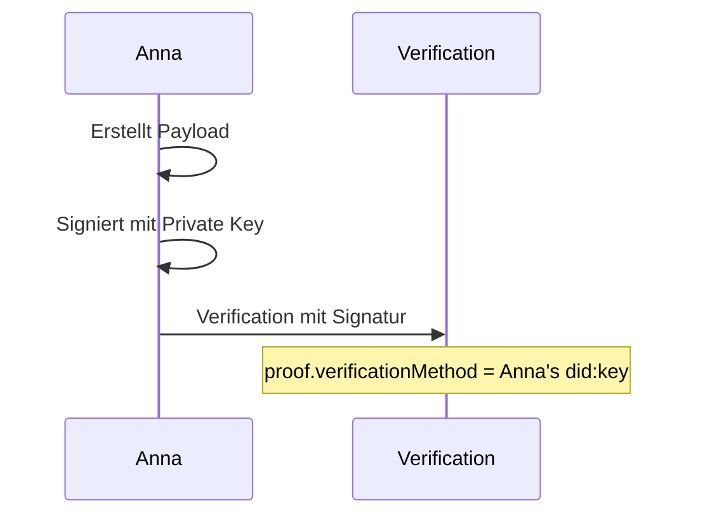
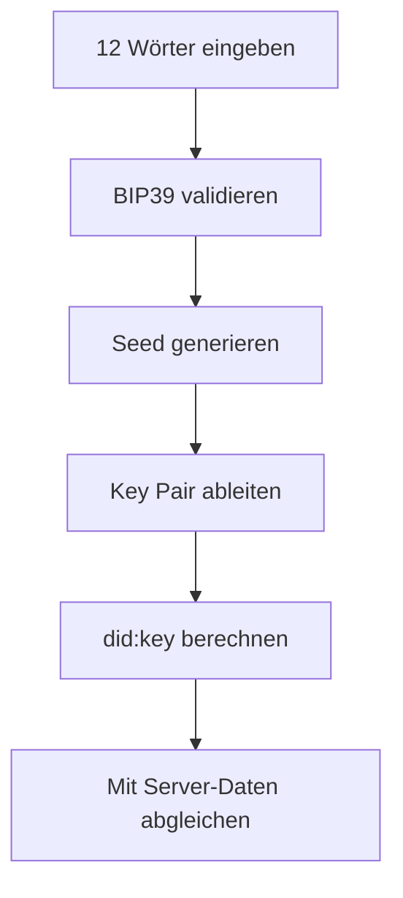

# did:key Verwendung

> Wie dezentrale Identifier im Web of Trust genutzt werden

## Warum did:key?

Das Web of Trust verwendet die [did:key](https://w3c-ccg.github.io/did-method-key/) Methode für dezentrale Identifier.

### Entscheidungsgründe

| Kriterium | did:key | Eigene Methode (did:wot) |
|-----------|---------|--------------------------|
| **Standard** | W3C CCG Standard | Proprietär |
| **Resolver nötig** | Nein (selbstbeschreibend) | Ja (eigene Infrastruktur) |
| **Interoperabilität** | Hoch | Keine |
| **Komplexität** | Gering | Hoch |
| **Offline-fähig** | Ja | Abhängig von Implementierung |

### Kernvorteil: Selbstbeschreibend

```
did:key:z6MkhaXgBZDvotDkL5257faiztiGiC2QtKLGpbnnEGta2doK
         └─────────────────────────────────────────────┘
                    Public Key (Multibase-encoded)
```

Der Public Key ist **direkt im DID enthalten** - kein Server-Lookup nötig.

---

## Struktur

### Format

```
did:key:<multibase-encoded-public-key>
```

### Beispiel

```
did:key:z6MkhaXgBZDvotDkL5257faiztiGiC2QtKLGpbnnEGta2doK
│       │ └──────────────────────────────────────────────┘
│       │                    Ed25519 Public Key
│       └─ Multibase-Präfix (z = base58btc)
└─ DID-Methode
```

---

## Generierung

### Ablauf


### Pseudocode

```javascript
// 1. Recovery Phrase generieren (einmalig bei Onboarding)
const mnemonic = bip39.generateMnemonic(128); // 12 Wörter

// 2. Seed ableiten
const seed = bip39.mnemonicToSeedSync(mnemonic);

// 3. Ed25519 Key Pair generieren
const keyPair = ed25519.generateKeyPair(seed.slice(0, 32));

// 4. DID erstellen
const publicKeyMultibase = multibase.encode('base58btc',
  Buffer.concat([
    Buffer.from([0xed, 0x01]), // Ed25519 Multicodec Präfix
    keyPair.publicKey
  ])
);

const did = `did:key:${publicKeyMultibase}`;
// Ergebnis: did:key:z6MkhaXgBZDvotDkL5257faiztiGiC2QtKLGpbnnEGta2doK
```

---

## DID Document

Obwohl kein Resolver nötig ist, kann ein DID Document abgeleitet werden:

```json
{
  "@context": [
    "https://www.w3.org/ns/did/v1",
    "https://w3id.org/security/suites/ed25519-2020/v1"
  ],
  "id": "did:key:z6MkhaXgBZDvotDkL5257faiztiGiC2QtKLGpbnnEGta2doK",
  "verificationMethod": [{
    "id": "did:key:z6MkhaXgBZDvotDkL5257faiztiGiC2QtKLGpbnnEGta2doK#z6MkhaXgBZDvotDkL5257faiztiGiC2QtKLGpbnnEGta2doK",
    "type": "Ed25519VerificationKey2020",
    "controller": "did:key:z6MkhaXgBZDvotDkL5257faiztiGiC2QtKLGpbnnEGta2doK",
    "publicKeyMultibase": "z6MkhaXgBZDvotDkL5257faiztiGiC2QtKLGpbnnEGta2doK"
  }],
  "authentication": [
    "did:key:z6MkhaXgBZDvotDkL5257faiztiGiC2QtKLGpbnnEGta2doK#z6MkhaXgBZDvotDkL5257faiztiGiC2QtKLGpbnnEGta2doK"
  ],
  "assertionMethod": [
    "did:key:z6MkhaXgBZDvotDkL5257faiztiGiC2QtKLGpbnnEGta2doK#z6MkhaXgBZDvotDkL5257faiztiGiC2QtKLGpbnnEGta2doK"
  ],
  "keyAgreement": [{
    "id": "did:key:z6MkhaXgBZDvotDkL5257faiztiGiC2QtKLGpbnnEGta2doK#z6LSbysY2xFMRpGMhb7tFTLMpeuPRaqaWM1yECx2AtzE3KCc",
    "type": "X25519KeyAgreementKey2020",
    "controller": "did:key:z6MkhaXgBZDvotDkL5257faiztiGiC2QtKLGpbnnEGta2doK",
    "publicKeyMultibase": "z6LSbysY2xFMRpGMhb7tFTLMpeuPRaqaWM1yECx2AtzE3KCc"
  }]
}
```

---

## Verwendung im System

### Identitäten

| Entität | DID-Verwendung |
|---------|----------------|
| Eigene Identität | `did:key` aus Recovery Phrase |
| Kontakt | `did:key` beim QR-Scan empfangen |
| Gruppe | `did:key` bei Gruppenerstellung generiert |

### Signaturen



### Verschlüsselung


**Hinweis:** Ed25519 (Signaturen) wird zu X25519 (Key Agreement) konvertiert. Beide sind im did:key DID Document enthalten.

---

## Kryptografische Primitive

| Zweck | Algorithmus | Standard |
|-------|-------------|----------|
| Signaturen | Ed25519 | RFC 8032 |
| Key Agreement | X25519 | RFC 7748 |
| Symmetrische Verschlüsselung | AES-256-GCM | NIST SP 800-38D |
| Hashing | SHA-256 / BLAKE3 | FIPS 180-4 / - |
| Multibase Encoding | base58btc | Multibase Spec |
| Multicodec Präfix | 0xed01 (Ed25519) | Multicodec Table |

---

## Recovery

### Von Recovery Phrase zu DID



### Determinismus

Die gleiche Recovery Phrase erzeugt **immer den gleichen DID**:

```
Recovery Phrase: apple banana cherry ...
         ↓
Seed:    0x1a2b3c4d...
         ↓
DID:     did:key:z6MkhaXgBZDvotDkL5257faiztiGiC2QtKLGpbnnEGta2doK
```

---

## Sicherheitshinweise

### Private Key Speicherung

| Plattform | Speicherort | Schutz |
|-----------|-------------|--------|
| iOS | Keychain | Secure Enclave |
| Android | Keystore | Hardware-backed (wenn verfügbar) |
| Web | IndexedDB + Web Crypto API | `extractable: false` |

### Was nie das Gerät verlässt

- Private Key
- Recovery Phrase (nach Onboarding)
- Seed

### Was geteilt wird

- Public Key (im did:key enthalten)
- DID
- Signaturen
