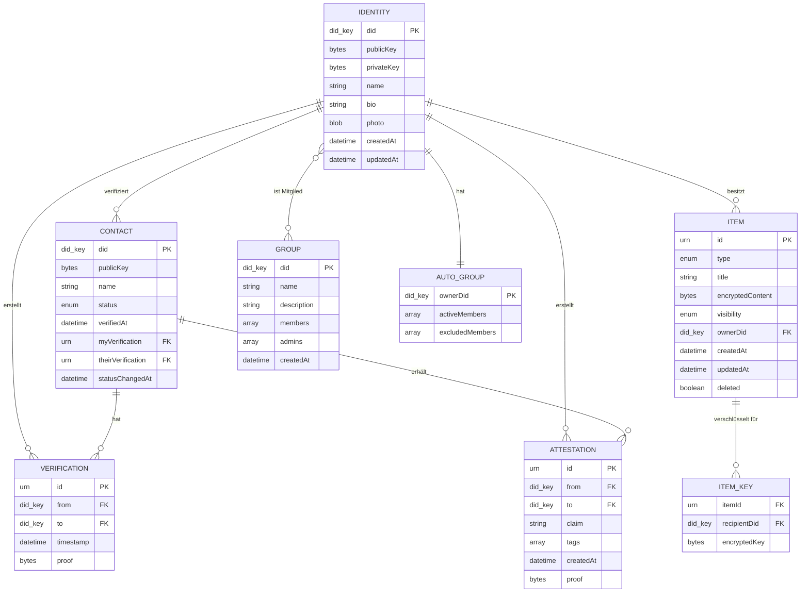
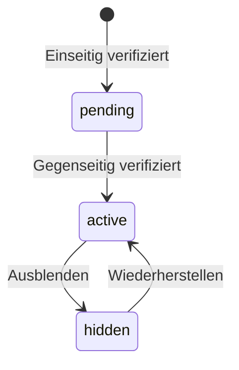
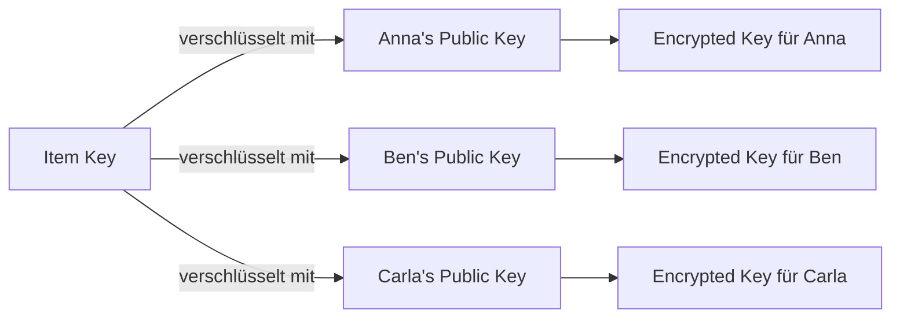
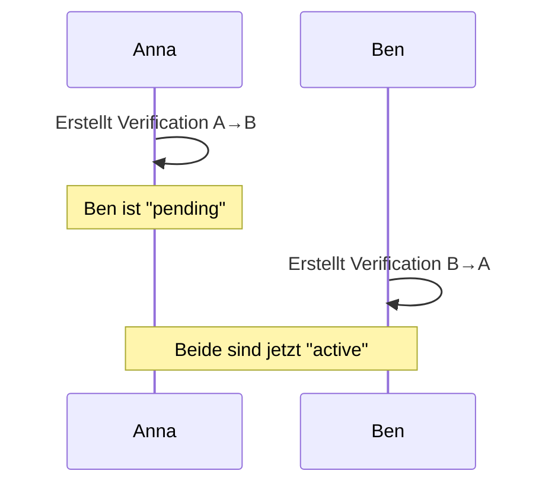
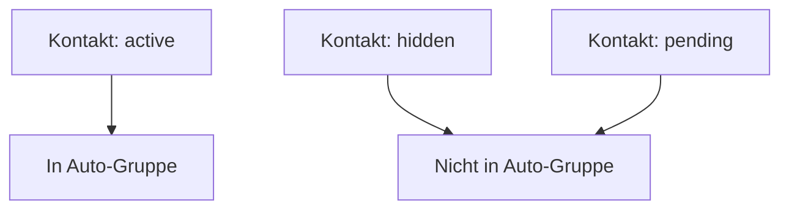
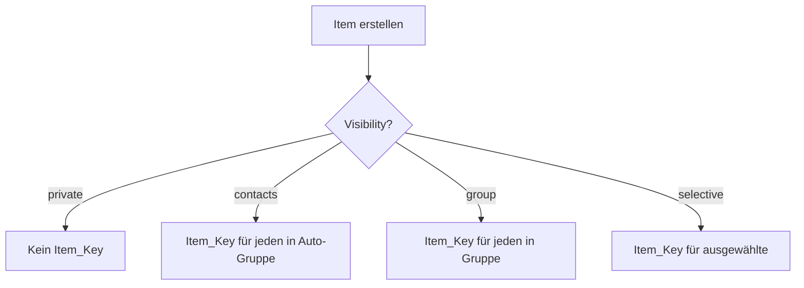

# Entitäten

> Vollständiges Datenmodell des Web of Trust

## ER-Diagramm (Übersicht)



---

## Identity (Eigene Identität)

Die eigene digitale Identität des Nutzers. Existiert genau einmal pro Gerät/Installation.

### Schema

```json
{
  "did": "did:key:z6Mkf5rGMoatrSj1f4CyvuHBeXJELe9RPdzo2PKGNCKVtZxP",
  "publicKey": {
    "type": "Ed25519VerificationKey2020",
    "publicKeyMultibase": "z6Mkf5rGMoatrSj1f4CyvuHBeXJELe9RPdzo2PKGNCKVtZxP"
  },
  "name": "Anna Müller",
  "bio": "Aktiv im Gemeinschaftsgarten Sonnenberg",
  "photo": {
    "mimeType": "image/jpeg",
    "data": "base64..."
  },
  "createdAt": "2025-01-01T10:00:00Z",
  "updatedAt": "2025-01-08T12:00:00Z"
}
```

### Felder

| Feld | Typ | Required | Beschreibung |
|------|-----|----------|--------------|
| did | `did:key` | Ja | Dezentraler Identifier, abgeleitet vom Public Key |
| publicKey | Object | Ja | Ed25519 Public Key |
| privateKey | Bytes | Ja | Ed25519 Private Key (nur lokal, nie synchronisiert) |
| name | String | Ja | Anzeigename (1-100 Zeichen) |
| bio | String | Nein | Beschreibung (max 500 Zeichen) |
| photo | Object | Nein | Profilbild (max 1 MB, JPEG/PNG) |
| createdAt | DateTime | Ja | Erstellungszeitpunkt (ISO 8601) |
| updatedAt | DateTime | Ja | Letzter Änderungszeitpunkt |

### Invarianten

- `did` wird aus `publicKey` abgeleitet (deterministisch)
- `privateKey` verlässt niemals das Gerät
- `privateKey` kann nur über Recovery-Phrase wiederhergestellt werden

---

## Contact (Verifizierter Kontakt)

Ein anderer Nutzer, mit dem eine Verifizierung besteht.

### Schema

```json
{
  "did": "did:key:z6MkhaXgBZDvotDkL5257faiztiGiC2QtKLGpbnnEGta2doK",
  "publicKey": {
    "type": "Ed25519VerificationKey2020",
    "publicKeyMultibase": "z6MkhaXgBZDvotDkL5257faiztiGiC2QtKLGpbnnEGta2doK"
  },
  "name": "Ben Schmidt",
  "status": "active",
  "verifiedAt": "2025-01-05T10:05:00Z",
  "myVerification": "urn:uuid:550e8400-e29b-41d4-a716-446655440000",
  "theirVerification": "urn:uuid:6fa459ea-ee8a-3ca4-894e-db77e160355e",
  "statusChangedAt": "2025-01-05T10:05:00Z"
}
```

### Status-Übergänge



| Status | Bedeutung |
|--------|-----------|
| `pending` | Nur eine Seite hat verifiziert |
| `active` | Gegenseitig verifiziert, in Auto-Gruppe |
| `hidden` | Ausgeblendet, nicht in Auto-Gruppe |

---

## Verification (Verifizierung)

Eine kryptografisch signierte Aussage "Ich habe diese Person getroffen".

### Schema

```json
{
  "id": "urn:uuid:550e8400-e29b-41d4-a716-446655440000",
  "type": "IdentityVerification",
  "from": "did:key:z6Mkf5rGMoatrSj1f4CyvuHBeXJELe9RPdzo2PKGNCKVtZxP",
  "to": "did:key:z6MkhaXgBZDvotDkL5257faiztiGiC2QtKLGpbnnEGta2doK",
  "timestamp": "2025-01-05T10:05:00Z",
  "proof": {
    "type": "Ed25519Signature2020",
    "verificationMethod": "did:key:z6Mkf5rGMoatrSj1f...",
    "proofValue": "z5vgFc..."
  }
}
```

### Eigenschaften

- **Unveränderlich:** Einmal erstellt, nie geändert
- **Unidirektional:** A→B und B→A sind separate Verifizierungen
- **Gegenseitigkeit:** Erst wenn beide existieren, ist der Kontakt "aktiv"

---

## Attestation

Eine signierte Aussage über einen Kontakt.

### Schema

```json
{
  "id": "urn:uuid:789e0123-e89b-12d3-a456-426614174000",
  "type": "Attestation",
  "from": "did:key:z6Mkf5rGMoatrSj1f4CyvuHBeXJELe9RPdzo2PKGNCKVtZxP",
  "to": "did:key:z6MkhaXgBZDvotDkL5257faiztiGiC2QtKLGpbnnEGta2doK",
  "claim": "Hat 3 Stunden im Gemeinschaftsgarten geholfen",
  "tags": ["garten", "helfen", "gemeinschaft"],
  "createdAt": "2025-01-08T14:00:00Z",
  "proof": {
    "type": "Ed25519Signature2020",
    "verificationMethod": "did:key:z6Mkf5rGMoatrSj1f...",
    "proofValue": "z3vFx..."
  }
}
```

### Regeln

| Regel | Beschreibung |
|-------|--------------|
| Nur für Kontakte | Attestation nur für verifizierte Kontakte möglich |
| Keine Selbst-Attestation | `from` und `to` müssen unterschiedlich sein |
| Unveränderlich | Einmal erstellt, nie geändert oder gelöscht |
| Unabhängig von Status | Auch für ausgeblendete Kontakte erstellbar |

---

## Item (Content-Eintrag)

Ein Inhaltselement des Nutzers.

### Schema

```json
{
  "id": "urn:uuid:abc12345-e89b-12d3-a456-426614174000",
  "type": "CalendarItem",
  "title": "Gartentreffen",
  "encryptedContent": "base64...",
  "visibility": "contacts",
  "ownerDid": "did:key:z6Mkf5rGMoatrSj1f4CyvuHBeXJELe9RPdzo2PKGNCKVtZxP",
  "createdAt": "2025-01-08T10:00:00Z",
  "updatedAt": "2025-01-08T10:00:00Z",
  "deleted": false
}
```

### Item-Typen

| Typ | Beschreibung | Content-Struktur |
|-----|--------------|------------------|
| `CalendarItem` | Kalender-Eintrag | `{startDate, endDate?, location?, description}` |
| `MapItem` | Karten-Markierung | `{lat, lng, name, description?, category}` |
| `ProjectItem` | Projekt | `{description, status, tasks[]}` |
| `NoteItem` | Notiz | `{text}` |

### Sichtbarkeit

| Visibility | Bedeutung |
|------------|-----------|
| `private` | Nur für mich |
| `contacts` | Alle aktiven Kontakte (Auto-Gruppe) |
| `groups` | Eine oder mehrere Gruppen |
| `selective` | Ausgewählte Kontakte |

### Beispiel: Item für mehrere Gruppen

```json
{
  "id": "urn:uuid:abc12345-e89b-12d3-a456-426614174000",
  "type": "CalendarItem",
  "title": "Nachbarschaftsfest",
  "visibility": "groups",
  "groupDids": [
    "did:key:z6MkgYGF3thn8k1Fv4p4dWXKtsXCnLH7q9yw4QgNPULDmDKB",
    "did:key:z6MkpTHR8VNsBxYaaLLLLLLLLLLLLLLLLLLLLLLLLLLLL"
  ],
  "ownerDid": "did:key:z6Mkf5rGMoatrSj1f..."
}
```

Das Item ist für alle Mitglieder beider Gruppen sichtbar.

---

## Item_Key (Verschlüsselungsschlüssel)

Verschlüsselter Item-Key für einen Empfänger.

### Schema

```json
{
  "itemId": "urn:uuid:abc12345-e89b-12d3-a456-426614174000",
  "recipientDid": "did:key:z6MkhaXgBZDvotDkL5257faiztiGiC2QtKLGpbnnEGta2doK",
  "encryptedKey": "base64..."
}
```

### Funktionsweise



---

## Group (Explizite Gruppe)

Eine vom Nutzer erstellte Gruppe.

### Schema

```json
{
  "did": "did:key:z6MkgYGF3thn8k1Fv4p4dWXKtsXCnLH7q9yw4QgNPULDmDKB",
  "name": "Gemeinschaftsgarten Sonnenberg",
  "description": "Koordination des Gemeinschaftsgartens",
  "members": [
    "did:key:z6Mkf5rGMoatrSj1f...",
    "did:key:z6MkhaXgBZDvotDkL...",
    "did:key:z6MkpTHR8VNsBxYa..."
  ],
  "admins": [
    "did:key:z6Mkf5rGMoatrSj1f..."
  ],
  "createdAt": "2025-01-02T10:00:00Z"
}
```

### Rollen

| Rolle | Rechte |
|-------|--------|
| `member` | Inhalte sehen und erstellen |
| `admin` | + Mitglieder einladen/entfernen |

---

## Auto-Gruppe

Implizite Gruppe aller aktiven Kontakte.

### Konzept

```
┌─────────────────────────────────────────────────────────────┐
│                                                             │
│  Auto-Gruppe von Anna                                       │
│                                                             │
│  Aktive Mitglieder:                                         │
│  ├── Ben (active)                                           │
│  ├── Carla (active)                                         │
│  └── Tom (active)                                           │
│                                                             │
│  Ausgeschlossen:                                            │
│  └── Max (hidden)                                           │
│                                                             │
│  Automatisch aktualisiert bei Statusänderungen              │
│                                                             │
└─────────────────────────────────────────────────────────────┘
```

### Regeln

1. Jeder Nutzer hat genau eine Auto-Gruppe
2. Mitgliedschaft = Kontakt mit `status: active`
3. Updates passieren automatisch bei Statusänderungen
4. Kein explizites "Hinzufügen" - ergibt sich aus Verifizierung

---

## Beziehungen

### Verifizierung → Kontakt



### Kontakt → Auto-Gruppe



### Item → Item_Keys


