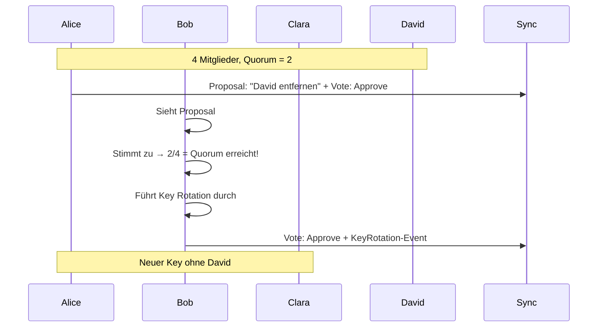
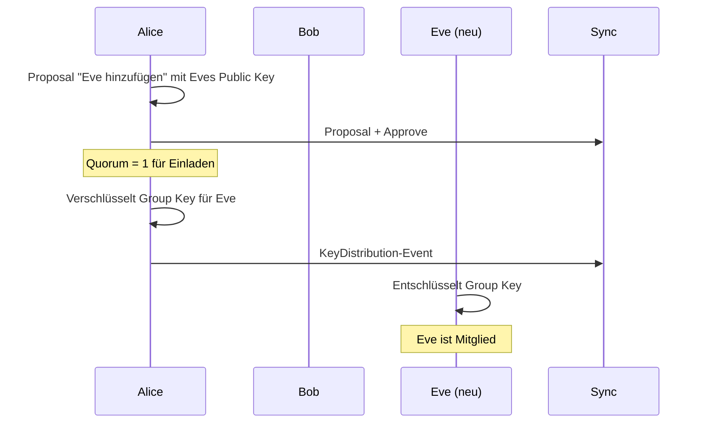

# Quorum-Konzept für Gruppenverwaltung

> Alternatives Konzept ohne Admin-Rolle - für spätere Implementierung

**Status:** Konzept dokumentiert, nicht implementiert
**Priorität:** Phase 2 (nach CRDT-Framework-Entscheidung)

---

## Motivation

Das Admin-Modell hat Schwächen:
- Single Point of Failure (Admin verliert Gerät)
- Machtkonzentration
- Admin kann Gruppe "kapern"

Das Quorum-Modell löst diese Probleme durch demokratische Entscheidungen.

---

## Grundprinzip

**Keine Admin-Rolle.** Alle Mitglieder sind gleichberechtigt.

Kritische Aktionen erfordern Zustimmung mehrerer Mitglieder (Quorum).

---

## Quorum-Berechnung

### Basis-Quorum

| Mitglieder | Quorum |
|------------|--------|
| 2 | 1 |
| 3 | 2 |
| 4 | 2 |
| 5+ | **3** (Maximum) |

```javascript
function getBaseQuorum(memberCount) {
  if (memberCount <= 4) return Math.ceil(memberCount / 2);
  return 3;  // Maximum wegen Inaktivität
}
```

### Gegenstimmen erhöhen Quorum

Jede Gegenstimme erhöht das benötigte Quorum um 1.

```javascript
function getQuorum(memberCount, rejectCount) {
  const baseQuorum = getBaseQuorum(memberCount);
  return Math.min(memberCount, baseQuorum + rejectCount);
}
```

**Beispiele (10 Mitglieder):**

| Rejects | Effektives Quorum |
|---------|-------------------|
| 0 | 3 |
| 2 | 5 |
| 5 | 8 |

---

## Aktionen und Quorum

| Aktion | Quorum | Key-Operation |
|--------|--------|---------------|
| Gruppe erstellen | - | Neuer Key |
| Mitglied einladen | **1** | Key verteilen |
| Mitglied entfernen | Basis + Rejects | Key Rotation |
| Gruppe verlassen | - | Key Rotation |
| Gruppe umbenennen | Basis + Rejects | - |
| Modul aktivieren | **1** | - |
| Modul ausblenden | **1** | - |

**Prinzip:** Konstruktive/reversible Aktionen = 1 Person. Destruktive Aktionen = Quorum.

---

## Proposal-Flow

### Ablauf



### Entscheidend: Quorum-Erreicher führt aus

Wer die entscheidende Stimme abgibt, führt sofort die Aktion aus.

- Keine Wartezeit
- Kein separater "Executor"
- Kein Offline-Problem

---

## Proposal-Status

```javascript
function getProposalStatus(proposal, memberCount) {
  const approves = proposal.votes.filter(v => v.vote === 'approve').length;
  const rejects = proposal.votes.filter(v => v.vote === 'reject').length;
  const notVoted = memberCount - approves - rejects;

  const quorum = getQuorum(memberCount, rejects);

  // Erfolg: Quorum erreicht
  if (approves >= quorum) {
    return 'approved';
  }

  // Gescheitert: Mathematisch unmöglich
  const maxPossibleApproves = approves + notVoted;
  if (maxPossibleApproves < quorum) {
    return 'rejected';
  }

  // Gescheitert: Timeout
  const daysSinceCreated = (Date.now() - proposal.createdAt) / 86400000;
  if (daysSinceCreated > 7) {
    return 'expired';
  }

  return 'pending';
}
```

| Status | Bedingung |
|--------|-----------|
| **approved** | Approves ≥ Quorum |
| **rejected** | Mathematisch unmöglich |
| **expired** | 7 Tage ohne Ergebnis |
| **pending** | Noch offen |

---

## Datenstrukturen

### Proposal

```json
{
  "id": "urn:uuid:...",
  "type": "group-proposal",
  "groupDid": "did:key:z6Mk...",
  "action": "remove-member",
  "target": "did:key:david...",
  "proposedBy": "did:key:alice...",
  "proposedAt": "2025-01-09T10:00:00Z",
  "expiresAt": "2025-01-16T10:00:00Z",
  "proof": "..."
}
```

### Vote (mit optionaler Key-Operation)

```json
{
  "id": "urn:uuid:...",
  "type": "proposal-vote",
  "proposalId": "urn:uuid:proposal...",
  "voter": "did:key:bob...",
  "vote": "approve",
  "timestamp": "2025-01-09T15:00:00Z",
  "quorumReached": true,
  "keyRotation": {
    "newKeyId": "key-2",
    "previousKeyId": "key-1",
    "encryptedKeys": [
      { "recipient": "did:key:alice...", "encryptedKey": "base64..." },
      { "recipient": "did:key:bob...", "encryptedKey": "base64..." },
      { "recipient": "did:key:clara...", "encryptedKey": "base64..." }
    ]
  },
  "proof": "..."
}
```

---

## Key-Operationen

### Mitglied entfernen → Key Rotation

Entferntes Mitglied hat den alten Key noch. Daher:
1. Neuen Group Key generieren
2. Neuen Key an verbleibende Mitglieder verteilen
3. Neue Inhalte mit neuem Key verschlüsseln

Entferntes Mitglied kann alte Inhalte noch lesen, aber keine neuen.

### Mitglied hinzufügen → Key verteilen

Kein neuer Key nötig. Neues Mitglied bekommt bestehenden Key.



---

## CRDT-Herausforderungen

### Problem: Parallele Votes

```
Alice: 1 Approve
Bob stimmt zu (offline) → 2 Approves → Key Rotation Y₁
Clara stimmt zu (offline) → 2 Approves → Key Rotation Y₂
```

Beide haben unabhängig Quorum erreicht und Key Rotation gemacht.

### Lösung: Deterministischer Gewinner

```javascript
function resolveKeyRotationConflict(rotation1, rotation2) {
  // Älterer Timestamp gewinnt
  if (rotation1.timestamp < rotation2.timestamp) return rotation1;
  if (rotation2.timestamp < rotation1.timestamp) return rotation2;

  // Bei gleichem Timestamp: kleinere DID gewinnt
  return rotation1.voter < rotation2.voter ? rotation1 : rotation2;
}
```

### Problem: Race Conditions bei Proposals

Was wenn zwei gegensätzliche Proposals gleichzeitig?

```
Alice: "Entferne David"
David: "Entferne Alice"
```

**Lösung:** Proposals blockieren sich gegenseitig oder CRDT-Konfliktauflösung (ältestes gewinnt).

---

## Warum nicht jetzt implementieren?

1. **CRDT-Framework noch nicht gewählt**
   - Konfliktauflösung hängt vom Framework ab
   - Manche Frameworks haben besseren Support für solche Patterns

2. **Komplexität**
   - Admin-Modell ist deutlich einfacher
   - Löst 90% der Fälle

3. **UI-Aufwand**
   - Proposal-Liste
   - Voting-Interface
   - Status-Anzeige

---

## Migrationspfad

### Phase 1 (jetzt)
Gruppen haben Admins (klassisches Modell)

### Phase 2 (später)
Option "Demokratischer Modus" pro Gruppe:
- Admin-Rolle wird abgeschafft
- Quorum-Logik greift
- Bestehende Admins werden zu normalen Mitgliedern

```json
{
  "groupDid": "did:key:...",
  "governanceMode": "democratic",  // oder "admin"
  "admins": []  // leer bei democratic
}
```

---

## Offene Fragen für Phase 2

1. **Timeout-Dauer:** 7 Tage optimal? Konfigurierbar?
2. **Cooldown:** Nach abgelehntem Proposal wie lange warten bis neues?
3. **Proposal-Konflikte:** Wie handhaben wenn mehrere Proposals gleichzeitig?
4. **UI/UX:** Wie Voting-Aufforderungen anzeigen ohne zu nerven?

---

## Fazit

Das Quorum-Konzept ist durchdacht und löst echte Probleme des Admin-Modells. Die Implementierung sollte aber warten bis:

- CRDT-Framework gewählt und verstanden
- Admin-Modell in Produktion getestet
- Bedarf für demokratische Gruppen validiert
