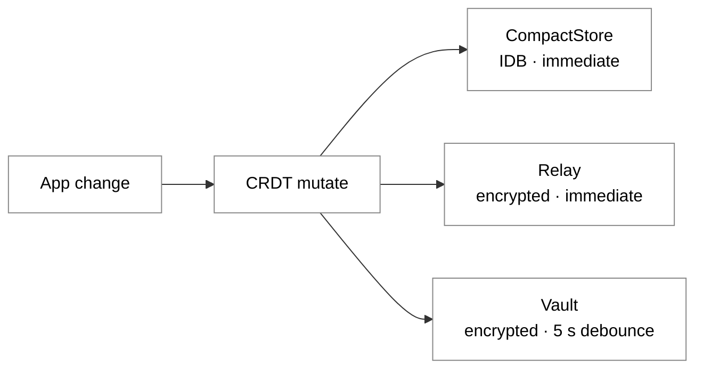
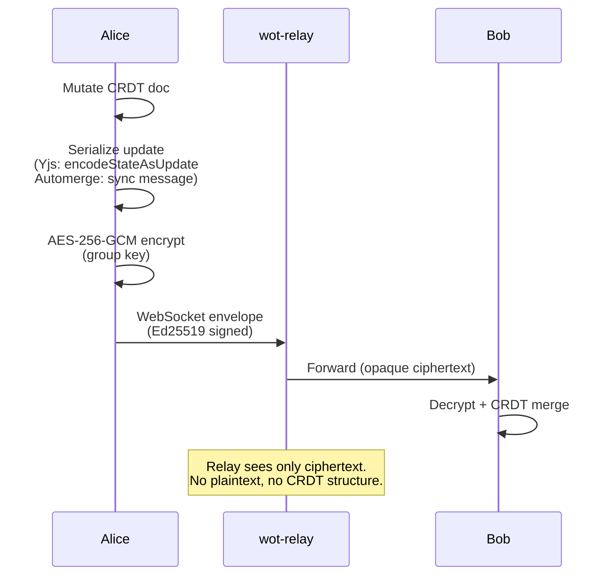
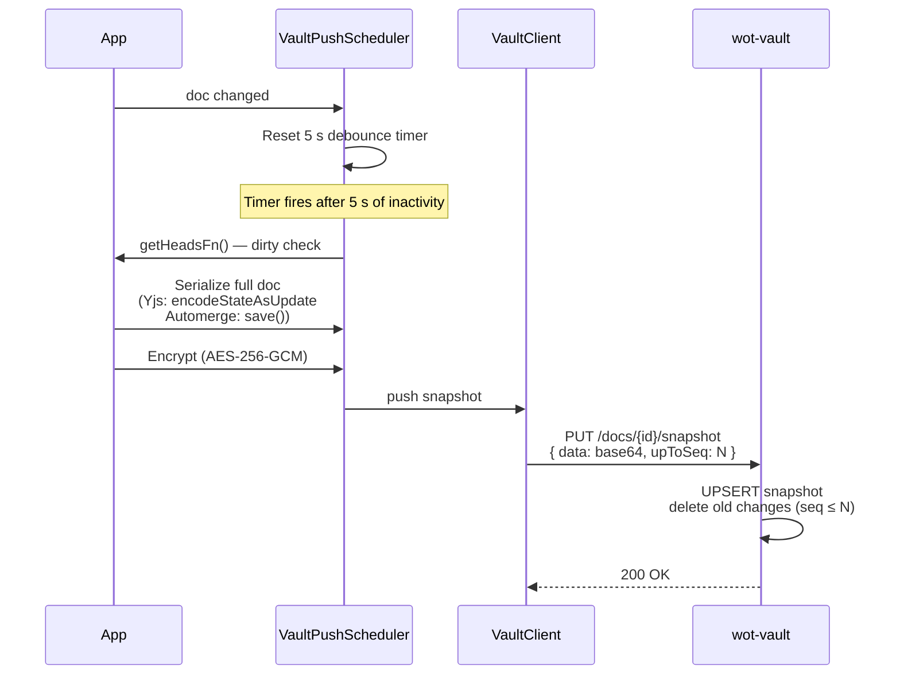
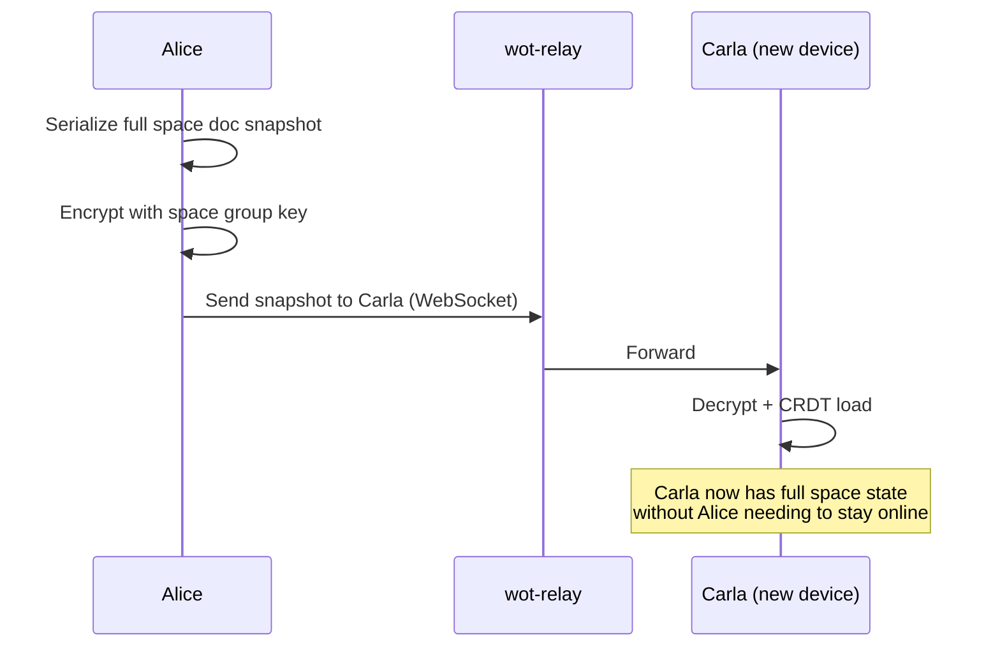

# Vault and Persistence Architecture

> How documents are stored locally, backed up to the Vault, and synchronized between
> devices and peers. This document supersedes `encrypted-doc-store.md` and `vault-sync.md`.
>
> Last updated: 2026-03-15 (post-Yjs migration)

---

## Overview

The system uses a **four-way persistence architecture**. Each layer has a distinct role:

| Layer | Transport | Purpose | CRDT-agnostic? |
|---|---|---|---|
| **CompactStore** | IndexedDB | Local snapshots — immediate, always available | Yes — stores raw bytes |
| **Relay** | WebSocket | Real-time sync between peers and devices | Yes — forwards encrypted envelopes |
| **Vault** (`wot-vault`) | HTTPS | Encrypted backup — device-loss recovery, offline-join | Yes — stores encrypted bytes |
| **wot-profiles** | HTTPS | Public profile discovery | Yes — profile server |

Every change flows through the first three layers in order:



Real-time sync (Relay) has **no debounce**. Only persistence (Vault, CompactStore) is debounced.

---

## Three Sync Patterns

The system has three distinct sync patterns, each suited to a different situation:

| Pattern | Transport | Data format | When used |
|---|---|---|---|
| **Peer-to-Peer** | WebSocket (wot-relay) | Incremental CRDT updates | Live sync, peers online |
| **Vault** | HTTPS (wot-vault) | Full snapshot (CRDT serialized) | Multi-device, offline restore |
| **Invite** | WebSocket (wot-relay) | Full snapshot (CRDT serialized) | Initial space join |

### 1. Peer-to-Peer Sync (Live)

When peers are online, CRDT updates are forwarded in real time through the Relay:



- **Updates are small** — only the diff, not the full state
- **The CRDT handles** conflict resolution, ordering, and deduplication
- **One key per space** — AES-256-GCM group key, rotated on member removal
- **Message buffer** — `WebSocketMessagingAdapter` buffers early messages so no updates are lost before handlers are registered

### 2. Vault Sync (Backup and Restore)

The Vault (`wot-vault`) is an **opaque E2E-encrypted document store**. The server sees only ciphertext — no plaintext, no CRDT structure, no metadata about doc contents.

#### Push: Snapshot Replace with 5 s Debounce



This is a **snapshot-replace** pattern: each push replaces the previous snapshot entirely.

#### Why snapshot-replace instead of incremental push?

The Vault does support a `POST /changes` append API, but we deliberately do **not** use it for regular pushes:

1. **E2EE constraint** — Incremental push requires tracking which heads have already been sent. With encrypted data, the server cannot assist with head reconciliation. The client would need per-device state tracking that adds complexity without benefit at our doc sizes.
2. **Small docs** — Our documents are 2–50 KB. A full snapshot push costs ~200–700 ms (HTTP round-trip) and is negligible.
3. **Idempotency** — Snapshot-replace is idempotent. There are no ordering problems, no gaps, no need to track previous push state. Concurrent pushes from two devices result in last-write-wins, which is acceptable because the Relay keeps both devices in sync in real time.

#### Restore: Vault-First

On startup (new device, app reinstall, or cold boot), the Vault is consulted before local IndexedDB:

```mermaid
flowchart TD
  A[initPersonalDoc] --> B{Vault reachable?}
  B -- yes --> C[GET /docs/{id}/changes<br/>Snapshot + any newer changes]
  C --> D[Decrypt + CRDT load]
  D --> G[Doc ready]
  B -- no --> E[CompactStore<br/>IndexedDB snapshot]
  E --> F{Found?}
  F -- yes --> G
  F -- no --> H[Empty doc<br/>or migration path]

  style A stroke:#888,fill:none,color:inherit
  style B stroke:#888,fill:none,color:inherit
  style C stroke:#888,fill:none,color:inherit
  style D stroke:#888,fill:none,color:inherit
  style E stroke:#888,fill:none,color:inherit
  style F stroke:#888,fill:none,color:inherit
  style G stroke:#888,fill:none,color:inherit
  style H stroke:#888,fill:none,color:inherit
```

Vault-First is faster than relying solely on IndexedDB because:
- The Vault delivers **one** compact snapshot (HTTP fetch ~200–700 ms)
- IndexedDB (pre-CompactStore) could accumulate 40+ incremental chunks requiring multiple merges — the root cause of WASM OOM on mobile with Automerge

### 3. Invite Sync (Initial Space Join)

When a new member joins a space and no peers are online to serve the current doc state, the inviting peer sends a full snapshot as part of the invite flow:



This pattern fills the offline-join gap: even if Alice goes offline after sending the invite, Carla can bootstrap from the snapshot she received. After that, the Vault takes over as the persistent fallback.

---

## wot-vault Package

`packages/wot-vault/` is a standalone HTTP service. It stores encrypted blobs — it has no knowledge of CRDT internals or document contents.

### Service Details

| Property | Value |
|---|---|
| Port | 8789 |
| Storage | SQLite (WAL mode) |
| Auth | Signed capability tokens (Ed25519 JWS) |
| Tests | 27 |

### HTTP API

| Method | Path | Description |
|---|---|---|
| `POST` | `/docs/{id}/changes` | Append an encrypted change chunk |
| `GET` | `/docs/{id}/changes?since={seq}` | Fetch snapshot + changes since seq |
| `PUT` | `/docs/{id}/snapshot` | UPSERT snapshot, delete changes ≤ upToSeq |
| `GET` | `/docs/{id}/info` | Metadata (latest seq, snapshot seq, total size) |
| `DELETE` | `/docs/{id}` | Delete all data for a doc |

The `GET /changes` response returns the current snapshot (if any) plus any changes appended after it. When `since=0`, clients receive the full recovery payload in one request.

### SQLite Schema

```sql
-- Append-only change log (used for incremental scenarios)
CREATE TABLE doc_changes (
  id          INTEGER PRIMARY KEY AUTOINCREMENT,
  doc_id      TEXT    NOT NULL,
  seq         INTEGER NOT NULL,
  data        BLOB    NOT NULL,     -- encrypted, opaque
  author_did  TEXT    NOT NULL,
  created_at  TEXT    NOT NULL,
  UNIQUE(doc_id, seq)
);

-- Compacted snapshots (one per doc, UPSERT replaces previous)
CREATE TABLE doc_snapshots (
  doc_id      TEXT    NOT NULL PRIMARY KEY,
  data        BLOB    NOT NULL,     -- encrypted, opaque
  up_to_seq   INTEGER NOT NULL,
  author_did  TEXT    NOT NULL,
  created_at  TEXT    NOT NULL
);
```

When a snapshot is pushed, all `doc_changes` with `seq ≤ upToSeq` are deleted. This keeps the database compact.

### Authentication: Signed Capability Tokens

The Vault has no ACL database. It verifies **signed capability tokens** — stateless, offline-verifiable, delegatable.

```typescript
interface DocCapability {
  docId:       string
  grantedTo:   string          // DID of recipient
  permissions: ('read' | 'write')[]
  grantedBy:   string          // DID of issuer
  delegatable: boolean
  exp:         number          // Unix timestamp
}
```

Tokens are signed as JWS (Ed25519) via `WotIdentity.signJws()`.

#### Request format

```
PUT /docs/{id}/snapshot
Authorization: Bearer <identity-JWS>     -- proves caller is who they claim to be
X-Capability:  <capability-JWS>          -- proves caller has write permission
Content-Type:  application/json
Body: { "data": "<base64>", "upToSeq": 42 }
```

The Vault verifies:
1. Identity JWS — caller's DID matches public key derived from `did:key`
2. Capability JWS — issuer granted this DID the required permission on this docId
3. Issuer's public key via `did:key` resolution — signature is valid
4. Capability has not expired

#### Delegation chain

```
Alice (creator)
  └── signs capability for Bob (delegatable: true)
        └── Bob signs capability for Dave
              └── Dave's request includes chain [Alice→Bob, Bob→Dave]
                    Vault verifies the full chain
```

#### Revocation

Revocation is handled by two complementary mechanisms rather than a revocation list:

1. **Key rotation** — On `removeMember()`, the group key is rotated. The removed member can no longer decrypt new changes even if their capability token is still technically valid.
2. **Token expiry** — Capabilities have a bounded lifetime (e.g. 30 days). Active members renew automatically; removed members receive no new tokens.

An optional server-side revocation list for immediate blocking is a low-priority future addition.

---

## Encryption Layers

All data stored in the Vault and transmitted via the Relay is encrypted before leaving the client.

### Personal Document

```
Key:       HKDF(masterKey, 'personal-doc-v1')
Algorithm: AES-256-GCM
Scope:     Owner's devices only (same BIP39 mnemonic → same key)
```

### Shared Spaces

```
Key:       AES-256 group key (per space, per generation)
Algorithm: AES-256-GCM
Rotation:  On removeMember() → new generation; old key kept for decrypt of existing data
Distribution: X25519 ECIES encrypted per recipient
```

### What the Vault Server Sees

```
PUT /docs/{id}/snapshot
  Body: { data: "base64(nonce || AES-GCM-ciphertext)", upToSeq: N }
```

No plaintext. No CRDT structure. No content metadata. The server is a blind blob store.

---

## Client-Side Components

### VaultClient (`services/VaultClient.ts`)

HTTP client for all Vault API calls.

```typescript
class VaultClient {
  constructor(baseUrl: string, identity: WotIdentity)

  pushSnapshot(docId: string, encryptedData: Uint8Array, upToSeq: number, capability: string): Promise<void>
  pullChanges(docId: string, sinceSeq: number, capability: string): Promise<{ snapshot, changes }>
  getInfo(docId: string, capability: string): Promise<{ latestSeq, snapshotSeq, totalSize }>
  deleteDoc(docId: string, capability: string): Promise<void>
}
```

### VaultPushScheduler (`services/VaultPushScheduler.ts`)

Manages the 5 s debounce and dirty detection for vault pushes.

```typescript
class VaultPushScheduler {
  constructor(
    vaultClient: VaultClient,
    getDocFn: () => Uint8Array,     // serialize current CRDT state
    getHeadsFn: () => string[],     // for dirty detection
    docId: string,
    capability: string,
    encryptFn: (data: Uint8Array) => Promise<Uint8Array>
  )

  scheduleWrite(): void             // call after every doc mutation
  flush(): Promise<void>            // force immediate push (e.g. on app close)
  dispose(): void
}
```

Dirty detection via `getHeadsFn` ensures that if two writes happen within the 5 s window and result in the same CRDT state, no redundant push is made.

---

## CRDT Compatibility

The Vault architecture is **CRDT-agnostic**. The Vault stores encrypted bytes; it does not know whether the payload is a Yjs update, an Automerge save, or any other binary format.

| Operation | Yjs | Automerge |
|---|---|---|
| Serialize for Vault | `Y.encodeStateAsUpdate(ydoc)` | `Automerge.save(doc)` |
| Restore from Vault | `Y.applyUpdate(ydoc, bytes)` | `Automerge.load(bytes)` |
| History overhead | Minimal (GC built-in) | <10% for additive changes; up to ~6x for repeated overwrites |

### Yjs (Default since 2026-03-15)

- Pure JavaScript, no WASM — 76x faster init on mobile than Automerge
- Built-in garbage collection (`ydoc.gc = true`) — no history-strip service needed
- `Y.encodeStateAsUpdate()` produces compact binary; snapshot size is proportional to live state, not history

### Automerge (Option via `VITE_CRDT=automerge`)

- `Automerge.save(doc)` includes change history but uses columnar compression
- Measured overhead for additive changes (contacts/attestations): <10%
- Measured overhead for repeated field overwrites: up to ~6.4x — acceptable for current doc sizes
- `CompactionService` handles two-phase save with yields to reduce UI freeze on mobile

---

## Persistence Flow: Full Picture

```mermaid
flowchart TD
  subgraph Client["Client (Alice)"]
    A[App mutation] --> B[CRDT doc]
    B --> CS[CompactStore<br/>IDB snapshot<br/>immediate]
    B --> RS[EncryptedSyncService<br/>serialize + encrypt]
    RS --> WS[WebSocketMessagingAdapter<br/>→ wot-relay<br/>immediate]
    B --> VP[VaultPushScheduler<br/>5 s debounce]
    VP --> VC[VaultClient<br/>HTTP PUT /snapshot]
  end

  subgraph Server["Infrastructure"]
    WS --> REL[wot-relay<br/>WebSocket<br/>SQLite ACK]
    VC --> VAULT[wot-vault<br/>HTTP<br/>SQLite]
  end

  subgraph Peer["Bob (another device or user)"]
    REL --> WS2[WebSocketMessagingAdapter]
    WS2 --> D2[Decrypt + CRDT merge]
  end

  subgraph Restore["Carla (cold start / new device)"]
    VAULT --> R1[GET /docs/{id}/changes]
    R1 --> R2[Decrypt + CRDT load]
    R2 --> R3[Doc ready]
  end

  style Client stroke:#888,fill:none,color:inherit
  style Server stroke:#888,fill:none,color:inherit
  style Peer stroke:#888,fill:none,color:inherit
  style Restore stroke:#888,fill:none,color:inherit
```

---

## Known Limitations

### Full-state push on every change

With a 5 s debounce, the entire serialized doc is pushed to the Vault on each flush. For documents under 50 KB this is negligible. For larger documents (e.g. spaces with embedded binary data), incremental push would reduce bandwidth — this is a future concern, not a current bottleneck.

### Last-write-wins on concurrent pushes

The Vault cannot merge; it only replaces snapshots. If two devices push concurrently, the later push wins. This is acceptable because:
- The Relay keeps both devices synchronized in real time via CRDT merge
- After a live merge, the next Vault push will contain the merged state

### Automerge history growth under heavy overwrites

`Automerge.save()` retains change history. Repeated overwrites of the same field (e.g. a counter, an outbox) can produce a binary ~6x larger than the pure state. For current doc sizes this is not a problem. Yjs avoids this entirely via built-in GC.

---

## Relationship to Other Concepts

### Encrypted Blob Store

`docs/concepts/encrypted-blob-store.md` describes storage for binary files (images, attachments). That is a distinct concept from the document store described here:

| | Doc Store (this document) | Blob Store |
|---|---|---|
| Data type | CRDT documents | Binary files |
| Merge | Client-side CRDT merge | No merge (overwrite) |
| Key | Space group key | Contact blob key / space key |
| Pattern | Snapshot replace | PUT / GET |

Both could share the same physical `wot-vault` server.

### WebSocket Relay vs. Vault

| | Relay (WebSocket) | Vault (HTTP) |
|---|---|---|
| When | Peers online — real time | Peers offline — fallback |
| Latency | Immediate | Pull-based, ~200–700 ms |
| Protocol | CRDT sync messages | Snapshot replace |
| Server role | Blind message router | Blind blob store |

---

## Future: Subduction

[Subduction](https://www.inkandswitch.com/) (Ink & Switch, pre-alpha) is the next-generation sync protocol designed to supersede both the Relay sync and the Vault backup pattern:

| Aspect | Current (this doc) | Subduction |
|---|---|---|
| Storage | Snapshot replace (HTTP) | Sedimentree (depth-indexed) |
| Sync | Push incremental via WebSocket | Push + pull (WebSocket / QUIC) |
| Diffing | Sequence numbers | Fingerprint reconciliation |
| Encryption | AES-256-GCM (manual, EncryptedSyncService) | Keyhive (BeeKEM CGKA) |
| Key management | GroupKeyService (manual rotation) | Keyhive convergent capabilities |

The current architecture was designed to be a **bridge to Subduction**:
- The server remains a blind blob store in both models — migration requires no trust-model change
- The append-only change log semantics are compatible with Sedimentree
- Signed capabilities align with Keyhive's capability model

Earliest production-ready estimate for Subduction + Keyhive: **end of 2026 / 2027**.

Until then, the snapshot-replace Vault provides a pragmatic, well-tested solution that covers the most important real-world scenario: restoring a document on a new device when no peers are online.
