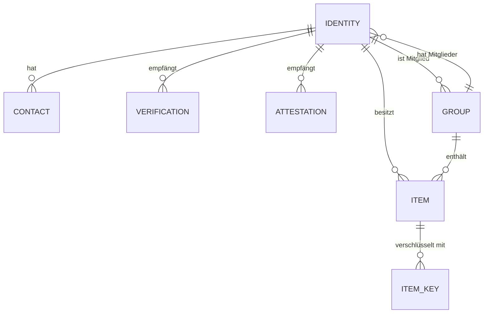
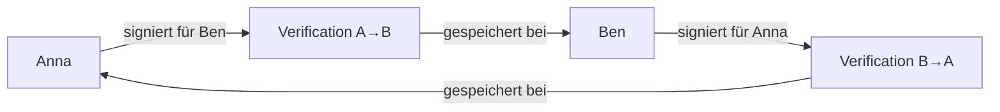

# Datenmodell

> Übersicht aller Entitäten und Datenstrukturen im Web of Trust

## Inhalt

| Dokument | Beschreibung |
|----------|--------------|
| [Architektur](architektur.md) | Framework-agnostische Architektur und Adapter-Pattern |
| [Entitäten](entitaeten.md) | Vollständiges ER-Diagramm aller Entitäten |
| [did:key Verwendung](did-key-usage.md) | Wie `did:key` im System genutzt wird |
| [Graph und Sichtbarkeit](graph-und-sichtbarkeit.md) | Wie das Netzwerk aus lokalen Perspektiven entsteht |
| [JSON-Schemas](json-schemas/) | Maschinenlesbare Schemas zur Validierung |

---

## Übersicht der Entitäten



> **Empfänger-Prinzip:** Verifizierungen und Attestationen werden beim **Empfänger** (`to`) gespeichert, nicht beim Ersteller (`from`).

---

## Kernentitäten

### Identity (Eigene Identität)

Die eigene digitale Identität des Nutzers.

| Feld | Typ | Beschreibung |
|------|-----|--------------|
| did | `did:key` | Dezentraler Identifier |
| publicKey | Ed25519 | Öffentlicher Schlüssel |
| name | String | Anzeigename |
| bio | String? | Optionale Beschreibung |
| photo | Blob? | Profilbild |
| createdAt | DateTime | Erstellungszeitpunkt |

### Contact (Verifizierter Kontakt)

Ein Kontakt mit Public Key für E2E-Verschlüsselung.

| Feld | Typ | Beschreibung |
|------|-----|--------------|
| did | `did:key` | DID des Kontakts |
| publicKey | Ed25519 | Öffentlicher Schlüssel (für Verschlüsselung) |
| name | String | Anzeigename |
| status | Enum | `pending`, `active` |
| verifiedAt | DateTime | Zeitpunkt der gegenseitigen Verifizierung |

> **Hinweis:** Der Sender speichert nur Public Keys. Die Verifizierungen selbst liegen beim jeweiligen Empfänger.

### Attestation

Eine signierte Aussage über einen Kontakt (wird beim Empfänger gespeichert).

| Feld | Typ | Beschreibung |
|------|-----|--------------|
| id | URN | Eindeutige ID |
| from | `did:key` | Wer hat signiert |
| to | `did:key` | Empfänger (Speicherort) |
| claim | String | Die Aussage |
| tags | String[] | Kategorisierung |
| accepted | Boolean | Empfänger kann annehmen (Default: false) - lokale Metadaten |
| createdAt | DateTime | Erstellungszeitpunkt |
| proof | Signature | Ed25519-Signatur von `from` |

### Item (Content-Eintrag)

Ein Inhaltselement (Kalender, Karte, Projekt, etc.).

| Feld | Typ | Beschreibung |
|------|-----|--------------|
| id | URN | Eindeutige ID |
| type | Enum | `calendar`, `map`, `project`, ... |
| title | String | Titel |
| content | Encrypted | Verschlüsselter Inhalt |
| visibility | Enum | `private`, `contacts`, `groups`, `selective` |
| groupDids | `did:key[]` | Zielgruppen (bei `groups`) |
| ownerDid | `did:key` | Besitzer |
| createdAt | DateTime | Erstellungszeitpunkt |

### Group (Explizite Gruppe)

Eine explizit erstellte Gruppe.

| Feld | Typ | Beschreibung |
|------|-----|--------------|
| did | `did:key` | Gruppen-DID |
| name | String | Gruppenname |
| members | `did:key[]` | Mitglieder-DIDs |
| admins | `did:key[]` | Admin-DIDs |
| createdAt | DateTime | Erstellungszeitpunkt |

---

## Spezielle Konstrukte

### Auto-Gruppe

Die implizite Gruppe aller aktiven Kontakte.

```
┌─────────────────────────────────────────┐
│                                         │
│  Auto-Gruppe (implizit)                 │
│                                         │
│  activeMembers = Kontakte mit           │
│                  status = "active"      │
│                  NICHT in excludedMembers│
│                                         │
│  excludedMembers = Ausgeblendete        │
│                    Kontakte (bleiben    │
│                    active, aber nicht   │
│                    in der Gruppe)       │
│                                         │
│  Wird automatisch aktualisiert bei:     │
│  • Neue Verifizierung → hinzufügen      │
│  • Kontakt ausblenden → excludedMembers │
│  • Wiederherstellen → aus excluded      │
│                                         │
└─────────────────────────────────────────┘
```

### Verification (Verifizierung)

Wird beim **Empfänger** gespeichert.



Erst wenn beide Verifications existieren, ist der Kontakt `active`.

---

## JSON-Schemas

Maschinenlesbare Schemas für Validierung:

- [`profile.schema.json`](json-schemas/profile.schema.json)
- [`verification.schema.json`](json-schemas/verification.schema.json)
- [`attestation.schema.json`](json-schemas/attestation.schema.json)
- [`item.schema.json`](json-schemas/item.schema.json)

---

## Weiterführend

- [Entitäten im Detail](entitaeten.md) - Vollständiges ER-Diagramm mit Beziehungen
- [did:key Verwendung](did-key-usage.md) - Wie DIDs generiert und verwendet werden
- [Graph und Sichtbarkeit](graph-und-sichtbarkeit.md) - Lokaler Graph, Datenhoheit, gemeinsame Kontakte
- [Verschlüsselung](../protokolle/verschluesselung.md) - Wie Items verschlüsselt werden
- [Adapter-Architektur v2](../protokolle/adapter-architektur-v2.md) - 6-Adapter-Spezifikation inkl. ReplicationAdapter (CRDT Spaces)
