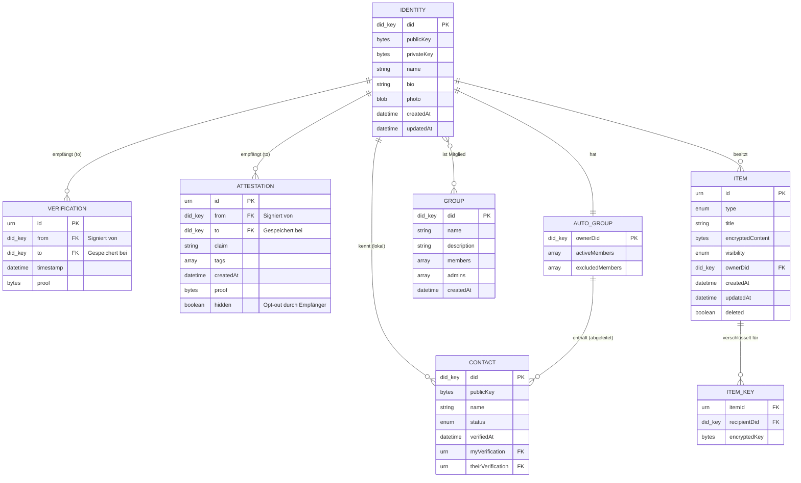
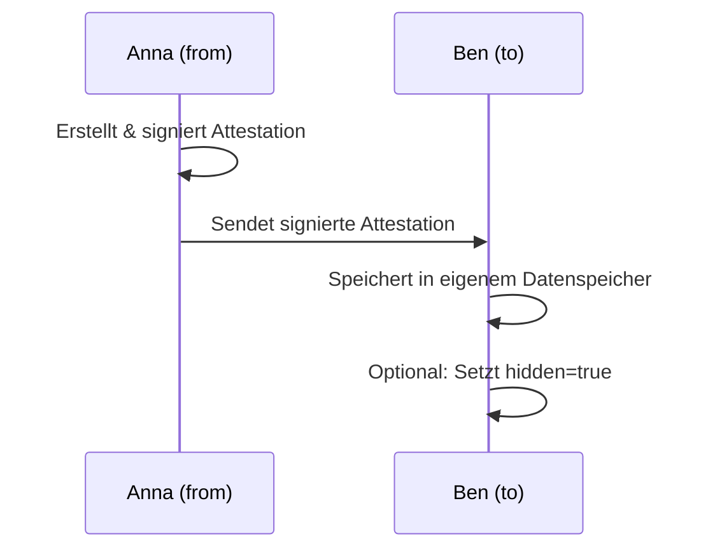
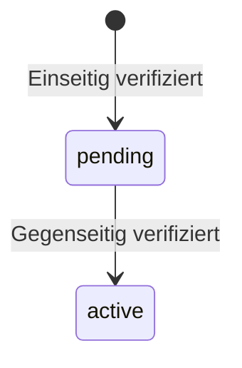
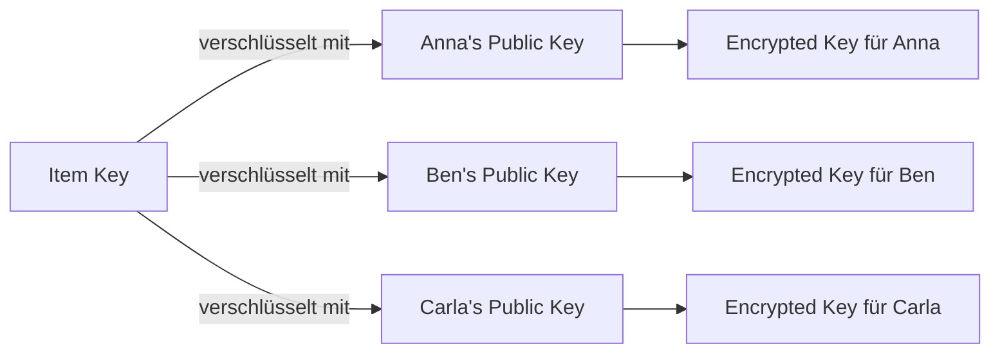
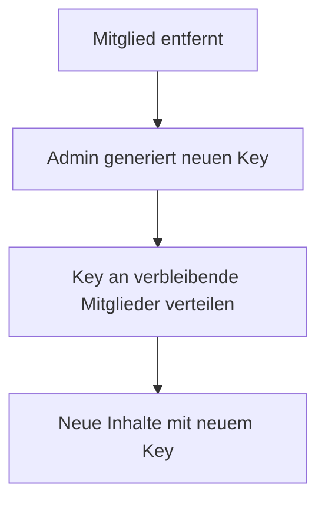
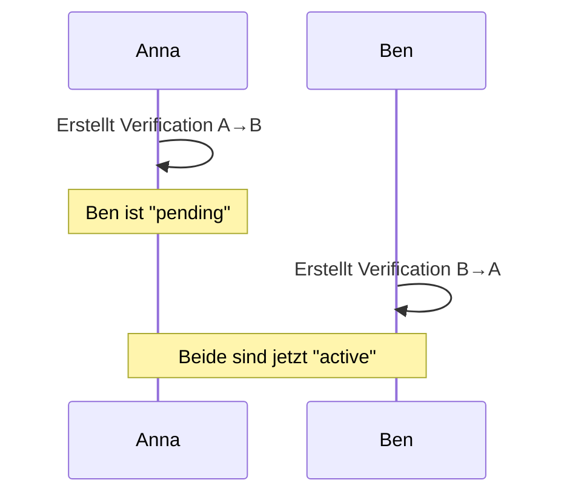
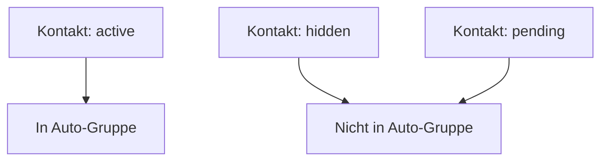
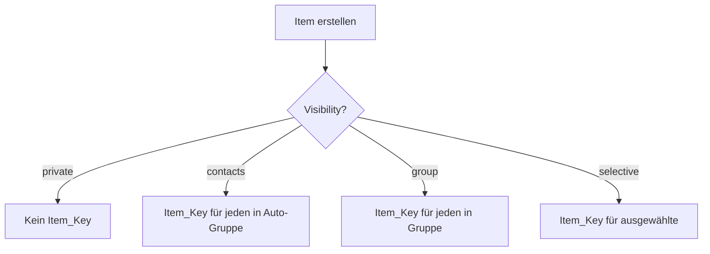

# Entitäten

> Vollständiges Datenmodell des Web of Trust

## ER-Diagramm (Übersicht)



---

## Empfänger-Prinzip

> **Kernprinzip:** Verifizierungen und Attestationen werden beim **Empfänger** (`to`) gespeichert, nicht beim Ersteller (`from`).

### Warum?

1. **Datenhoheit:** Der Empfänger kontrolliert, was über ihn veröffentlicht wird
2. **Keine Konflikte:** Jeder schreibt nur in seinen eigenen Datenspeicher
3. **Geschenk-Semantik:** Eine Attestation ist wie ein Geschenk – der Empfänger erhält sie

### Wie funktioniert es?



### Felder erklärt

| Feld | Bedeutung |
|------|-----------|
| `from` | Wer hat signiert? (Ersteller, besitzt Private Key) |
| `to` | Wer speichert? (Empfänger, kontrolliert Sichtbarkeit) |
| `proof` | Signatur von `from` – beweist Authentizität |
| `hidden` | Nur bei Attestation: Empfänger kann ausblenden |

### Was der Ersteller behält

Der Ersteller (`from`) speichert nur die **Public Keys** seiner Kontakte – für die E2E-Verschlüsselung. Die Verifizierungen und Attestationen selbst liegen beim Empfänger.

---

## Identity (Eigene Identität)

Die eigene digitale Identität des Nutzers. Existiert genau einmal pro Gerät/Installation.

### Schema

```json
{
  "did": "did:key:z6Mkf5rGMoatrSj1f4CyvuHBeXJELe9RPdzo2PKGNCKVtZxP",
  "publicKey": {
    "type": "Ed25519VerificationKey2020",
    "publicKeyMultibase": "z6Mkf5rGMoatrSj1f4CyvuHBeXJELe9RPdzo2PKGNCKVtZxP"
  },
  "name": "Anna Müller",
  "bio": "Aktiv im Gemeinschaftsgarten Sonnenberg",
  "photo": {
    "mimeType": "image/jpeg",
    "data": "base64..."
  },
  "createdAt": "2025-01-01T10:00:00Z",
  "updatedAt": "2025-01-08T12:00:00Z"
}
```

### Felder

| Feld | Typ | Required | Beschreibung |
|------|-----|----------|--------------|
| did | `did:key` | Ja | Dezentraler Identifier, abgeleitet vom Public Key |
| publicKey | Object | Ja | Ed25519 Public Key |
| privateKey | Bytes | Ja | Ed25519 Private Key (nur lokal, nie synchronisiert) |
| name | String | Ja | Anzeigename (1-100 Zeichen) |
| bio | String | Nein | Beschreibung (max 500 Zeichen) |
| photo | Object | Nein | Profilbild (max 1 MB, JPEG/PNG) |
| createdAt | DateTime | Ja | Erstellungszeitpunkt (ISO 8601) |
| updatedAt | DateTime | Ja | Letzter Änderungszeitpunkt |

### Invarianten

- `did` wird aus `publicKey` abgeleitet (deterministisch)
- `privateKey` verlässt niemals das Gerät
- `privateKey` kann nur über Recovery-Phrase wiederhergestellt werden

---

## Contact (Verifizierter Kontakt)

Ein anderer Nutzer, mit dem eine Verifizierung besteht.

### Schema

```json
{
  "did": "did:key:z6MkhaXgBZDvotDkL5257faiztiGiC2QtKLGpbnnEGta2doK",
  "publicKey": {
    "type": "Ed25519VerificationKey2020",
    "publicKeyMultibase": "z6MkhaXgBZDvotDkL5257faiztiGiC2QtKLGpbnnEGta2doK"
  },
  "name": "Ben Schmidt",
  "status": "active",
  "verifiedAt": "2025-01-05T10:05:00Z",
  "myVerification": "urn:uuid:550e8400-e29b-41d4-a716-446655440000",
  "theirVerification": "urn:uuid:6fa459ea-ee8a-3ca4-894e-db77e160355e"
}
```

### Status-Übergänge



| Status | Bedeutung |
|--------|-----------|
| `pending` | Nur eine Seite hat verifiziert |
| `active` | Gegenseitig verifiziert |

> **Hinweis:** Das Ausblenden von Kontakten erfolgt über die `excludedMembers`-Liste der Auto-Gruppe, nicht über den Kontakt-Status. Ein ausgeschlossener Kontakt bleibt `active`, ist aber nicht in der Auto-Gruppe.

---

## Verification (Verifizierung)

Eine kryptografisch signierte Aussage "Ich habe diese Person getroffen".

> **Hinweis:** Eine Verification ist strukturell eine spezielle Form von Attestation mit implizitem Claim "Ich habe diese Person getroffen". Sie wird jedoch separat behandelt, da sie den Kontakt-Status steuert (pending → active).

### Speicherort

Die Verification wird beim **Empfänger** (`to`) gespeichert:

- Anna erstellt Verification für Ben → wird bei **Ben** gespeichert
- Ben erstellt Verification für Anna → wird bei **Anna** gespeichert
- Beide sehen die jeweils empfangene Verification in ihrem Profil

### Schema

```json
{
  "id": "urn:uuid:550e8400-e29b-41d4-a716-446655440000",
  "type": "IdentityVerification",
  "from": "did:key:z6Mkf5rGMoatrSj1f4CyvuHBeXJELe9RPdzo2PKGNCKVtZxP",
  "to": "did:key:z6MkhaXgBZDvotDkL5257faiztiGiC2QtKLGpbnnEGta2doK",
  "timestamp": "2025-01-05T10:05:00Z",
  "proof": {
    "type": "Ed25519Signature2020",
    "verificationMethod": "did:key:z6Mkf5rGMoatrSj1f...",
    "proofValue": "z5vgFc..."
  }
}
```

### Felder

| Feld | Typ | Beschreibung |
|------|-----|--------------|
| `from` | `did:key` | Wer hat verifiziert (Signatur-Ersteller) |
| `to` | `did:key` | Wer wurde verifiziert (Speicherort) |
| `timestamp` | DateTime | Zeitpunkt der Verifizierung |
| `proof` | Object | Ed25519 Signatur von `from` |

### Eigenschaften

- **Unveränderlich:** Einmal erstellt, nie geändert
- **Unidirektional:** A→B und B→A sind separate Verifizierungen
- **Gegenseitigkeit:** Erst wenn beide existieren, ist der Kontakt "aktiv"
- **Immer sichtbar:** Kann nicht ausgeblendet werden (steuert Kontakt-Status)

---

## Attestation

Eine signierte Aussage über einen Kontakt.

### Speicherort

Die Attestation wird beim **Empfänger** (`to`) gespeichert:

- Anna schreibt Attestation für Ben → wird bei **Ben** gespeichert
- Ben kontrolliert die Sichtbarkeit (kann `hidden: true` setzen)
- Andere sehen Bens Attestationen, wenn sie sein Profil abrufen

### Schema

```json
{
  "id": "urn:uuid:789e0123-e89b-12d3-a456-426614174000",
  "type": "Attestation",
  "from": "did:key:z6Mkf5rGMoatrSj1f4CyvuHBeXJELe9RPdzo2PKGNCKVtZxP",
  "to": "did:key:z6MkhaXgBZDvotDkL5257faiztiGiC2QtKLGpbnnEGta2doK",
  "claim": "Hat 3 Stunden im Gemeinschaftsgarten geholfen",
  "tags": ["garten", "helfen", "gemeinschaft"],
  "createdAt": "2025-01-08T14:00:00Z",
  "hidden": false,
  "proof": {
    "type": "Ed25519Signature2020",
    "verificationMethod": "did:key:z6Mkf5rGMoatrSj1f...",
    "proofValue": "z3vFx..."
  }
}
```

### Felder

| Feld | Typ | Required | Beschreibung |
|------|-----|----------|--------------|
| `from` | `did:key` | Ja | Wer hat attestiert (Signatur-Ersteller) |
| `to` | `did:key` | Ja | Wer erhält die Attestation (Speicherort) |
| `claim` | String | Ja | Freitext-Aussage (5-500 Zeichen) |
| `tags` | Array | Nein | Schlagwörter (max 5) |
| `createdAt` | DateTime | Ja | Erstellungszeitpunkt |
| `hidden` | Boolean | Nein | Wenn true, nicht öffentlich sichtbar (Default: false) |
| `proof` | Object | Ja | Ed25519 Signatur von `from` |

### Sichtbarkeit

| `hidden` | Wer sieht die Attestation? |
|----------|----------------------------|
| `false` (Default) | Alle, die das Profil abrufen |
| `true` | Nur der Empfänger selbst |

> **Hinweis:** Der Empfänger kann eine Attestation ausblenden, aber nicht löschen. Die Signatur bleibt gültig.

### Regeln

| Regel | Beschreibung |
|-------|--------------|
| Nur für Kontakte | Attestation nur für verifizierte Kontakte möglich |
| Keine Selbst-Attestation | `from` und `to` müssen unterschiedlich sein |
| Unveränderlich | Claim, tags, proof können nie geändert werden |
| Ausblendbar | Nur `hidden` kann vom Empfänger geändert werden |
| Unabhängig von Status | Auch für ausgeblendete Kontakte erstellbar |

---

## Item (Content-Eintrag)

Ein Inhaltselement des Nutzers.

### Schema

```json
{
  "id": "urn:uuid:abc12345-e89b-12d3-a456-426614174000",
  "type": "CalendarItem",
  "title": "Gartentreffen",
  "encryptedContent": "base64...",
  "visibility": "contacts",
  "ownerDid": "did:key:z6Mkf5rGMoatrSj1f4CyvuHBeXJELe9RPdzo2PKGNCKVtZxP",
  "createdAt": "2025-01-08T10:00:00Z",
  "updatedAt": "2025-01-08T10:00:00Z",
  "deleted": false
}
```

### Item-Typen

| Typ | Beschreibung | Content-Struktur |
|-----|--------------|------------------|
| `CalendarItem` | Kalender-Eintrag | `{startDate, endDate?, location?, description}` |
| `MapItem` | Karten-Markierung | `{lat, lng, name, description?, category}` |
| `ProjectItem` | Projekt | `{description, status, tasks[]}` |
| `NoteItem` | Notiz | `{text}` |

### Sichtbarkeit

| Visibility | Bedeutung |
|------------|-----------|
| `private` | Nur für mich |
| `contacts` | Alle aktiven Kontakte (Auto-Gruppe) |
| `groups` | Eine oder mehrere Gruppen |
| `selective` | Ausgewählte Kontakte |

### Beispiel: Item für mehrere Gruppen

```json
{
  "id": "urn:uuid:abc12345-e89b-12d3-a456-426614174000",
  "type": "CalendarItem",
  "title": "Nachbarschaftsfest",
  "visibility": "groups",
  "groupDids": [
    "did:key:z6MkgYGF3thn8k1Fv4p4dWXKtsXCnLH7q9yw4QgNPULDmDKB",
    "did:key:z6MkpTHR8VNsBxYaaLLLLLLLLLLLLLLLLLLLLLLLLLLLL"
  ],
  "ownerDid": "did:key:z6Mkf5rGMoatrSj1f..."
}
```

Das Item ist für alle Mitglieder beider Gruppen sichtbar.

---

## Item_Key (Verschlüsselungsschlüssel)

Verschlüsselter Item-Key für einen Empfänger.

### Schema

```json
{
  "itemId": "urn:uuid:abc12345-e89b-12d3-a456-426614174000",
  "recipientDid": "did:key:z6MkhaXgBZDvotDkL5257faiztiGiC2QtKLGpbnnEGta2doK",
  "encryptedKey": "base64..."
}
```

### Funktionsweise



---

## Group (Explizite Gruppe)

Eine vom Nutzer erstellte Gruppe.

### Schema

```json
{
  "did": "did:key:z6MkgYGF3thn8k1Fv4p4dWXKtsXCnLH7q9yw4QgNPULDmDKB",
  "name": "Gemeinschaftsgarten Sonnenberg",
  "description": "Koordination des Gemeinschaftsgartens",
  "members": [
    "did:key:z6Mkf5rGMoatrSj1f...",
    "did:key:z6MkhaXgBZDvotDkL...",
    "did:key:z6MkpTHR8VNsBxYa..."
  ],
  "admins": [
    "did:key:z6Mkf5rGMoatrSj1f..."
  ],
  "createdAt": "2025-01-02T10:00:00Z"
}
```

### Rollen und Rechte

| Rolle | Beschreibung |
|-------|--------------|
| `member` | Normales Gruppenmitglied |
| `admin` | Gruppenmitglied mit Verwaltungsrechten |

### Aktionen und Berechtigungen

| Aktion | Member | Admin | Key-Operation |
|--------|--------|-------|---------------|
| Inhalte sehen | ✅ | ✅ | - |
| Inhalte erstellen | ✅ | ✅ | - |
| Gruppe verlassen | ✅ | ✅ | Key Rotation* |
| Mitglied einladen | ❌ | ✅ | Key verteilen |
| Mitglied entfernen | ❌ | ✅ | Key Rotation |
| Gruppe umbenennen | ❌ | ✅ | - |
| Anderen zum Admin machen | ❌ | ✅ | - |
| Modul aktivieren | ❌ | ✅ | - |
| Modul deaktivieren | ❌ | ✅ | - |

*Key Rotation beim Verlassen wird von einem Admin durchgeführt.

### Key Rotation

Wenn ein Mitglied entfernt wird oder die Gruppe verlässt:

1. Ein Admin generiert einen neuen Group Key
2. Der neue Key wird für alle verbleibenden Mitglieder verschlüsselt
3. Neue Inhalte werden mit dem neuen Key verschlüsselt
4. Das entfernte Mitglied kann alte Inhalte noch lesen, aber keine neuen



### Empfehlung: Mehrere Admins

Um das Risiko zu minimieren, dass eine Gruppe "verwaist" (alle Admins verlieren Zugang), wird empfohlen:

- Mindestens 2 Admins pro Gruppe
- UI zeigt Warnung bei nur einem Admin
- Bei Gruppen-Erstellung: Hinweis "Füge einen zweiten Admin hinzu"

> **Hinweis:** Ein alternatives Quorum-basiertes Modell ohne Admin-Rolle ist für eine spätere Phase konzipiert. Siehe [Quorum-Konzept](../anhang/quorum-konzept.md).

---

## Auto-Gruppe

Implizite Gruppe aller aktiven Kontakte.

### Konzept

```
┌─────────────────────────────────────────────────────────────┐
│                                                             │
│  Auto-Gruppe von Anna                                       │
│                                                             │
│  Aktive Mitglieder:                                         │
│  ├── Ben (active)                                           │
│  ├── Carla (active)                                         │
│  └── Tom (active)                                           │
│                                                             │
│  Ausgeschlossen:                                            │
│  └── Max (hidden)                                           │
│                                                             │
│  Automatisch aktualisiert bei Statusänderungen              │
│                                                             │
└─────────────────────────────────────────────────────────────┘
```

### Regeln

1. Jeder Nutzer hat genau eine Auto-Gruppe
2. Mitgliedschaft = Kontakt mit `status: active`
3. Updates passieren automatisch bei Statusänderungen
4. Kein explizites "Hinzufügen" - ergibt sich aus Verifizierung

---

## Beziehungen

### Verifizierung → Kontakt



### Kontakt → Auto-Gruppe



### Item → Item_Keys


