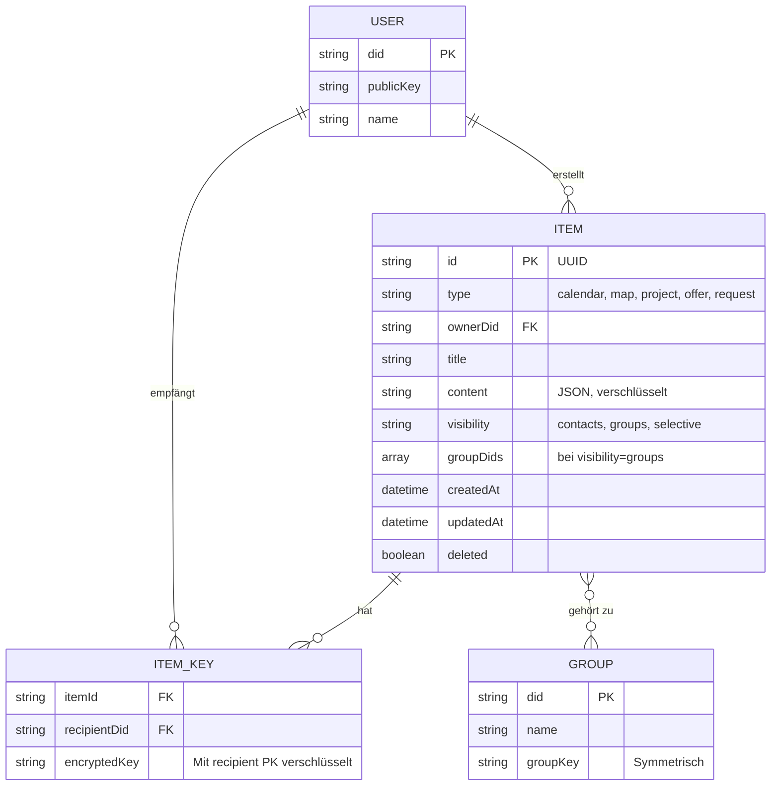
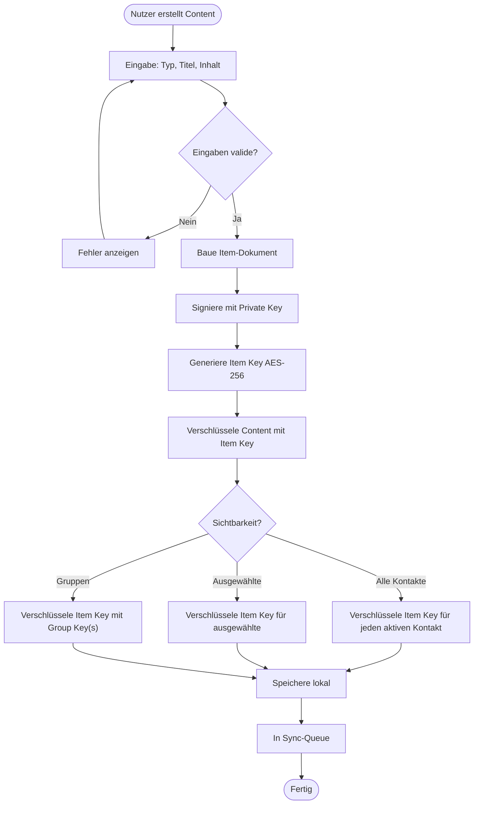
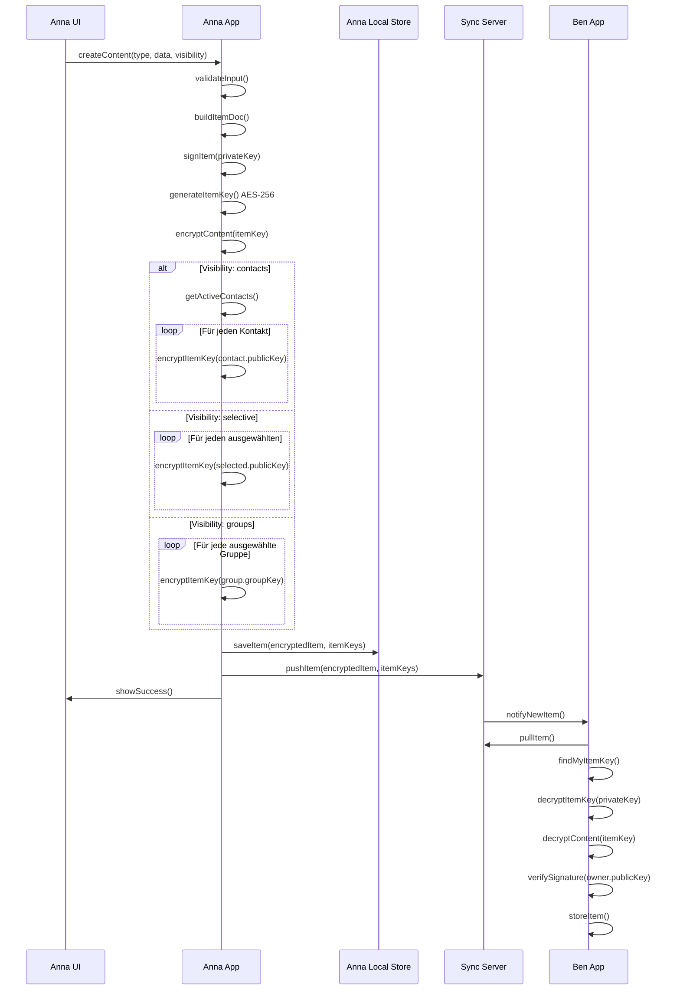
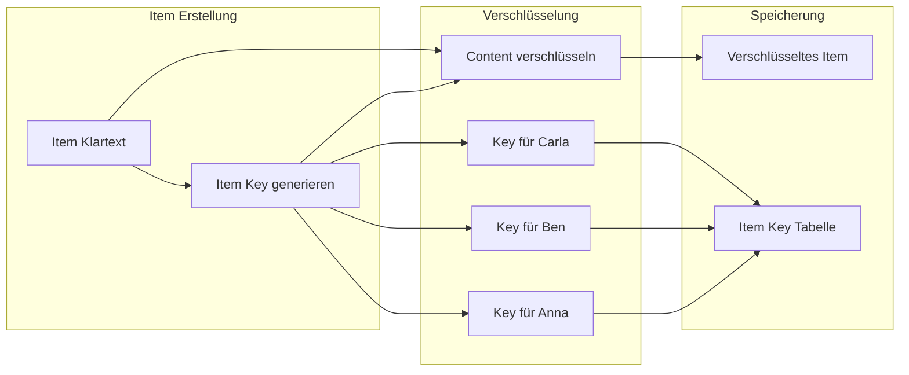
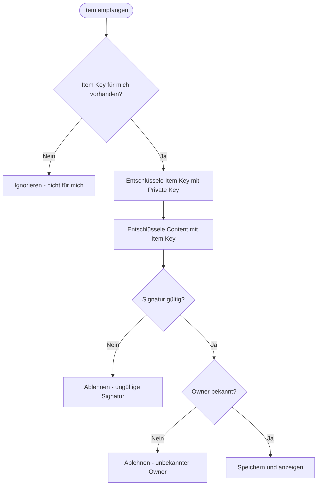
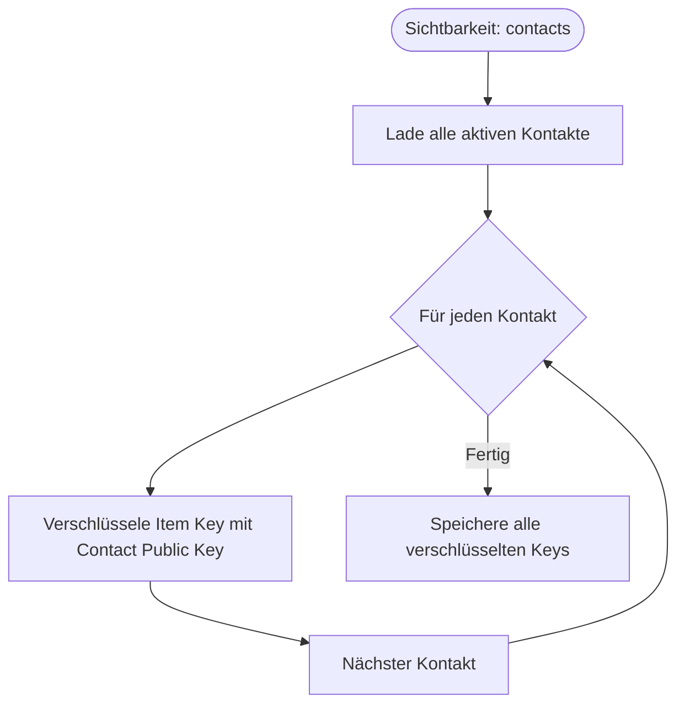
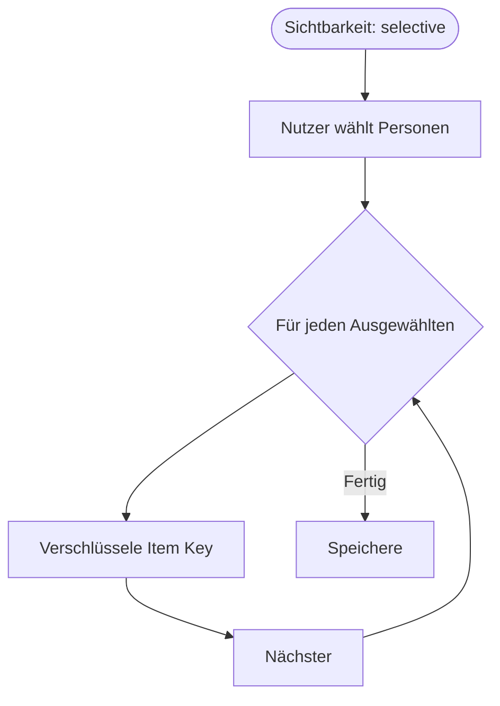
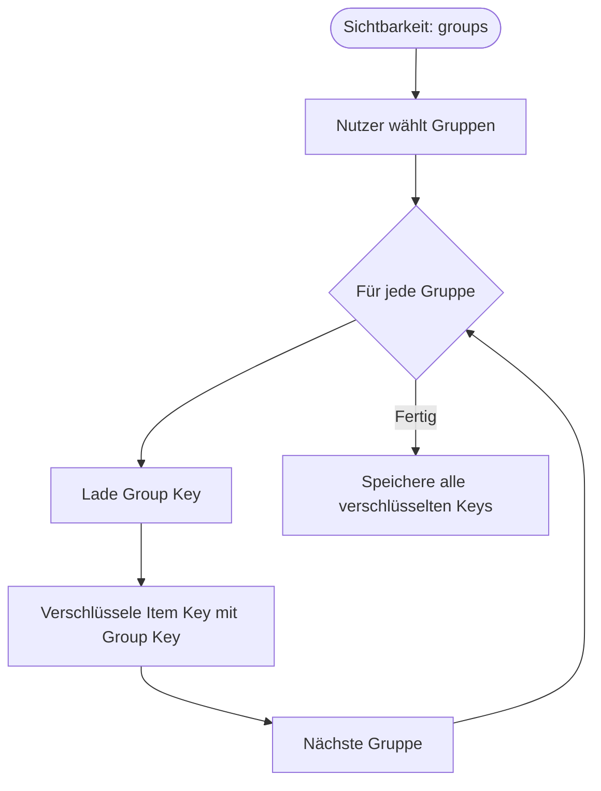
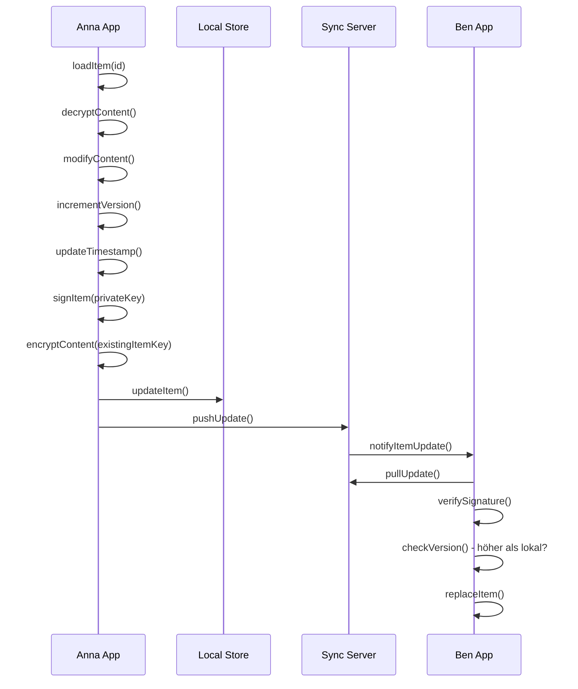
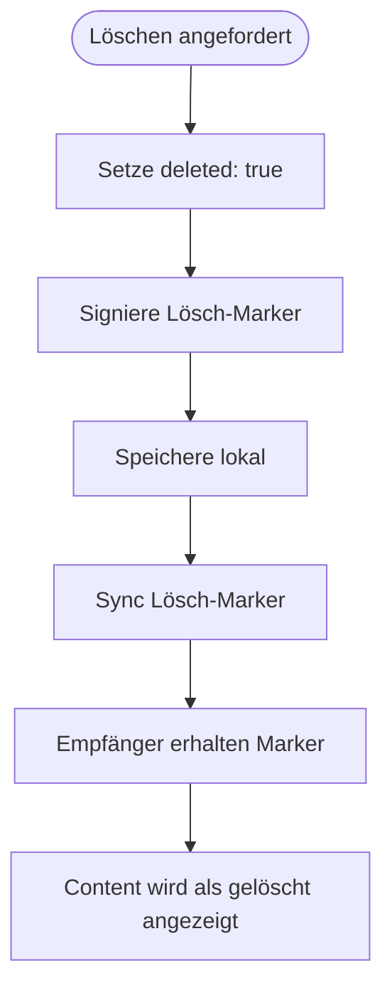

# Content-Flow (Technische Perspektive)

> Wie Content erstellt, verschlüsselt und verteilt wird

## Datenmodell



## Item-Dokument Struktur

### Kalender-Eintrag

```json
{
  "@context": "https://w3id.org/weboftrust/v1",
  "type": "CalendarItem",
  "id": "urn:uuid:550e8400-e29b-41d4-a716-446655440000",
  "owner": "did:key:anna123",
  "title": "Gartentreffen",
  "content": {
    "startDate": "2025-01-15T14:00:00Z",
    "endDate": "2025-01-15T17:00:00Z",
    "location": {
      "name": "Gemeinschaftsgarten Sonnenberg",
      "coordinates": [51.0504, 13.7373]
    },
    "description": "Wir bereiten die Beete für das Frühjahr vor."
  },
  "visibility": {
    "type": "contacts"
  },
  "createdAt": "2025-01-08T10:00:00Z",
  "updatedAt": "2025-01-08T10:00:00Z",
  "proof": {
    "type": "Ed25519Signature2020",
    "verificationMethod": "did:key:anna123#key-1",
    "proofValue": "z58DAdFfa9..."
  }
}
```

### Karten-Markierung

```json
{
  "@context": "https://w3id.org/weboftrust/v1",
  "type": "MapItem",
  "id": "urn:uuid:660e8400-e29b-41d4-a716-446655440001",
  "owner": "did:key:anna123",
  "title": "Werkzeugverleih",
  "content": {
    "coordinates": [51.0504, 13.7373],
    "category": "lending",
    "description": "Hier kann man sich Werkzeug ausleihen."
  },
  "visibility": {
    "type": "contacts"
  },
  "createdAt": "2025-01-08T10:00:00Z",
  "proof": { ... }
}
```

### Angebot / Gesuch

```json
{
  "@context": "https://w3id.org/weboftrust/v1",
  "type": "OfferItem",
  "id": "urn:uuid:770e8400-e29b-41d4-a716-446655440002",
  "owner": "did:key:ben456",
  "title": "Kann bei Umzug helfen",
  "content": {
    "category": "help",
    "description": "Habe ein Auto und kann schwere Sachen transportieren.",
    "availability": "Wochenenden"
  },
  "visibility": {
    "type": "contacts"
  },
  "createdAt": "2025-01-08T10:00:00Z",
  "proof": { ... }
}
```

---

## Hauptflow: Content erstellen



---

## Sequenzdiagramm: Content erstellen und verteilen



---

## Verschlüsselungsschema

### Item Key Verteilung



### Datenstruktur

```json
{
  "encryptedItem": {
    "id": "urn:uuid:550e8400...",
    "owner": "did:key:anna123",
    "ciphertext": "base64...",
    "nonce": "base64...",
    "proof": { ... }
  },
  "itemKeys": [
    {
      "recipientDid": "did:key:anna123",
      "encryptedKey": "base64..."
    },
    {
      "recipientDid": "did:key:ben456",
      "encryptedKey": "base64..."
    }
  ]
}
```

---

## Detailflow: Content empfangen



---

## Sichtbarkeits-Optionen

### Typ: contacts (Alle Kontakte)



**Bei neuem Kontakt:** Wenn Anna später einen neuen Kontakt verifiziert, werden alle Items mit `visibility: contacts` automatisch für diesen Kontakt neu verschlüsselt.

### Typ: selective (Ausgewählte)



**Bei neuem Kontakt:** Neue Kontakte sehen diesen Content NICHT automatisch.

### Typ: groups (Eine oder mehrere Gruppen)



**Multi-Gruppen:** Ein Item kann für mehrere Gruppen gleichzeitig freigegeben werden. Jede Gruppe erhält einen eigenen verschlüsselten Item Key.

**Effizienz:** Pro Gruppe nur eine Verschlüsselung nötig, egal wie viele Gruppenmitglieder.

---

## Content aktualisieren



### Versionierung

```json
{
  "id": "urn:uuid:550e8400...",
  "version": 3,
  "previousVersion": "hash-of-version-2",
  "updatedAt": "2025-01-08T15:00:00Z"
}
```

---

## Content löschen



### Lösch-Marker

```json
{
  "type": "ItemDeletion",
  "itemId": "urn:uuid:550e8400...",
  "deletedAt": "2025-01-08T16:00:00Z",
  "proof": {
    "type": "Ed25519Signature2020",
    "verificationMethod": "did:key:anna123#key-1",
    "proofValue": "z58DAdFfa9..."
  }
}
```

**Wichtig:** Der verschlüsselte Content wird nicht physisch gelöscht. Empfänger, die ihn bereits entschlüsselt haben, behalten eine lokale Kopie.

---

## Speicher-Schema

```sql
CREATE TABLE items (
    id TEXT PRIMARY KEY,
    type TEXT NOT NULL,
    owner_did TEXT NOT NULL,
    title TEXT,
    encrypted_content TEXT NOT NULL,
    nonce TEXT NOT NULL,
    visibility_type TEXT NOT NULL,
    visibility_target TEXT,
    version INTEGER DEFAULT 1,
    created_at DATETIME NOT NULL,
    updated_at DATETIME NOT NULL,
    deleted BOOLEAN DEFAULT FALSE,
    signature TEXT NOT NULL,
    raw_json TEXT NOT NULL
);

CREATE TABLE item_keys (
    item_id TEXT,
    recipient_did TEXT,
    encrypted_key TEXT NOT NULL,
    PRIMARY KEY (item_id, recipient_did)
);

CREATE INDEX idx_items_owner ON items(owner_did);
CREATE INDEX idx_items_type ON items(type);
CREATE INDEX idx_items_deleted ON items(deleted);
CREATE INDEX idx_item_keys_recipient ON item_keys(recipient_did);
```

---

## Abfragen

### Alle Items eines Typs

```javascript
const calendarItems = await db.items
  .where('type')
  .equals('CalendarItem')
  .and(item => !item.deleted)
  .toArray();
```

### Items für einen bestimmten Zeitraum

```javascript
const upcomingEvents = await db.items
  .where('type')
  .equals('CalendarItem')
  .filter(item => {
    const content = decryptContent(item);
    return new Date(content.startDate) > new Date();
  })
  .toArray();
```

### Items in der Nähe

```javascript
const nearbyItems = await db.items
  .where('type')
  .equals('MapItem')
  .filter(item => {
    const content = decryptContent(item);
    return calculateDistance(myLocation, content.coordinates) < 1000;
  })
  .toArray();
```

---

## Benachrichtigungen

### Benachrichtigungs-Typen

```json
{
  "type": "item_created",
  "itemId": "urn:uuid:550e8400...",
  "itemType": "CalendarItem",
  "ownerDid": "did:key:anna123",
  "ownerName": "Anna Müller",
  "title": "Gartentreffen",
  "createdAt": "2025-01-08T10:00:00Z"
}
```

```json
{
  "type": "item_updated",
  "itemId": "urn:uuid:550e8400...",
  "changes": ["title", "content.startDate"],
  "updatedAt": "2025-01-08T15:00:00Z"
}
```

```json
{
  "type": "item_deleted",
  "itemId": "urn:uuid:550e8400...",
  "deletedAt": "2025-01-08T16:00:00Z"
}
```

---

## Sicherheitsüberlegungen

### Validierung

| Prüfung | Beschreibung |
| ------- | ------------ |
| Signatur | Item muss vom angegebenen Owner signiert sein |
| Owner | Owner muss ein bekannter Kontakt sein |
| Version | Update-Version muss höher sein als lokale |
| Lösch-Berechtigung | Nur Owner kann löschen |

### Angriffsvektoren

| Angriff | Schutz |
| ------- | ------ |
| Gefälschtes Item | Signatur-Prüfung |
| Replay alter Version | Versions-Check |
| Unbefugtes Löschen | Nur signierte Lösch-Marker akzeptieren |
| Metadaten-Leak | Auch Metadaten sind verschlüsselt |
