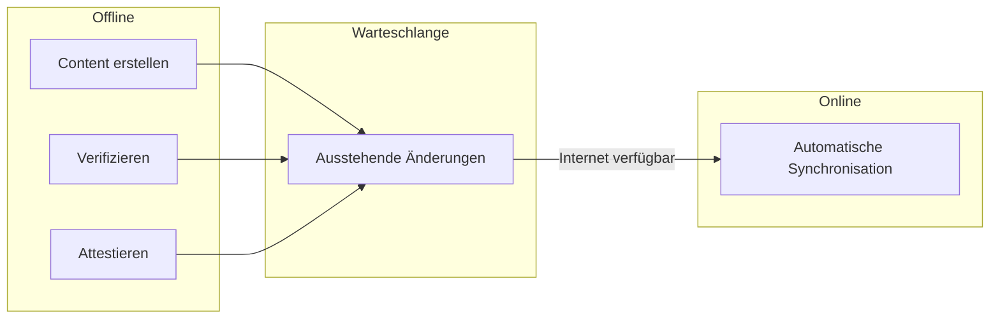
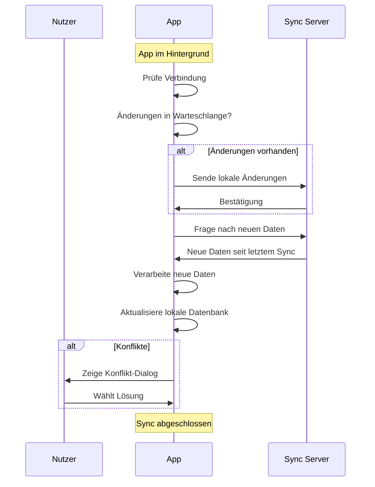
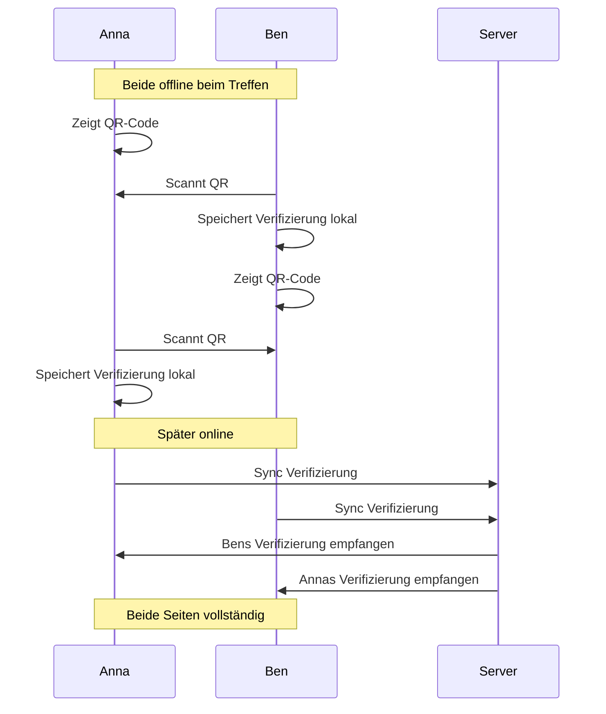
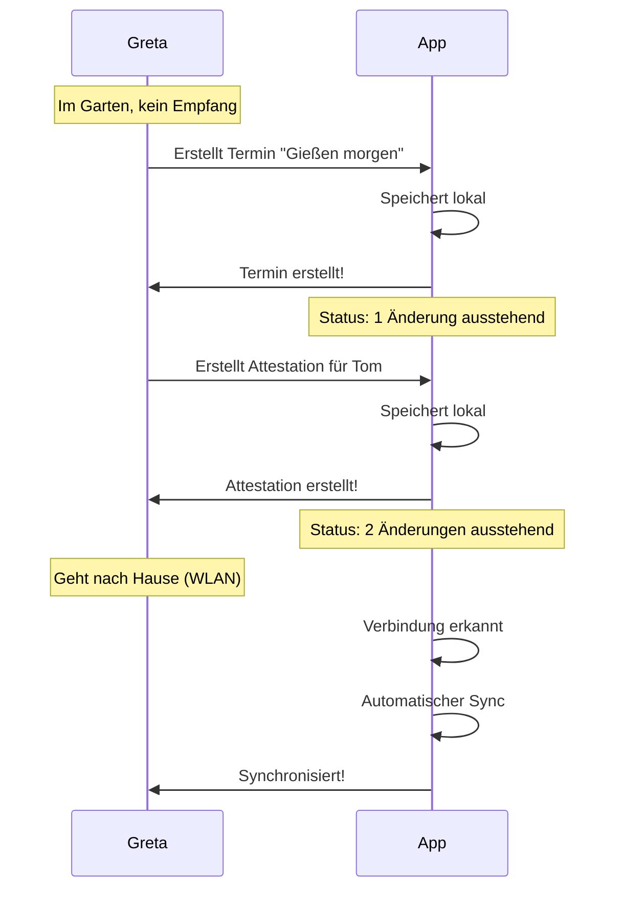
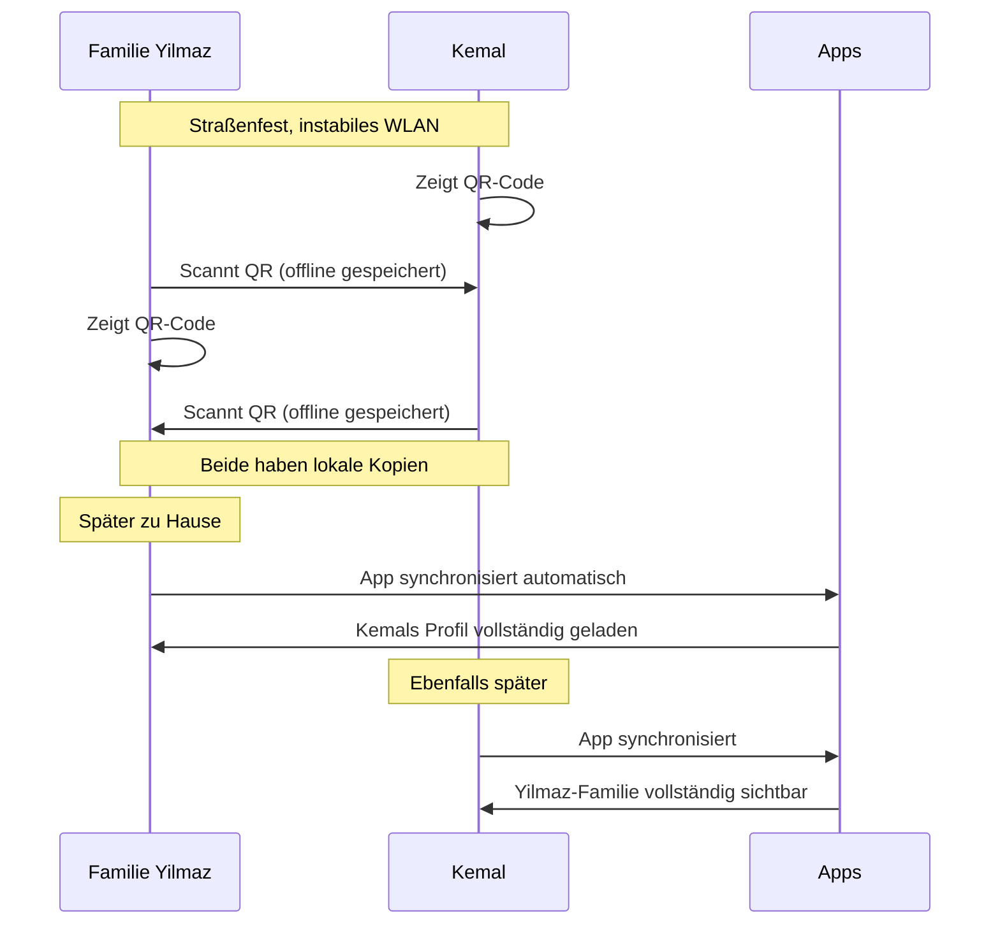
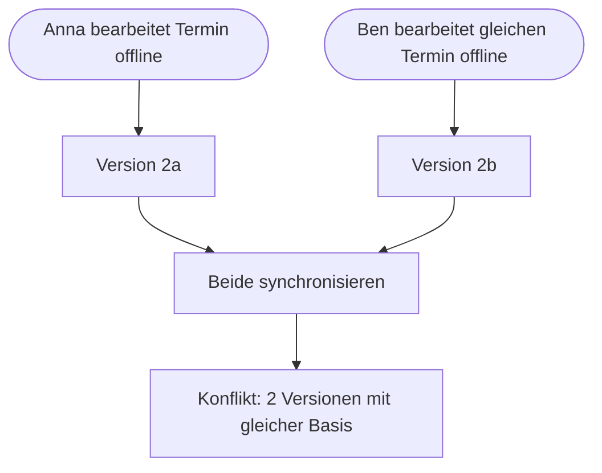
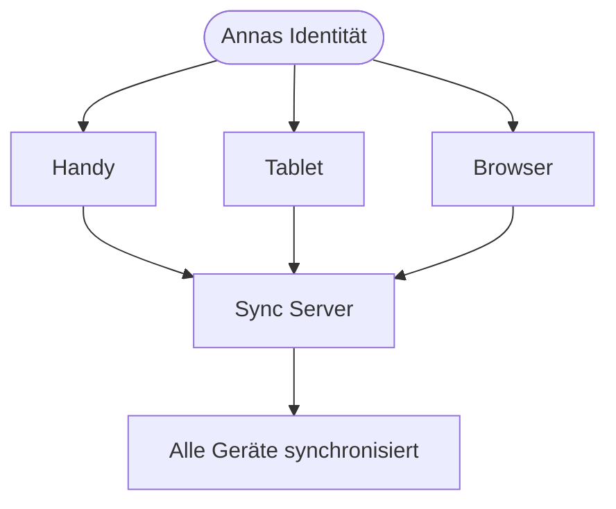

# Sync-Flow (Nutzer-Perspektive)

> Wie Daten zwischen Geräten synchronisiert werden

## Grundprinzip

Das Web of Trust funktioniert **offline-first**: Du kannst die App jederzeit nutzen, auch ohne Internet. Sobald eine Verbindung besteht, werden Änderungen automatisch synchronisiert.



---

## Was der Nutzer sieht

### Sync-Status in der App

```
┌─────────────────────────────────┐
│  ☁️ Synchronisation             │
├─────────────────────────────────┤
│                                 │
│  Status: ✅ Synchronisiert      │
│                                 │
│  Letzte Sync: vor 2 Minuten     │
│                                 │
│  Ausstehend: 0 Änderungen       │
│                                 │
└─────────────────────────────────┘
```

### Offline-Modus

```
┌─────────────────────────────────┐
│  📴 Offline                     │
├─────────────────────────────────┤
│                                 │
│  Du bist offline.               │
│  Die App funktioniert normal.   │
│                                 │
│  ━━━━━━━━━━━━━━━━━━━━━━━━━━━    │
│                                 │
│  Ausstehende Änderungen: 3      │
│                                 │
│  • 1 Kalender-Eintrag           │
│  • 1 Verifizierung              │
│  • 1 Attestation                │
│                                 │
│  Wird synchronisiert sobald     │
│  du wieder online bist.         │
│                                 │
└─────────────────────────────────┘
```

### Sync läuft

```
┌─────────────────────────────────┐
│  🔄 Synchronisiere...           │
├─────────────────────────────────┤
│                                 │
│  ████████████░░░░░░░ 60%        │
│                                 │
│  Sende: 3 Änderungen            │
│  Empfange: 12 neue Einträge     │
│                                 │
└─────────────────────────────────┘
```

### Sync-Konflikt

```
┌─────────────────────────────────┐
│  ⚠️ Konflikt                    │
├─────────────────────────────────┤
│                                 │
│  Der Termin "Gartentreffen"     │
│  wurde von dir und Anna         │
│  gleichzeitig bearbeitet.       │
│                                 │
│  Deine Version:                 │
│  "Sa, 15.01. 14:00"             │
│                                 │
│  Annas Version:                 │
│  "Sa, 15.01. 15:00"             │
│                                 │
│  ━━━━━━━━━━━━━━━━━━━━━━━━━━━    │
│                                 │
│  [ Meine behalten ]             │
│                                 │
│  [ Annas übernehmen ]           │
│                                 │
│  [ Beide behalten ]             │
│                                 │
└─────────────────────────────────┘
```

---

## Hauptflow: Automatische Synchronisation



---

## Offline-Nutzung

### Was offline funktioniert

| Aktion | Offline möglich? |
| ------ | ---------------- |
| Content ansehen | ✅ Ja (lokal gespeichert) |
| Content erstellen | ✅ Ja (wird später synchronisiert) |
| Content bearbeiten | ✅ Ja |
| Verifizierung per QR | ✅ Ja (lokal gespeichert) |
| Attestation erstellen | ✅ Ja |
| Neue Kontakte sehen | ❌ Nein (noch nicht synchronisiert) |
| Profil-Updates sehen | ❌ Nein |

### Offline-Verifizierung



---

## Personas

### Greta im Garten (schlechter Empfang)



### Familie Yilmaz auf dem Straßenfest



---

## Konflikte

### Wann entstehen Konflikte?



### Automatische Konfliktauflösung

Die meisten Konflikte werden automatisch gelöst:

| Situation | Lösung |
| --------- | ------ |
| Gleiches Feld, gleicher Wert | Kein Konflikt |
| Verschiedene Felder geändert | Beide Änderungen übernehmen |
| Neuere Version überschreibt | Last-Write-Wins |

### Manuelle Konfliktauflösung

Bei echten Konflikten (gleiches Feld, verschiedene Werte) wird der Nutzer gefragt:

```
┌─────────────────────────────────┐
│                                 │
│  Welche Version behalten?       │
│                                 │
│  ┌─────────────────────────┐    │
│  │ Deine Version           │    │
│  │ Bearbeitet: vor 10 Min  │    │
│  │ "Treffpunkt: Parkplatz" │    │
│  └─────────────────────────┘    │
│                                 │
│  ┌─────────────────────────┐    │
│  │ Annas Version           │    │
│  │ Bearbeitet: vor 5 Min   │    │
│  │ "Treffpunkt: Eingang"   │    │
│  └─────────────────────────┘    │
│                                 │
└─────────────────────────────────┘
```

---

## Einstellungen

### Sync-Einstellungen

```
┌─────────────────────────────────┐
│  ⚙️ Synchronisation             │
├─────────────────────────────────┤
│                                 │
│  Automatisch synchronisieren    │
│  [===========○] An              │
│                                 │
│  Nur über WLAN                  │
│  [○===========] Aus             │
│                                 │
│  ━━━━━━━━━━━━━━━━━━━━━━━━━━━    │
│                                 │
│  [ Jetzt synchronisieren ]      │
│                                 │
│  Letzte Sync: vor 5 Minuten     │
│                                 │
└─────────────────────────────────┘
```

---

## Multi-Device

### Gleiche Identität auf mehreren Geräten



### Neues Gerät hinzufügen

```
┌─────────────────────────────────┐
│                                 │
│  📱 Neues Gerät                 │
│                                 │
├─────────────────────────────────┤
│                                 │
│  Um deine Identität auf         │
│  diesem Gerät zu nutzen,        │
│  gib deine Recovery-Phrase      │
│  ein.                           │
│                                 │
│  ┌─────────────────────────┐    │
│  │ 1. apple                │    │
│  │ 2. banana               │    │
│  │ 3. cherry               │    │
│  │ ...                     │    │
│  └─────────────────────────┘    │
│                                 │
│  [ Wiederherstellen ]           │
│                                 │
└─────────────────────────────────┘
```

---

## Datenvolumen

### Was wird synchronisiert?

| Daten | Größe (typisch) |
| ----- | --------------- |
| Profil | 1-5 KB |
| Verifizierung | < 1 KB |
| Attestation | 1-2 KB |
| Kalender-Eintrag | 1-3 KB |
| Karten-Markierung | 1-2 KB |
| Foto (komprimiert) | 50-200 KB |

### Typisches Datenvolumen

| Szenario | Monatlich |
| -------- | --------- |
| Wenig aktiv (10 Kontakte) | 1-5 MB |
| Aktiv (50 Kontakte) | 10-30 MB |
| Sehr aktiv (100+ Kontakte) | 50-100 MB |

---

## Fehlerbehebung

### Sync funktioniert nicht

```
┌─────────────────────────────────┐
│  ❌ Sync fehlgeschlagen         │
├─────────────────────────────────┤
│                                 │
│  Mögliche Ursachen:             │
│                                 │
│  • Keine Internetverbindung     │
│  • Server nicht erreichbar      │
│  • App-Update erforderlich      │
│                                 │
│  ━━━━━━━━━━━━━━━━━━━━━━━━━━━    │
│                                 │
│  [ Erneut versuchen ]           │
│                                 │
│  [ Offline weiterarbeiten ]     │
│                                 │
└─────────────────────────────────┘
```

### Daten zurücksetzen

Falls die lokale Datenbank korrupt ist:

```
┌─────────────────────────────────┐
│  🔄 Daten neu laden             │
├─────────────────────────────────┤
│                                 │
│  ⚠️ Alle lokalen Daten werden   │
│  gelöscht und vom Server neu    │
│  geladen.                       │
│                                 │
│  Deine Identität bleibt         │
│  erhalten.                      │
│                                 │
│  [ Abbrechen ]                  │
│                                 │
│  [ Daten neu laden ]            │
│                                 │
└─────────────────────────────────┘
```
