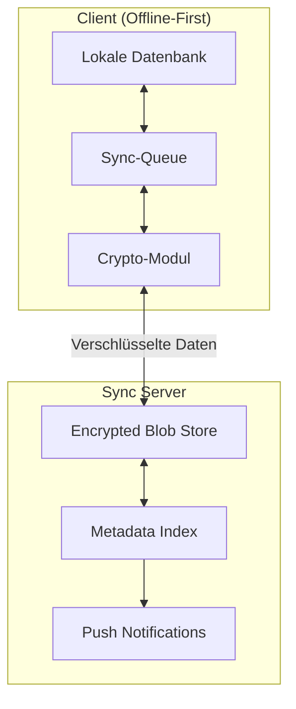
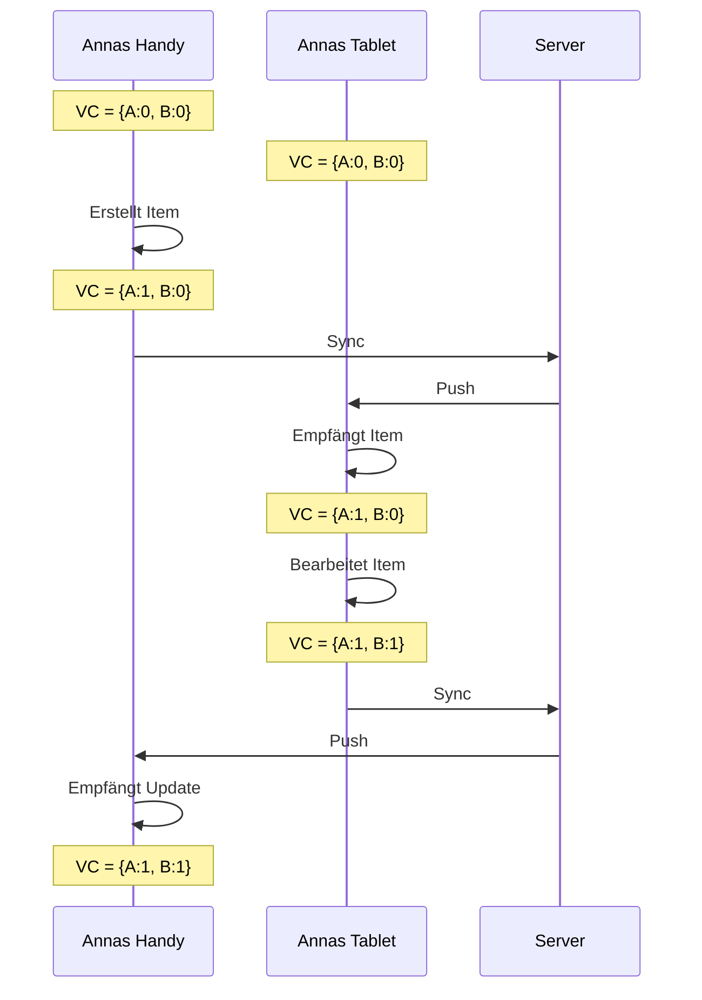
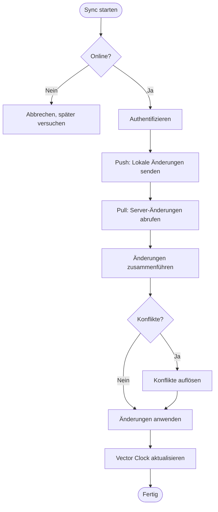
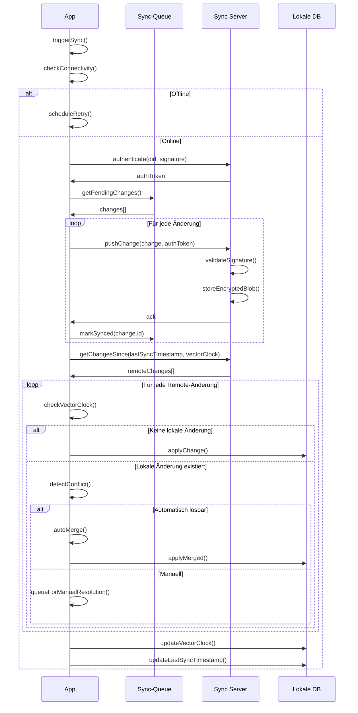
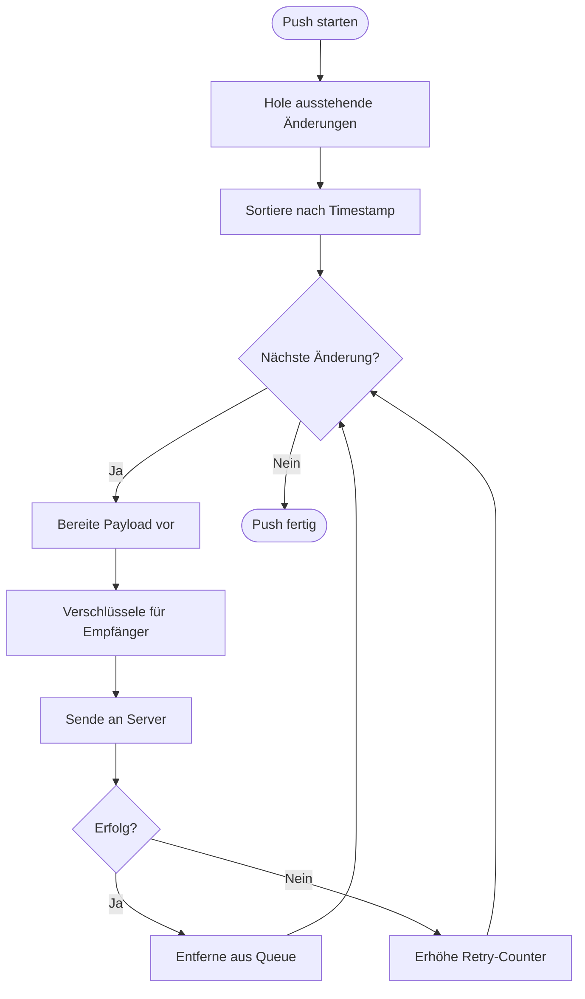
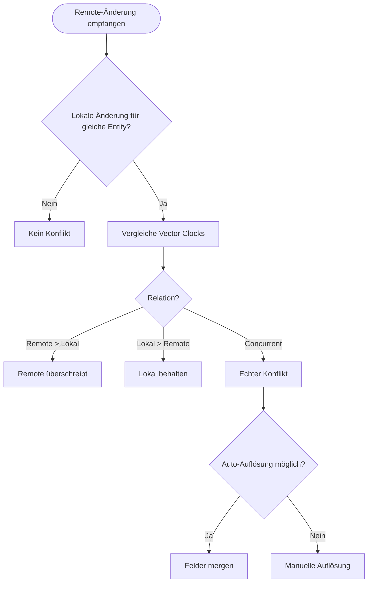
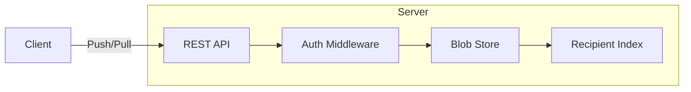
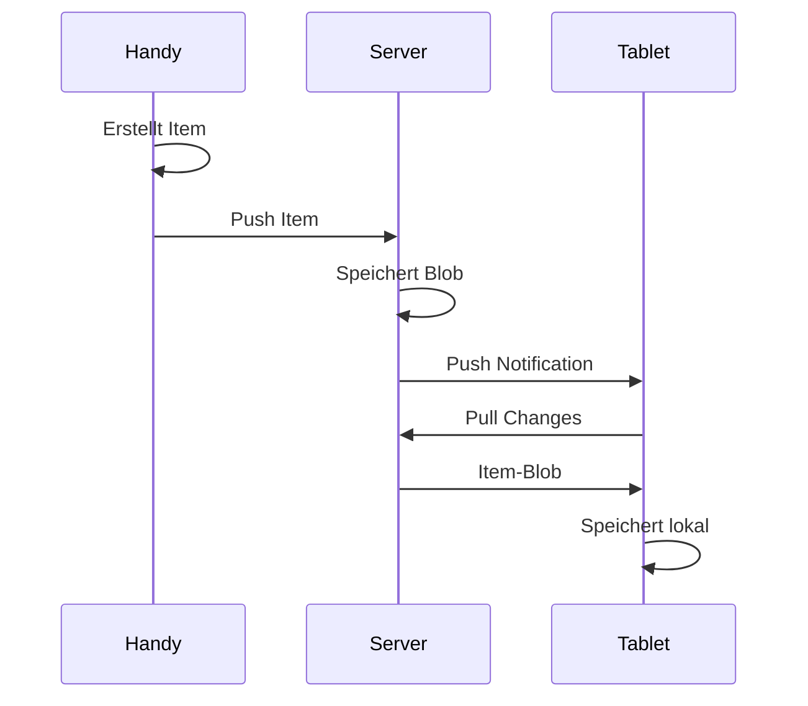
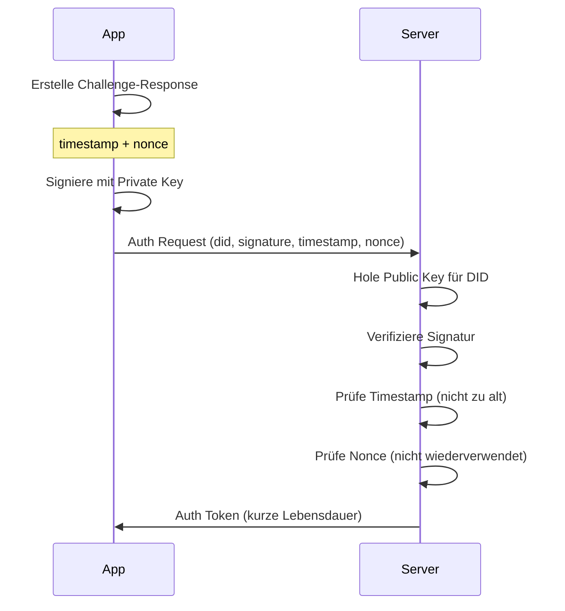

# Sync-Flow (Technische Perspektive)

> Wie Daten zwischen Geräten und Server synchronisiert werden

## Architektur-Überblick



**Wichtig:** Der Server speichert nur verschlüsselte Blobs. Er kann den Inhalt nicht lesen.

---

## Datenmodell

### Sync-Eintrag

```json
{
  "id": "urn:uuid:550e8400...",
  "type": "item",
  "operation": "create",
  "timestamp": "2025-01-08T10:00:00Z",
  "vectorClock": {
    "did:wot:anna123": 42,
    "did:wot:ben456": 17
  },
  "payload": {
    "encrypted": "base64...",
    "recipients": ["did:wot:anna123", "did:wot:ben456"]
  }
}
```

### Vector Clock

Jedes Gerät führt einen Zähler. Bei jeder Änderung wird der eigene Zähler erhöht.



---

## Hauptflow: Synchronisation



---

## Sequenzdiagramm: Vollständiger Sync



---

## Push: Lokale Änderungen senden

### Sync-Queue Struktur

```sql
CREATE TABLE sync_queue (
    id TEXT PRIMARY KEY,
    entity_type TEXT NOT NULL,
    entity_id TEXT NOT NULL,
    operation TEXT NOT NULL,
    payload TEXT NOT NULL,
    created_at DATETIME NOT NULL,
    retry_count INTEGER DEFAULT 0,
    last_error TEXT
);

CREATE INDEX idx_sync_queue_created ON sync_queue(created_at);
```

### Push-Algorithmus



---

## Pull: Server-Änderungen abrufen

### Pull-Request

```json
{
  "type": "pull",
  "since": "2025-01-08T09:00:00Z",
  "vectorClock": {
    "did:wot:anna123": 42,
    "did:wot:ben456": 17
  },
  "limit": 100
}
```

### Pull-Response

```json
{
  "changes": [
    {
      "id": "urn:uuid:...",
      "type": "item",
      "operation": "create",
      "timestamp": "2025-01-08T10:00:00Z",
      "vectorClock": { ... },
      "payload": { ... }
    }
  ],
  "hasMore": false,
  "serverTime": "2025-01-08T10:05:00Z"
}
```

---

## Konfliktauflösung

### Konflikterkennung



### Vector Clock Vergleich

```javascript
function compareVectorClocks(vc1, vc2) {
  let vc1Greater = false;
  let vc2Greater = false;

  const allKeys = new Set([...Object.keys(vc1), ...Object.keys(vc2)]);

  for (const key of allKeys) {
    const v1 = vc1[key] || 0;
    const v2 = vc2[key] || 0;

    if (v1 > v2) vc1Greater = true;
    if (v2 > v1) vc2Greater = true;
  }

  if (vc1Greater && !vc2Greater) return 'vc1_greater';
  if (vc2Greater && !vc1Greater) return 'vc2_greater';
  if (vc1Greater && vc2Greater) return 'concurrent';
  return 'equal';
}
```

### Auto-Merge Strategien

| Situation | Strategie |
| --------- | --------- |
| Verschiedene Felder geändert | Beide Änderungen übernehmen |
| Gleiches Feld, gleicher Wert | Kein Konflikt |
| Nur eines hat Wert (null vs. value) | Non-null gewinnt |
| Last-Write-Wins (konfigurierbar) | Neuerer Timestamp gewinnt |

### Manueller Konflikt

```json
{
  "type": "conflict",
  "entityType": "item",
  "entityId": "urn:uuid:...",
  "localVersion": {
    "vectorClock": { ... },
    "data": { ... }
  },
  "remoteVersion": {
    "vectorClock": { ... },
    "data": { ... }
  },
  "conflictingFields": ["content.description", "content.startDate"]
}
```

---

## Server-Architektur

### Blob Store



### Server sieht nur

| Sichtbar | Nicht sichtbar |
| -------- | -------------- |
| Verschlüsselte Blobs | Klartext-Inhalt |
| Empfänger-DIDs | Beziehungen zwischen Nutzern |
| Timestamps | Was geteilt wird |
| Blob-Größe | Wer was mit wem |

### API-Endpunkte

```
POST   /sync/push          - Änderung hochladen
GET    /sync/pull          - Änderungen abrufen
POST   /sync/ack           - Empfang bestätigen
GET    /sync/status        - Sync-Status abrufen
DELETE /sync/blob/:id      - Blob löschen (nur Owner)
```

---

## Multi-Device Sync

### Geräteverwaltung

```json
{
  "did": "did:wot:anna123",
  "devices": [
    {
      "id": "device-1",
      "name": "Annas iPhone",
      "lastSeen": "2025-01-08T10:00:00Z",
      "vectorClock": { ... }
    },
    {
      "id": "device-2",
      "name": "Annas iPad",
      "lastSeen": "2025-01-07T18:00:00Z",
      "vectorClock": { ... }
    }
  ]
}
```

### Sync zwischen eigenen Geräten



---

## Offline-Handling

### Retry-Strategie

```javascript
const retryDelays = [
  1000,      // 1 Sekunde
  5000,      // 5 Sekunden
  30000,     // 30 Sekunden
  60000,     // 1 Minute
  300000,    // 5 Minuten
  900000,    // 15 Minuten
  3600000    // 1 Stunde (max)
];

function getRetryDelay(retryCount) {
  const index = Math.min(retryCount, retryDelays.length - 1);
  return retryDelays[index];
}
```

### Connectivity Detection

```javascript
// Browser
navigator.onLine;
window.addEventListener('online', handleOnline);
window.addEventListener('offline', handleOffline);

// Native Apps
NetInfo.addEventListener(state => {
  if (state.isConnected) {
    triggerSync();
  }
});
```

---

## Speicher-Schema

```sql
CREATE TABLE sync_state (
    key TEXT PRIMARY KEY,
    value TEXT NOT NULL
);

-- Speichert: lastSyncTimestamp, vectorClock, deviceId

CREATE TABLE sync_queue (
    id TEXT PRIMARY KEY,
    entity_type TEXT NOT NULL,
    entity_id TEXT NOT NULL,
    operation TEXT NOT NULL,
    payload TEXT NOT NULL,
    vector_clock TEXT NOT NULL,
    created_at DATETIME NOT NULL,
    synced_at DATETIME,
    retry_count INTEGER DEFAULT 0,
    last_error TEXT
);

CREATE TABLE sync_conflicts (
    id TEXT PRIMARY KEY,
    entity_type TEXT NOT NULL,
    entity_id TEXT NOT NULL,
    local_version TEXT NOT NULL,
    remote_version TEXT NOT NULL,
    conflicting_fields TEXT NOT NULL,
    created_at DATETIME NOT NULL,
    resolved_at DATETIME,
    resolution TEXT
);
```

---

## Sicherheitsüberlegungen

### Authentifizierung



### Angriffsvektoren

| Angriff | Schutz |
| ------- | ------ |
| Replay-Attacke | Nonces + Timestamp-Prüfung |
| Man-in-the-Middle | TLS + E2E-Verschlüsselung |
| Server-Kompromittierung | Nur verschlüsselte Blobs |
| Denial of Service | Rate Limiting |
| Metadata-Analyse | Recipient-DIDs sind öffentlich |

### Rate Limiting

| Aktion | Limit |
| ------ | ----- |
| Push | 100 Änderungen / Minute |
| Pull | 10 Requests / Minute |
| Auth | 5 Versuche / Minute |

---

## Performance-Optimierungen

### Delta-Sync

Statt ganzer Objekte nur Änderungen senden:

```json
{
  "type": "delta",
  "entityId": "urn:uuid:...",
  "baseVersion": 3,
  "changes": [
    { "op": "replace", "path": "/content/title", "value": "Neuer Titel" }
  ]
}
```

### Batching

Mehrere Änderungen in einem Request:

```json
{
  "type": "batch",
  "changes": [
    { "id": "...", "operation": "create", ... },
    { "id": "...", "operation": "update", ... },
    { "id": "...", "operation": "delete", ... }
  ]
}
```

### Compression

- Gzip für HTTP-Transport
- Deduplizierung auf Server-Seite
