# Recovery-Flow (Technische Perspektive)

> Wie eine Identität aus der Recovery-Phrase wiederhergestellt wird

## Übersicht

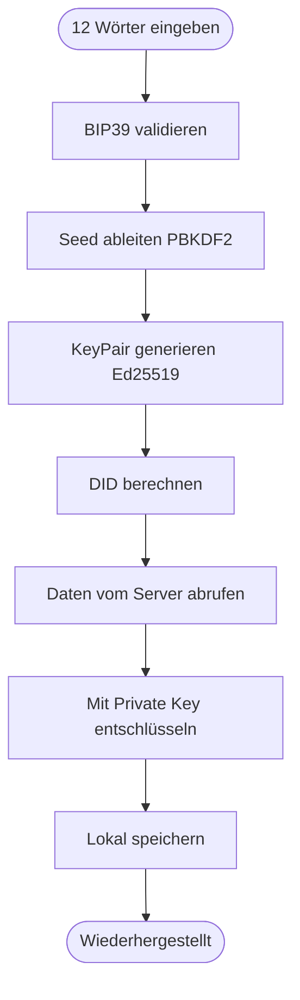

---

## Hauptflow: Recovery

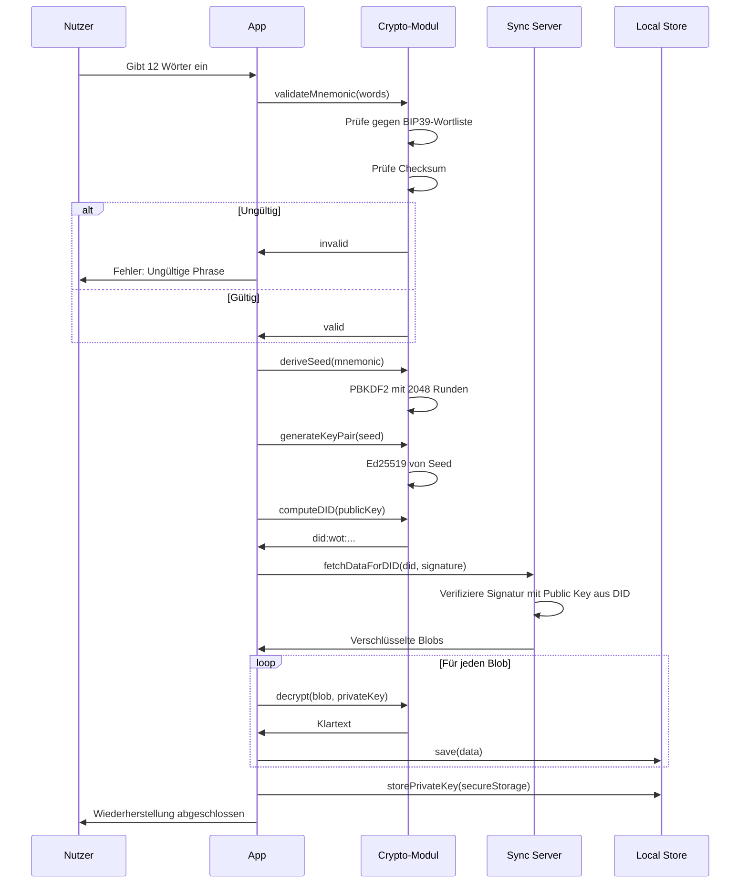

---

## Schritt 1: Mnemonic validieren

### BIP39-Validierung

```javascript
function validateMnemonic(words) {
  // 1. Prüfe Anzahl
  if (words.length !== 12) {
    return { valid: false, error: 'Genau 12 Wörter erforderlich' };
  }

  // 2. Prüfe ob alle Wörter in BIP39-Liste
  const wordlist = getBIP39Wordlist('english');
  for (const word of words) {
    if (!wordlist.includes(word.toLowerCase())) {
      return { valid: false, error: `Unbekanntes Wort: ${word}` };
    }
  }

  // 3. Prüfe Checksum
  const entropy = mnemonicToEntropy(words);
  const checksumBits = calculateChecksum(entropy);
  const expectedChecksum = extractChecksumFromMnemonic(words);

  if (checksumBits !== expectedChecksum) {
    return { valid: false, error: 'Checksum ungültig' };
  }

  return { valid: true };
}
```

### Checksum-Berechnung

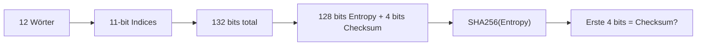

---

## Schritt 2: Schlüssel ableiten

### Von Mnemonic zu KeyPair

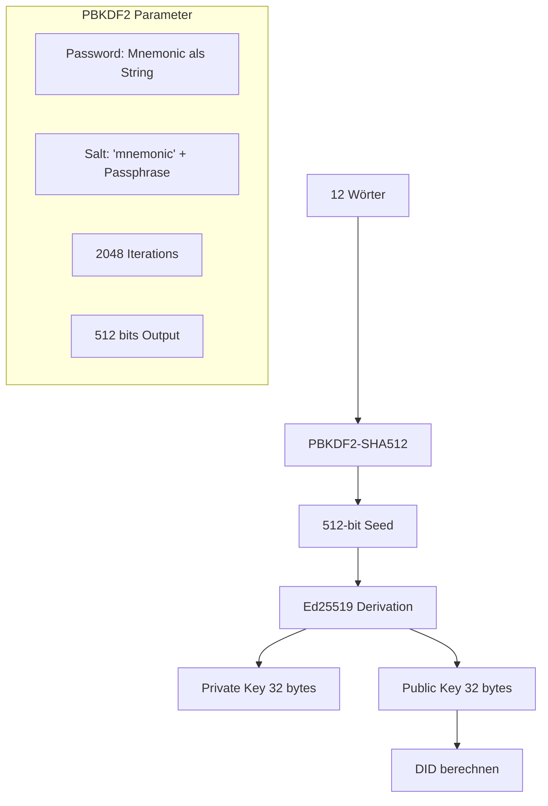

### Code-Beispiel

```javascript
async function recoverKeyPair(mnemonic) {
  // 1. Mnemonic zu Seed
  const mnemonicString = mnemonic.join(' ');
  const salt = 'mnemonic'; // Keine zusätzliche Passphrase

  const seed = await pbkdf2(
    mnemonicString,
    salt,
    2048,           // Iterations
    64,             // Key length in bytes (512 bits)
    'sha512'
  );

  // 2. Seed zu Ed25519 KeyPair
  const privateKey = seed.slice(0, 32);
  const publicKey = ed25519.getPublicKey(privateKey);

  // 3. DID berechnen
  const publicKeyHash = sha256(publicKey);
  const didSuffix = base58.encode(publicKeyHash.slice(0, 16));
  const did = `did:wot:${didSuffix}`;

  return { privateKey, publicKey, did };
}
```

---

## Schritt 3: Daten abrufen

### Authentifizierung bei Recovery

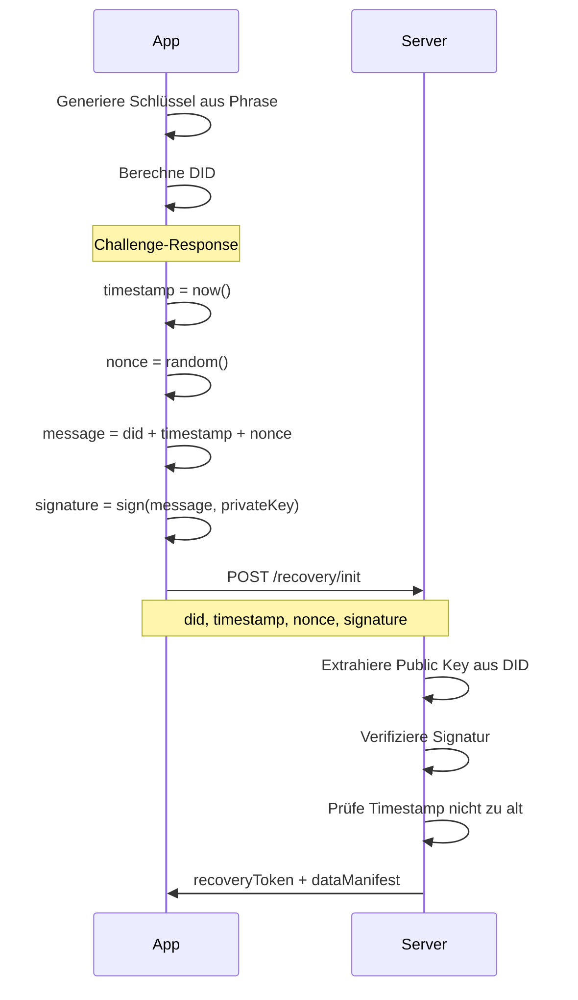

### Daten-Manifest

```json
{
  "did": "did:wot:anna123",
  "dataAvailable": {
    "profile": true,
    "contacts": 23,
    "verifications": 23,
    "attestationsReceived": 47,
    "attestationsGiven": 12,
    "items": 34,
    "groups": 3
  },
  "totalSize": "2.3 MB",
  "lastSync": "2025-01-08T10:00:00Z"
}
```

### Daten herunterladen

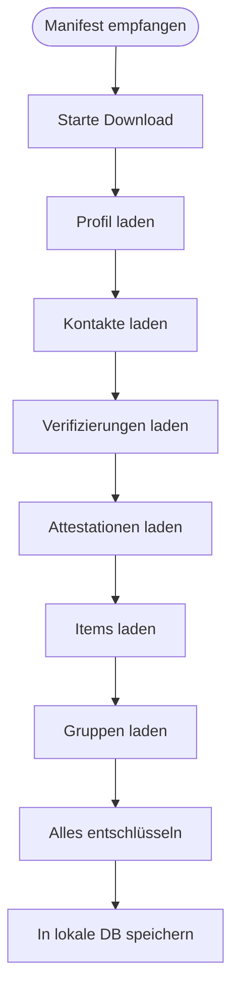

---

## Schritt 4: Daten entschlüsseln

### Entschlüsselungs-Flow

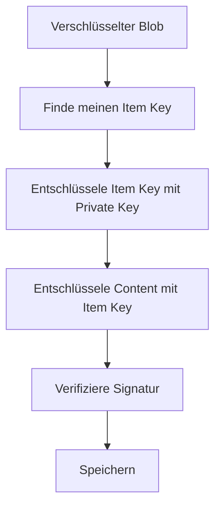

### Code-Beispiel

```javascript
async function decryptBlob(blob, privateKey) {
  // 1. Finde meinen verschlüsselten Item Key
  const myDid = computeDID(getPublicKey(privateKey));
  const myItemKey = blob.itemKeys.find(k => k.recipientDid === myDid);

  if (!myItemKey) {
    throw new Error('Kein Schlüssel für mich gefunden');
  }

  // 2. Entschlüssele Item Key
  const itemKey = await decryptAsymmetric(
    myItemKey.encryptedKey,
    privateKey
  );

  // 3. Entschlüssele Content
  const content = await decryptSymmetric(
    blob.encryptedContent,
    itemKey,
    blob.nonce
  );

  // 4. Verifiziere Signatur
  const ownerPublicKey = await getPublicKeyForDID(blob.owner);
  const isValid = await verifySignature(content, blob.proof, ownerPublicKey);

  if (!isValid) {
    throw new Error('Ungültige Signatur');
  }

  return JSON.parse(content);
}
```

---

## Schritt 5: Private Key speichern

### Plattform-spezifische Speicherung

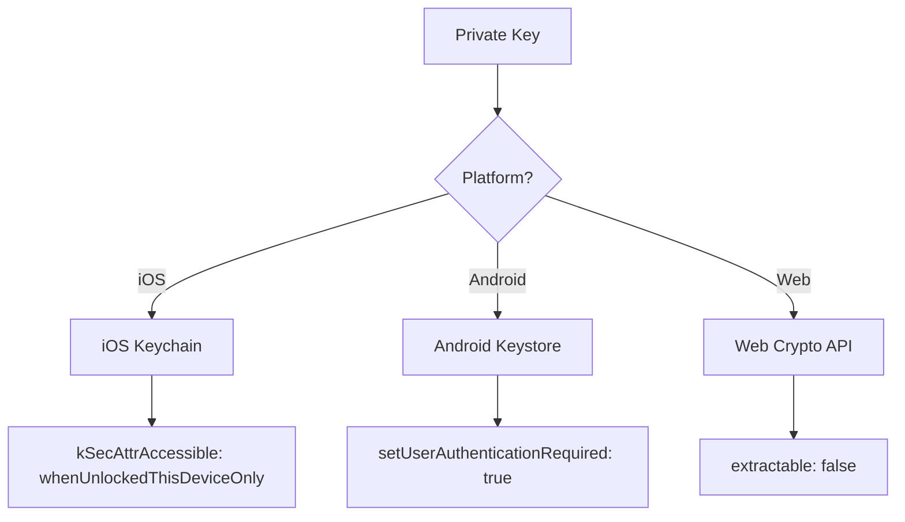

### Web: Besonderheit bei Recovery

Bei Web/Browser muss der Key aus der Mnemonic abgeleitet werden, da `extractable: false` Keys nicht importiert werden können:

```javascript
// Web: Key aus Seed generieren (nicht importieren)
async function storeKeyWeb(seed) {
  // Generiere non-extractable Key direkt aus Seed
  const keyPair = await crypto.subtle.generateKey(
    {
      name: "Ed25519",
      // Seed als Entropy-Quelle (vereinfacht)
    },
    false,  // extractable = false
    ["sign", "verify"]
  );

  // In IndexedDB speichern
  const db = await openDB('wot-keys', 1);
  await db.put('keys', keyPair.privateKey, 'privateKey');
  await db.put('keys', keyPair.publicKey, 'publicKey');
}
```

**Hinweis:** Die genaue Implementierung hängt von der Web Crypto API Unterstützung ab. Möglicherweise muss ein anderer Algorithmus verwendet werden.

---

## Fehlerbehandlung

### Fehlertypen

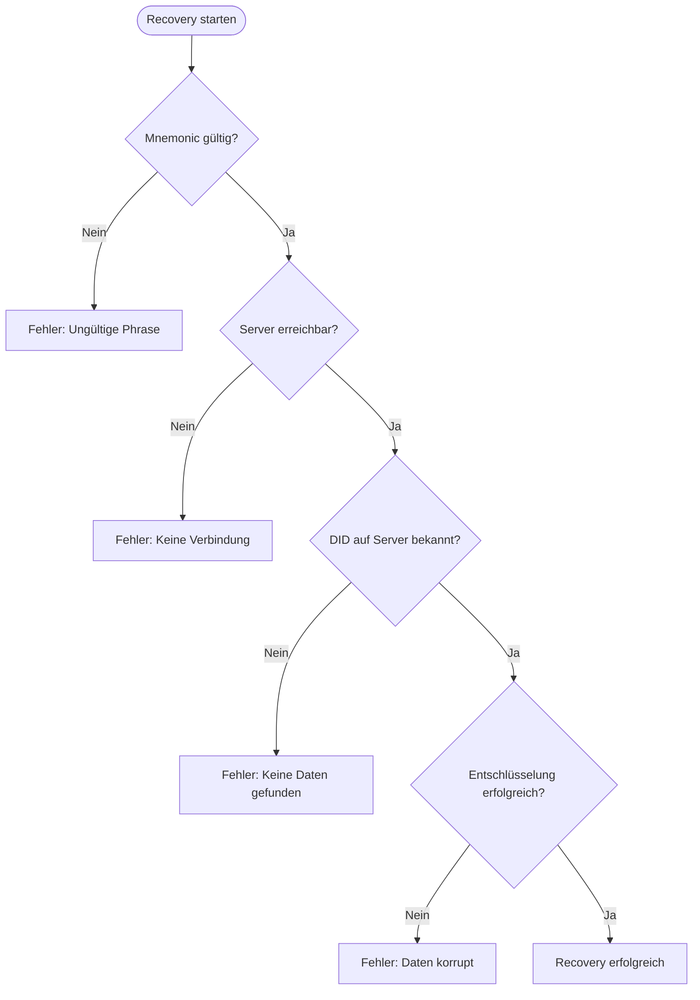

### Fehler-Responses

```json
{
  "error": "invalid_mnemonic",
  "message": "Die Recovery-Phrase ist ungültig",
  "details": {
    "invalidWord": "applz",
    "position": 1,
    "suggestion": "apple"
  }
}
```

```json
{
  "error": "did_not_found",
  "message": "Für diese Identität existieren keine Daten",
  "details": {
    "did": "did:wot:xyz123",
    "hint": "Wurde die Identität auf einem anderen Server erstellt?"
  }
}
```

---

## Sicherheitsüberlegungen

### Brute-Force-Schutz

| Maßnahme | Beschreibung |
| -------- | ------------ |
| BIP39 Entropy | 128 bits = 2^128 Kombinationen |
| Rate Limiting | Max 5 Recovery-Versuche pro IP pro Stunde |
| Keine Enumeration | Server verrät nicht ob DID existiert ohne gültige Signatur |

### Timing-Analyse

```javascript
// Constant-time Vergleich für Signatur-Prüfung
function constantTimeCompare(a, b) {
  if (a.length !== b.length) {
    return false;
  }

  let result = 0;
  for (let i = 0; i < a.length; i++) {
    result |= a[i] ^ b[i];
  }

  return result === 0;
}
```

### Recovery vs. Neuanmeldung

Der Server kann nicht unterscheiden zwischen:
- Legitimem Nutzer der recovered
- Angreifer der die Phrase gestohlen hat

**Konsequenz:** Die Phrase IST die Identität. Wer die Phrase hat, hat die Kontrolle.

---

## Speicher-Schema

### Recovery-spezifische Tabellen

```sql
-- Tracking für Recovery-Prozess
CREATE TABLE recovery_state (
    id INTEGER PRIMARY KEY,
    phase TEXT NOT NULL,
    progress INTEGER DEFAULT 0,
    total_items INTEGER,
    started_at DATETIME NOT NULL,
    completed_at DATETIME,
    error TEXT
);

-- Download-Queue während Recovery
CREATE TABLE recovery_queue (
    id TEXT PRIMARY KEY,
    blob_type TEXT NOT NULL,
    blob_id TEXT NOT NULL,
    downloaded BOOLEAN DEFAULT FALSE,
    decrypted BOOLEAN DEFAULT FALSE,
    error TEXT
);
```

---

## Multi-Device vs. Recovery

### Unterschied

| Aspekt | Multi-Device | Recovery |
| ------ | ------------ | -------- |
| Phrase eingeben | Ja | Ja |
| Altes Gerät noch aktiv | Ja | Nein |
| Sync-State | Übernommen vom alten Gerät | Komplett neu vom Server |
| Private Key | Neu generiert aus Phrase | Neu generiert aus Phrase |

### Gleiche Phrase, mehrere Geräte

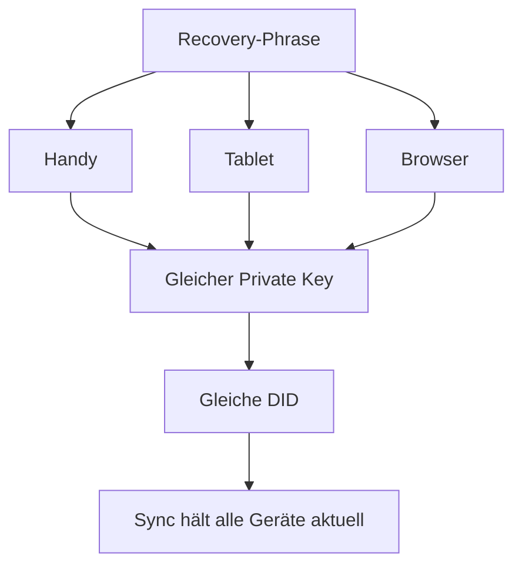

---

## Sequenzdiagramm: Vollständiger Recovery-Flow

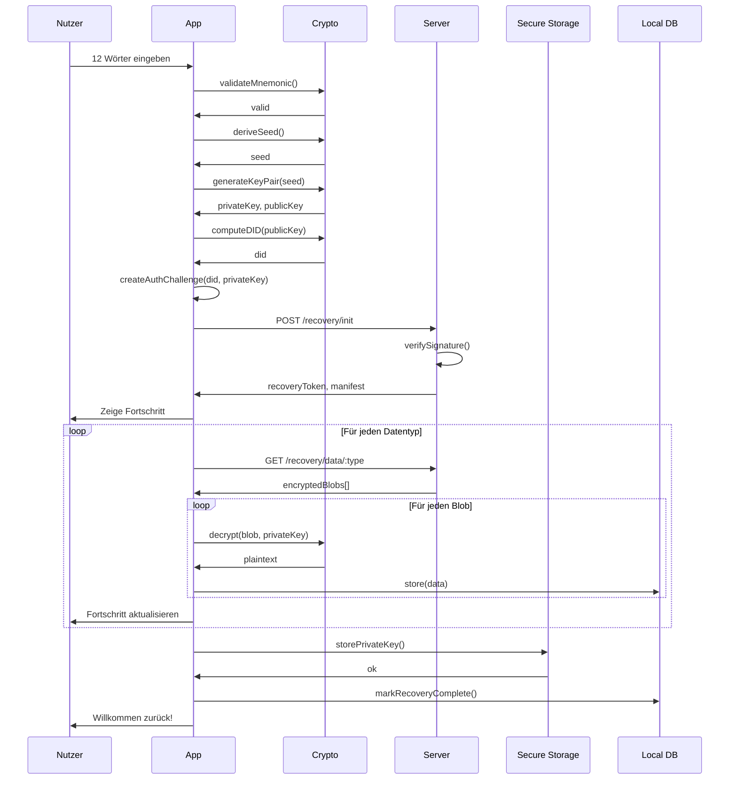
