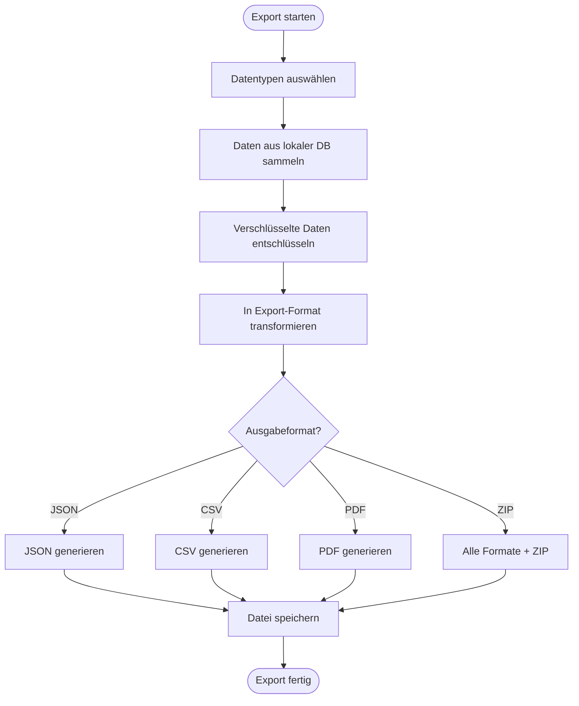
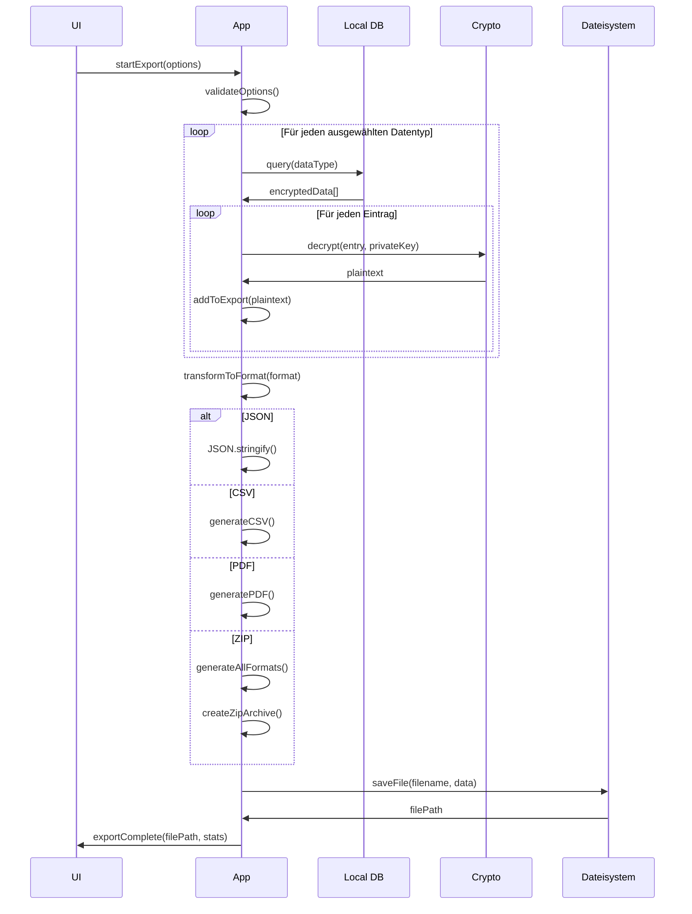

# Export-Flow (Technische Perspektive)

> Wie Daten exportiert und formatiert werden

## Übersicht



---

## Export-Datenstruktur

### Vollständiger Export (JSON)

```json
{
  "$schema": "https://weboftrust.app/schemas/export-v1.json",
  "exportVersion": "1.0",
  "exportedAt": "2025-01-08T15:00:00Z",
  "exportedBy": "did:wot:anna123",

  "profile": {
    "did": "did:wot:anna123",
    "name": "Anna Müller",
    "bio": "Aktiv im Gemeinschaftsgarten Sonnenberg",
    "photo": {
      "format": "jpeg",
      "data": "base64...",
      "hash": "sha256:abc123..."
    },
    "publicKey": {
      "type": "Ed25519VerificationKey2020",
      "publicKeyMultibase": "z6Mkf..."
    },
    "createdAt": "2025-01-01T10:00:00Z",
    "updatedAt": "2025-01-08T12:00:00Z"
  },

  "contacts": [
    {
      "did": "did:wot:ben456",
      "name": "Ben Schmidt",
      "status": "active",
      "verifiedAt": "2025-01-05T10:05:00Z",
      "myVerificationId": "urn:uuid:123..."
    }
  ],

  "verifications": [
    {
      "id": "urn:uuid:123...",
      "type": "IdentityVerification",
      "from": "did:wot:anna123",
      "to": "did:wot:ben456",
      "timestamp": "2025-01-05T10:05:00Z",
      "proof": { ... }
    }
  ],

  "attestationsReceived": [
    {
      "id": "urn:uuid:456...",
      "from": "did:wot:tom012",
      "claim": "Hat 3 Stunden im Garten geholfen",
      "tags": ["garten", "helfen"],
      "createdAt": "2025-01-08T14:00:00Z",
      "proof": { ... }
    }
  ],

  "attestationsGiven": [
    {
      "id": "urn:uuid:789...",
      "to": "did:wot:ben456",
      "claim": "Kennt sich mit Fahrrädern aus",
      "tags": ["handwerk", "fahrrad"],
      "createdAt": "2025-01-06T10:00:00Z",
      "proof": { ... }
    }
  ],

  "items": [
    {
      "id": "urn:uuid:item1...",
      "type": "CalendarItem",
      "title": "Gartentreffen",
      "content": {
        "startDate": "2025-01-15T14:00:00Z",
        "location": "Gemeinschaftsgarten"
      },
      "createdAt": "2025-01-08T10:00:00Z"
    }
  ],

  "groups": [
    {
      "did": "did:wot:group:gemeinschaftsgarten",
      "name": "Gemeinschaftsgarten Sonnenberg",
      "role": "member",
      "joinedAt": "2025-01-02T10:00:00Z"
    }
  ],

  "metadata": {
    "totalContacts": 23,
    "totalVerifications": 23,
    "totalAttestationsReceived": 47,
    "totalAttestationsGiven": 12,
    "totalItems": 34,
    "totalGroups": 3,
    "exportSizeBytes": 2456789
  }
}
```

---

## Hauptflow: Export



---

## Datensammlung

### Profile exportieren

```javascript
async function exportProfile(privateKey) {
  const profile = await db.profile.get();

  // Foto laden falls vorhanden
  let photoData = null;
  if (profile.photoId) {
    const photo = await db.media.get(profile.photoId);
    photoData = {
      format: photo.mimeType.split('/')[1],
      data: arrayBufferToBase64(photo.data),
      hash: await sha256(photo.data)
    };
  }

  return {
    did: profile.did,
    name: profile.name,
    bio: profile.bio,
    photo: photoData,
    publicKey: profile.publicKey,
    createdAt: profile.createdAt,
    updatedAt: profile.updatedAt
  };
}
```

### Kontakte exportieren

```javascript
async function exportContacts() {
  const contacts = await db.contacts
    .where('status')
    .notEqual('deleted')
    .toArray();

  return contacts.map(contact => ({
    did: contact.did,
    name: contact.name,
    status: contact.status,
    verifiedAt: contact.verifiedAt,
    myVerificationId: contact.myVerification
  }));
}
```

### Items exportieren

```javascript
async function exportItems(privateKey) {
  const items = await db.items
    .where('ownerDid')
    .equals(myDid)
    .and(item => !item.deleted)
    .toArray();

  return Promise.all(items.map(async item => {
    // Entschlüsseln
    const content = await decryptItem(item, privateKey);

    return {
      id: item.id,
      type: item.type,
      title: item.title,
      content: content,
      visibility: item.visibility,
      createdAt: item.createdAt,
      updatedAt: item.updatedAt
    };
  }));
}
```

---

## Format-Konvertierung

### JSON

```javascript
function generateJSON(exportData) {
  return JSON.stringify(exportData, null, 2);
}
```

### CSV

```javascript
function generateCSV(data, type) {
  const configs = {
    contacts: {
      headers: ['Name', 'DID', 'Status', 'Verifiziert am'],
      row: (c) => [c.name, c.did, c.status, c.verifiedAt]
    },
    attestations: {
      headers: ['Von', 'An', 'Text', 'Tags', 'Datum'],
      row: (a) => [
        a.from || '-',
        a.to || '-',
        `"${a.claim.replace(/"/g, '""')}"`,
        a.tags.join(';'),
        a.createdAt
      ]
    },
    items: {
      headers: ['Typ', 'Titel', 'Erstellt', 'Aktualisiert'],
      row: (i) => [i.type, i.title, i.createdAt, i.updatedAt]
    }
  };

  const config = configs[type];
  const lines = [
    config.headers.join(','),
    ...data.map(item => config.row(item).join(','))
  ];

  return lines.join('\n');
}
```

### PDF

```javascript
async function generatePDF(exportData) {
  const doc = new PDFDocument();

  // Header
  doc.fontSize(24).text('Web of Trust Export');
  doc.fontSize(12).text(exportData.profile.name);
  doc.text(new Date().toLocaleDateString('de-DE'));

  doc.moveDown();

  // Profil
  doc.fontSize(16).text('Profil');
  doc.fontSize(10)
     .text(`DID: ${exportData.profile.did}`)
     .text(`Name: ${exportData.profile.name}`)
     .text(`Bio: ${exportData.profile.bio || '-'}`);

  doc.moveDown();

  // Kontakte
  doc.fontSize(16).text(`Kontakte (${exportData.contacts.length})`);
  for (const contact of exportData.contacts) {
    doc.fontSize(10)
       .text(`• ${contact.name} - ${contact.status}`);
  }

  doc.moveDown();

  // Attestationen
  doc.fontSize(16).text('Attestationen');

  doc.fontSize(12).text('Erhalten:');
  for (const att of exportData.attestationsReceived) {
    doc.fontSize(10)
       .text(`• "${att.claim}" - von ${att.fromName || att.from}`);
  }

  // ... weitere Abschnitte

  return doc;
}
```

### ZIP-Archiv

```javascript
async function generateZipArchive(exportData) {
  const zip = new JSZip();

  // JSON
  zip.file('export.json', generateJSON(exportData));

  // CSV files
  zip.file('contacts.csv', generateCSV(exportData.contacts, 'contacts'));
  zip.file('attestations-received.csv',
    generateCSV(exportData.attestationsReceived, 'attestations'));
  zip.file('attestations-given.csv',
    generateCSV(exportData.attestationsGiven, 'attestations'));
  zip.file('items.csv', generateCSV(exportData.items, 'items'));

  // PDF
  const pdf = await generatePDF(exportData);
  zip.file('summary.pdf', pdf);

  // Media
  if (exportData.profile.photo) {
    const mediaFolder = zip.folder('media');
    mediaFolder.file(
      `profile-photo.${exportData.profile.photo.format}`,
      exportData.profile.photo.data,
      { base64: true }
    );
  }

  return zip.generateAsync({ type: 'blob' });
}
```

---

## Export-Optionen

### Konfiguration

```typescript
interface ExportOptions {
  // Was exportieren
  includeProfile: boolean;
  includeContacts: boolean;
  includeVerifications: boolean;
  includeAttestationsReceived: boolean;
  includeAttestationsGiven: boolean;
  includeItems: boolean;
  includeGroups: boolean;
  includeMedia: boolean;

  // Format
  format: 'json' | 'csv' | 'pdf' | 'zip';

  // Filter
  dateFrom?: Date;
  dateTo?: Date;
  contactFilter?: string[]; // DIDs

  // Optionen
  prettyPrint: boolean;
  includeProofs: boolean;
}
```

### Standard-Optionen

```javascript
const defaultExportOptions = {
  includeProfile: true,
  includeContacts: true,
  includeVerifications: true,
  includeAttestationsReceived: true,
  includeAttestationsGiven: true,
  includeItems: true,
  includeGroups: true,
  includeMedia: true,

  format: 'zip',

  prettyPrint: true,
  includeProofs: false  // Signaturen sind groß
};
```

---

## Sicherheitsüberlegungen

### Was NICHT exportiert wird

```javascript
const NEVER_EXPORT = [
  'privateKey',
  'mnemonic',
  'recoveryPhrase',
  'groupKeys',
  'itemKeys',
  'encryptedBlobs'
];

function sanitizeForExport(data) {
  const sanitized = { ...data };

  for (const key of NEVER_EXPORT) {
    delete sanitized[key];
  }

  return sanitized;
}
```

### Warnung bei sensiblen Daten

```javascript
function showExportWarning() {
  return {
    title: 'Export enthält persönliche Daten',
    message: `
      Der Export enthält:
      • Deinen Namen und dein Profil
      • Alle deine Kontakte
      • Alle Attestationen

      Behandle die Datei vertraulich.
      Teile sie nicht öffentlich.
    `,
    confirmText: 'Verstanden, exportieren'
  };
}
```

---

## Speicher-Schema für Export-History

```sql
CREATE TABLE export_history (
    id INTEGER PRIMARY KEY AUTOINCREMENT,
    exported_at DATETIME NOT NULL,
    format TEXT NOT NULL,
    options TEXT NOT NULL,
    file_name TEXT NOT NULL,
    file_size INTEGER NOT NULL,
    items_exported INTEGER NOT NULL
);

CREATE INDEX idx_export_history_date ON export_history(exported_at);
```

---

## API

### Export starten

```javascript
async function startExport(options) {
  // 1. Optionen validieren
  validateExportOptions(options);

  // 2. Warnung anzeigen
  const confirmed = await showExportWarning();
  if (!confirmed) return null;

  // 3. Private Key holen
  const privateKey = await getPrivateKey();

  // 4. Daten sammeln
  const exportData = await collectExportData(options, privateKey);

  // 5. Format generieren
  let output;
  switch (options.format) {
    case 'json':
      output = generateJSON(exportData);
      break;
    case 'csv':
      output = generateAllCSV(exportData);
      break;
    case 'pdf':
      output = await generatePDF(exportData);
      break;
    case 'zip':
      output = await generateZipArchive(exportData);
      break;
  }

  // 6. Datei speichern
  const fileName = generateFileName(options.format);
  const filePath = await saveFile(fileName, output);

  // 7. History speichern
  await db.exportHistory.add({
    exportedAt: new Date().toISOString(),
    format: options.format,
    options: JSON.stringify(options),
    fileName,
    fileSize: output.size || output.length,
    itemsExported: countExportedItems(exportData)
  });

  return {
    filePath,
    fileName,
    fileSize: output.size || output.length,
    stats: exportData.metadata
  };
}
```

### Dateiname generieren

```javascript
function generateFileName(format) {
  const date = new Date().toISOString().split('T')[0];
  const extension = format === 'zip' ? 'zip' : format;
  return `wot-export-${date}.${extension}`;
}
```

---

## Plattform-spezifische Speicherung

### iOS

```javascript
// Share Sheet verwenden
async function saveFileIOS(filename, data) {
  const tempPath = `${RNFS.CachesDirectoryPath}/${filename}`;
  await RNFS.writeFile(tempPath, data, 'base64');

  await Share.open({
    url: `file://${tempPath}`,
    type: getMimeType(filename)
  });
}
```

### Android

```javascript
// Downloads-Ordner oder Share
async function saveFileAndroid(filename, data) {
  const downloadPath = `${RNFS.DownloadDirectoryPath}/${filename}`;
  await RNFS.writeFile(downloadPath, data, 'base64');

  return downloadPath;
}
```

### Web

```javascript
// Download-Link erstellen
function saveFileWeb(filename, data) {
  const blob = new Blob([data], { type: getMimeType(filename) });
  const url = URL.createObjectURL(blob);

  const a = document.createElement('a');
  a.href = url;
  a.download = filename;
  a.click();

  URL.revokeObjectURL(url);
}
```

---

## Export-Schema (JSON Schema)

```json
{
  "$schema": "http://json-schema.org/draft-07/schema#",
  "$id": "https://weboftrust.app/schemas/export-v1.json",
  "title": "Web of Trust Export",
  "type": "object",
  "required": ["exportVersion", "exportedAt", "exportedBy", "profile"],
  "properties": {
    "exportVersion": {
      "type": "string",
      "const": "1.0"
    },
    "exportedAt": {
      "type": "string",
      "format": "date-time"
    },
    "exportedBy": {
      "type": "string",
      "pattern": "^did:wot:"
    },
    "profile": {
      "$ref": "#/definitions/Profile"
    },
    "contacts": {
      "type": "array",
      "items": { "$ref": "#/definitions/Contact" }
    }
  },
  "definitions": {
    "Profile": { ... },
    "Contact": { ... },
    "Attestation": { ... },
    "Item": { ... }
  }
}
```
