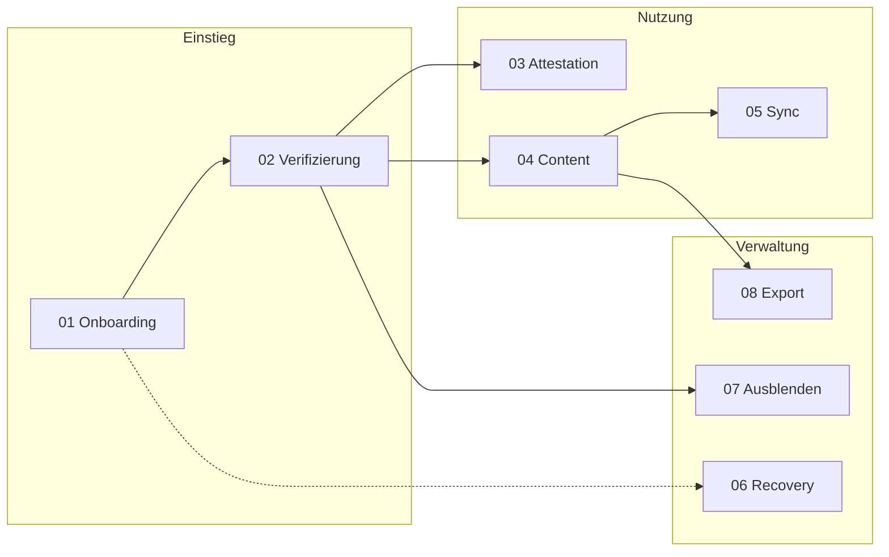

# Flows - Übersicht

> Alle Prozess-Flows des Web of Trust

---

## Aufbau

Jeder Flow existiert in zwei Versionen:

| Version | Zielgruppe | Inhalt |
| ------- | ---------- | ------ |
| **Nutzer-Flow** | Stakeholder, Designer, Nutzer | Was Menschen erleben, UI-Mockups, Personas |
| **Technisch-Flow** | Entwickler, Architekten | Sequenzdiagramme, Datenstrukturen, Algorithmen |

---

## Übersicht

---

## Flows im Detail

### 01 - Onboarding

**Wie eine neue Person ins Netzwerk kommt**

- App installieren
- Profil erstellen
- ID generieren
- Recovery-Phrase sichern (Quiz bestehen)
- Erste Verifizierung

| Dokument | Beschreibung |
| -------- | ------------ |
| [01-onboarding-nutzer-flow.md](01-onboarding-nutzer-flow.md) | Nutzer-Perspektive |
| [01-onboarding-technisch-flow.md](01-onboarding-technisch-flow.md) | Technische Details |

---

### 02 - Verifizierung

**Wie zwei Personen sich gegenseitig verifizieren**

- QR-Code scannen
- Profil prüfen
- Identität bestätigen
- Gegenseitige Verifizierung

| Dokument | Beschreibung |
| -------- | ------------ |
| [02-verifizierung-nutzer-flow.md](02-verifizierung-nutzer-flow.md) | Nutzer-Perspektive |
| [02-verifizierung-technisch-flow.md](02-verifizierung-technisch-flow.md) | Technische Details |

---

### 03 - Attestation

**Wie Nutzer Attestationen erstellen und ansehen**

- Attestation erstellen
- Tags zuweisen
- Gruppen-Kontext
- Attestationen ansehen

| Dokument | Beschreibung |
| -------- | ------------ |
| [03-attestation-nutzer-flow.md](03-attestation-nutzer-flow.md) | Nutzer-Perspektive |
| [03-attestation-technisch-flow.md](03-attestation-technisch-flow.md) | Technische Details |

---

### 04 - Content teilen

**Wie Nutzer Inhalte erstellen und teilen**

- Kalender-Einträge
- Karten-Markierungen
- Projekte
- Sichtbarkeit steuern

| Dokument | Beschreibung |
| -------- | ------------ |
| [04-content-nutzer-flow.md](04-content-nutzer-flow.md) | Nutzer-Perspektive |
| [04-content-technisch-flow.md](04-content-technisch-flow.md) | Technische Details |

---

### 05 - Synchronisation

**Wie Daten zwischen Geräten synchronisiert werden**

- Offline-Nutzung
- Konfliktauflösung
- Sync-Status

| Dokument | Beschreibung |
| -------- | ------------ |
| [05-sync-nutzer-flow.md](05-sync-nutzer-flow.md) | Nutzer-Perspektive |
| [05-sync-technisch-flow.md](05-sync-technisch-flow.md) | Technische Details |

---

### 06 - Recovery

**Wie eine Identität wiederhergestellt wird**

- Gerät verloren
- Recovery-Phrase eingeben
- Identität wiederherstellen

| Dokument | Beschreibung |
| -------- | ------------ |
| [06-recovery-nutzer-flow.md](06-recovery-nutzer-flow.md) | Nutzer-Perspektive |
| [06-recovery-technisch-flow.md](06-recovery-technisch-flow.md) | Technische Details |

---

### 07 - Ausblenden

**Wie ein Kontakt ausgeblendet wird**

- Kontakt ausblenden
- Auswirkungen auf Content
- Rückgängig machen

| Dokument | Beschreibung |
| -------- | ------------ |
| [07-ausblenden-nutzer-flow.md](07-ausblenden-nutzer-flow.md) | Nutzer-Perspektive |
| [07-ausblenden-technisch-flow.md](07-ausblenden-technisch-flow.md) | Technische Details |

---

### 08 - Export

**Wie Daten exportiert werden**

- Daten auswählen
- Format wählen
- Exportieren

| Dokument | Beschreibung |
| -------- | ------------ |
| [08-export-nutzer-flow.md](08-export-nutzer-flow.md) | Nutzer-Perspektive |
| [08-export-technisch-flow.md](08-export-technisch-flow.md) | Technische Details |

---

## Legende

### Mermaid-Diagramme

Die Flows verwenden verschiedene Diagrammtypen:

| Typ | Verwendung |
| --- | ---------- |
| `sequenceDiagram` | Interaktionen zwischen Akteuren |
| `flowchart` | Entscheidungsbäume, Prozessabläufe |
| `stateDiagram` | Zustandsübergänge |
| `erDiagram` | Datenmodelle |

### Farbcodierung

In den Diagrammen werden folgende Farben verwendet:

| Farbe | Bedeutung |
| ----- | --------- |
| Grün (`#90EE90`, `#E4FFE4`) | Erfolg, sicher |
| Rot (`#FFB6C1`, `#FFE4E4`) | Fehler, kritisch, blockiert |
| Gelb (`#FFE4B5`, `#FFF3CD`) | Warnung, Achtung |
| Blau (`#E6F5FF`) | Informativ, Phase |

---

[Zurück zur Hauptseite](../README.md)
