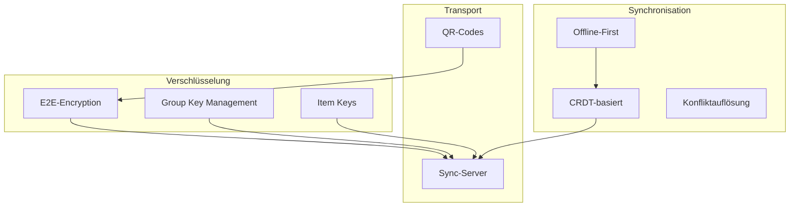

# Protokolle

> Kommunikations- und Verschlüsselungsprotokolle im Web of Trust

## Inhalt

| Dokument | Beschreibung |
|----------|--------------|
| [Verschlüsselung](verschluesselung.md) | E2E-Verschlüsselung, Protokoll-Vergleich |
| [Sync-Protokoll](sync-protokoll.md) | Offline/Online Synchronisation |
| [QR-Code-Formate](qr-code-formate.md) | QR-Code-Strukturen für Verifizierung |

---

## Überblick



---

## Kernprinzipien

### 1. End-to-End-Verschlüsselung

```
┌─────────────────────────────────────────────────────────────┐
│                                                             │
│  Der Server sieht nur verschlüsselte Daten                  │
│                                                             │
│  Anna's Gerät ──[verschlüsselt]──► Server                   │
│                                        │                    │
│                                        ▼                    │
│  Ben's Gerät  ◄──[verschlüsselt]────────                    │
│                                                             │
│  Entschlüsselung nur auf den Geräten der Empfänger          │
│                                                             │
└─────────────────────────────────────────────────────────────┘
```

### 2. Offline-First

```
┌─────────────────────────────────────────────────────────────┐
│                                                             │
│  Alle Operationen funktionieren offline:                    │
│                                                             │
│  ✅ Kontakte ansehen                                        │
│  ✅ Items erstellen/bearbeiten                              │
│  ✅ Attestationen erstellen                                 │
│                                                             │
│  Bei Verbindung:                                            │
│  🔄 Automatischer Sync                                      │
│  🔄 Konfliktauflösung                                       │
│                                                             │
└─────────────────────────────────────────────────────────────┘
```

### 3. Dezentral

```
┌─────────────────────────────────────────────────────────────┐
│                                                             │
│  Kein Single Point of Failure:                              │
│                                                             │
│  • Identität = eigener Private Key                          │
│  • Verifizierung = direkt zwischen Personen                 │
│  • Server = nur Transport & Speicher (austauschbar)         │
│                                                             │
└─────────────────────────────────────────────────────────────┘
```

---

## Protokoll-Stack

| Schicht | Protokoll | Zweck |
|---------|-----------|-------|
| **Identität** | did:key | Dezentrale Identifier |
| **Signaturen** | Ed25519 | Verifizierungen, Attestationen |
| **Verschlüsselung** | X25519 + AES-256-GCM | Item-Verschlüsselung |
| **Gruppenschlüssel** | [Offen - siehe Vergleich](verschluesselung.md) | Key Management für Gruppen |
| **Sync** | CRDT-basiert | Konfliktfreie Synchronisation |
| **Transport** | HTTPS / WebSocket | Server-Kommunikation |

---

## Weiterführend

- [Verschlüsselung im Detail](verschluesselung.md) - Wie Items verschlüsselt werden
- [Sync-Protokoll](sync-protokoll.md) - Wie Offline-Änderungen synchronisiert werden
- [QR-Code-Formate](qr-code-formate.md) - QR-Strukturen für Verifizierung
- [Datenmodell](../datenmodell/README.md) - Entitäten und Schemas
