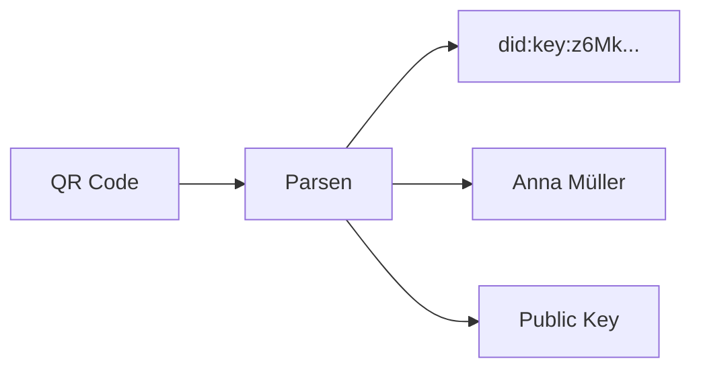
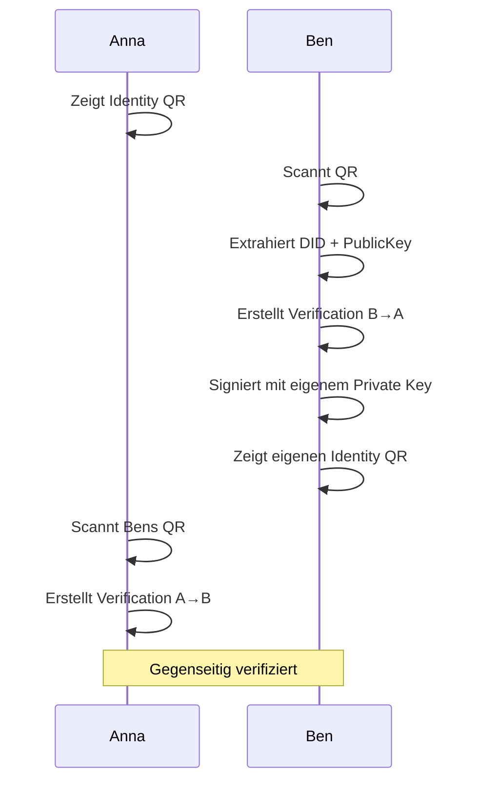
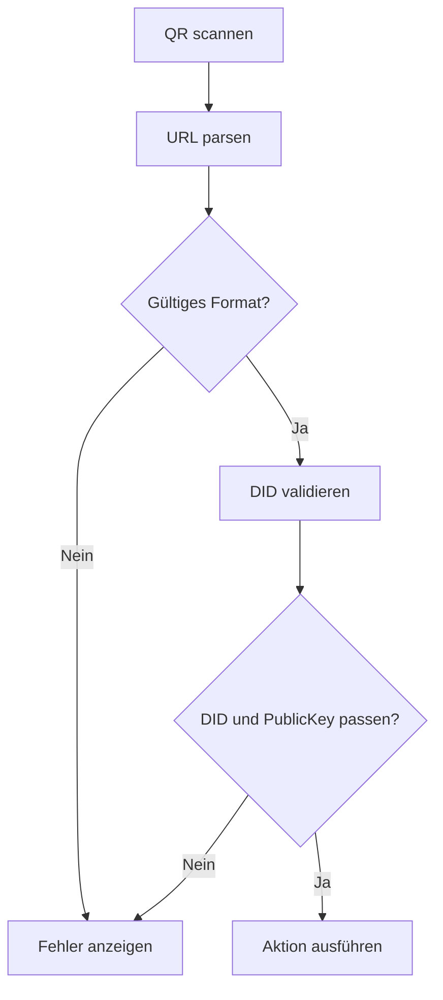

# QR-Code-Formate

> QR-Code-Strukturen für Verifizierung und Einladungen

## Übersicht

QR-Codes werden im Web of Trust für den direkten Austausch zwischen Personen verwendet.

| Typ | Zweck | Wann verwendet |
|-----|-------|----------------|
| **Identity QR** | Eigene Identität teilen | Verifizierung starten |
| **Invite QR** | Einladung zu Gruppe | Gruppeneinladung |
| **Deep Link QR** | App-Link | Marketing, Onboarding |

---

## Identity QR

### Zweck

Teilt die eigene Identität mit einer anderen Person für die gegenseitige Verifizierung.

### Format

```
wot://verify?did=<did>&name=<name>&pk=<publicKey>
```

### Beispiel

```
wot://verify?did=did:key:z6MkhaXgBZDvotDkL5257faiztiGiC2QtKLGpbnnEGta2doK&name=Anna%20M%C3%BCller&pk=z6MkhaXgBZDvotDkL5257faiztiGiC2QtKLGpbnnEGta2doK
```

### Struktur



### JSON-Repräsentation

```json
{
  "type": "identity",
  "version": 1,
  "did": "did:key:z6MkhaXgBZDvotDkL5257faiztiGiC2QtKLGpbnnEGta2doK",
  "name": "Anna Müller",
  "publicKey": "z6MkhaXgBZDvotDkL5257faiztiGiC2QtKLGpbnnEGta2doK"
}
```

### Ablauf



---

## Invite QR

### Zweck

Lädt eine Person zu einer Gruppe ein.

### Format

```
wot://invite?group=<groupDid>&name=<groupName>&inviter=<inviterDid>&token=<token>
```

### Beispiel

```
wot://invite?group=did:key:z6MkgYGF3thn8k1Fv4p4dWXKtsXCnLH7q9yw4QgNPULDmDKB&name=Gemeinschaftsgarten&inviter=did:key:z6Mkf5rGMoatrSj1f...&token=abc123...
```

### JSON-Repräsentation

```json
{
  "type": "invite",
  "version": 1,
  "group": {
    "did": "did:key:z6MkgYGF3thn8k1Fv4p4dWXKtsXCnLH7q9yw4QgNPULDmDKB",
    "name": "Gemeinschaftsgarten Sonnenberg"
  },
  "inviter": {
    "did": "did:key:z6Mkf5rGMoatrSj1f4CyvuHBeXJELe9RPdzo2PKGNCKVtZxP",
    "name": "Anna Müller"
  },
  "token": "abc123...",
  "expiresAt": "2025-01-15T10:00:00Z"
}
```

### Token

Das `token` ist eine Signatur des Einladenden, die beweist:
1. Die Einladung kommt wirklich von dieser Person
2. Die Person hat Einlade-Rechte (Admin)

```javascript
token = sign({
  groupDid: "did:key:z6MkgYGF...",
  inviterDid: "did:key:z6Mkf5rG...",
  createdAt: "2025-01-08T10:00:00Z",
  expiresAt: "2025-01-15T10:00:00Z"
}, inviterPrivateKey)
```

---

## Deep Link QR

### Zweck

Allgemeine App-Links für Marketing oder spezielle Aktionen.

### Format

```
https://weboftrust.app/open?action=<action>&params=<params>
```

### Beispiele

**App installieren:**
```
https://weboftrust.app/open?action=install
```

**Profil ansehen (öffentlich):**
```
https://weboftrust.app/open?action=profile&did=did:key:z6Mk...
```

---

## QR-Code-Generierung

### Größe und Fehlerkorrektur

| Inhaltslänge | QR-Version | Empfohlene Größe | Fehlerkorrektur |
|--------------|------------|------------------|-----------------|
| < 100 Zeichen | 3-5 | 200x200 px | Level M (15%) |
| 100-300 Zeichen | 6-10 | 300x300 px | Level M (15%) |
| > 300 Zeichen | 11+ | 400x400 px | Level L (7%) |

### Best Practices

```
┌─────────────────────────────────────────────────────────────┐
│                                                             │
│  QR-Code Best Practices:                                    │
│                                                             │
│  ✅ Hoher Kontrast (schwarz auf weiß)                       │
│  ✅ Ruhezone um QR (mind. 4 Module)                         │
│  ✅ Fehlerkorrektur Level M oder höher                      │
│  ✅ Kurze URLs bevorzugen                                   │
│                                                             │
│  ❌ Keine Logos im QR-Code (reduziert Lesbarkeit)           │
│  ❌ Keine bunten QR-Codes                                   │
│  ❌ Keine zu kleinen QR-Codes                               │
│                                                             │
└─────────────────────────────────────────────────────────────┘
```

---

## Sicherheitsüberlegungen

### Was im QR-Code ist

| Enthalten | Nicht enthalten |
|-----------|-----------------|
| DID (öffentlich) | Private Key |
| Public Key (öffentlich) | Verschlüsselte Daten |
| Name (öffentlich) | Session Tokens |

### Validierung beim Scannen



### Prüfungen

1. **Schema:** Muss `wot://` oder `https://weboftrust.app/` sein
2. **DID-Format:** Muss gültiges `did:key:z...` sein
3. **PublicKey:** Muss zum DID passen (ableitbar)
4. **Token (bei Invite):** Signatur muss gültig sein

---

## URL-Encoding

### Sonderzeichen

| Zeichen | Encoded |
|---------|---------|
| Leerzeichen | `%20` |
| Umlaute (ä) | `%C3%A4` |
| : | `%3A` |
| / | `%2F` |

### Beispiel

```
Name: "Anna Müller"
Encoded: "Anna%20M%C3%BCller"
```

---

## Plattform-spezifisches Handling

### iOS

```
wot:// → Custom URL Scheme → App öffnet
https://weboftrust.app/ → Universal Link → App öffnet
```

### Android

```
wot:// → Intent Filter → App öffnet
https://weboftrust.app/ → App Link → App öffnet
```

### Web (kein App installiert)

```
wot:// → Nicht unterstützt → Fallback-Seite
https://weboftrust.app/ → Landing Page mit Install-Link
```

---

## Weiterführend

- [Verifizierungs-Flow](../flows/02-verifizierung-nutzer-flow.md) - Wie QR-Codes bei Verifizierung genutzt werden
- [Onboarding-Flow](../flows/01-onboarding-nutzer-flow.md) - QR beim ersten Start
