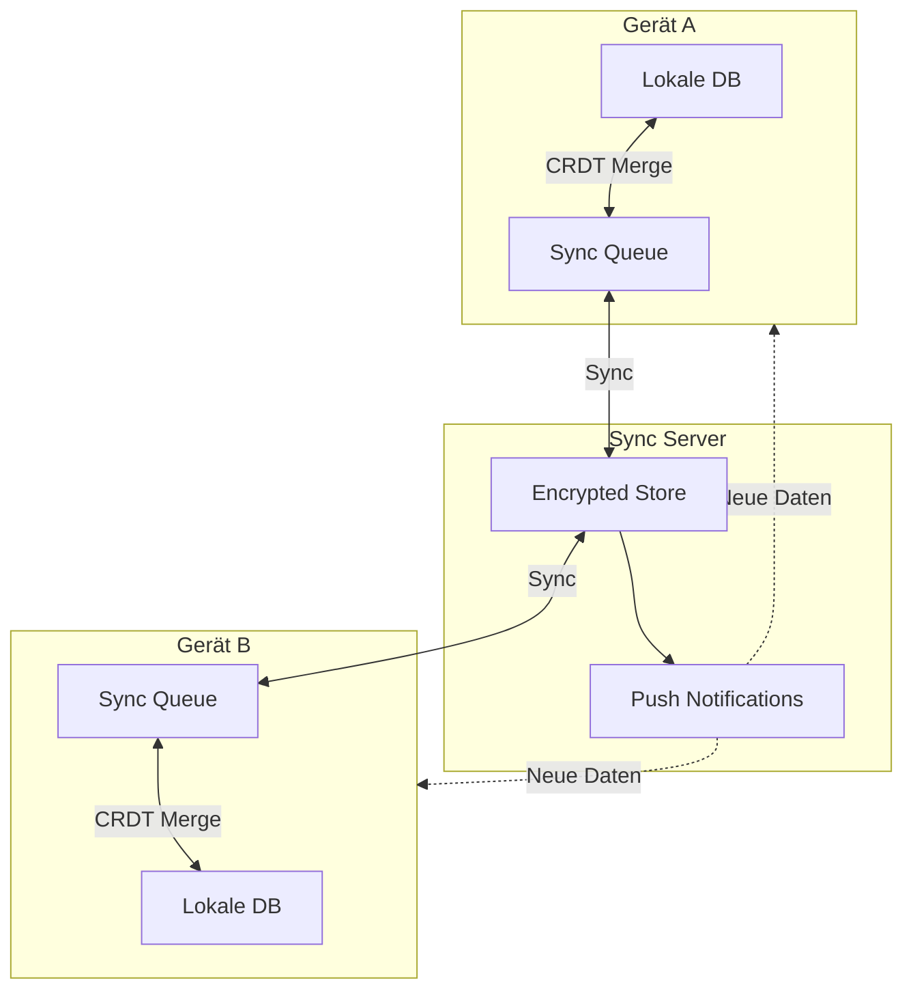
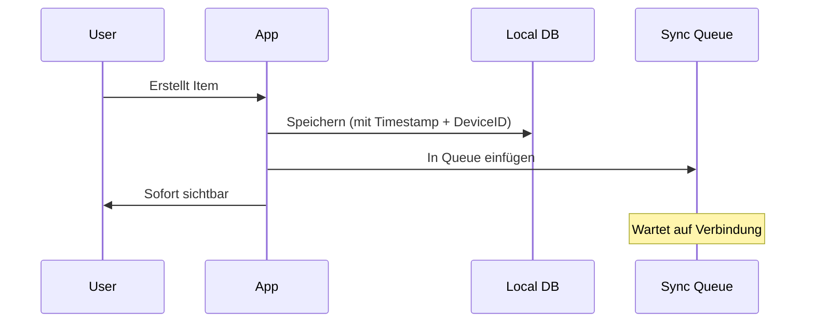
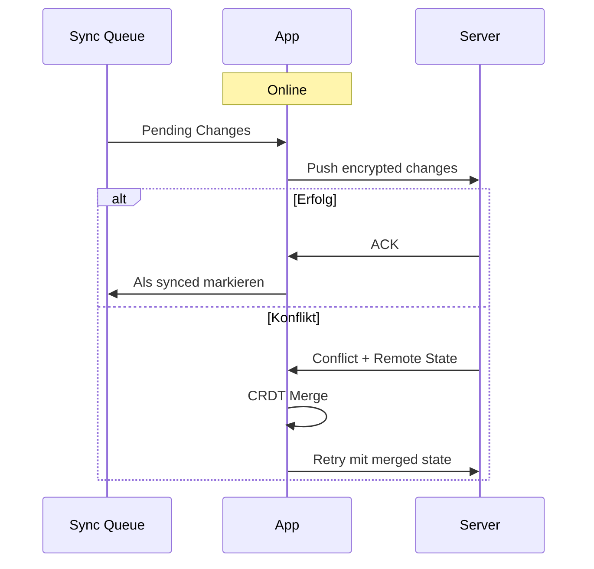
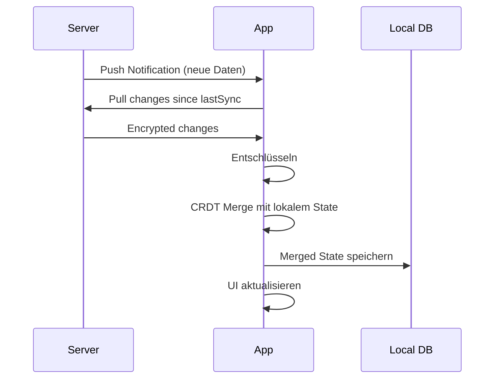
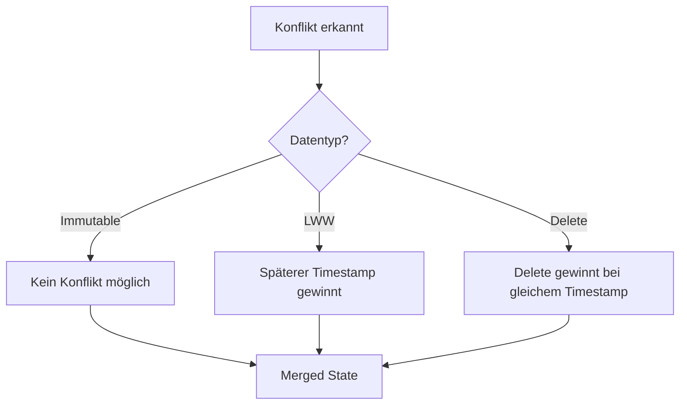
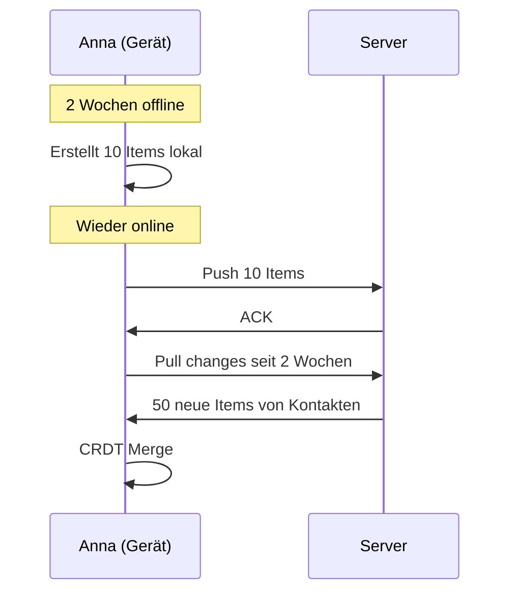
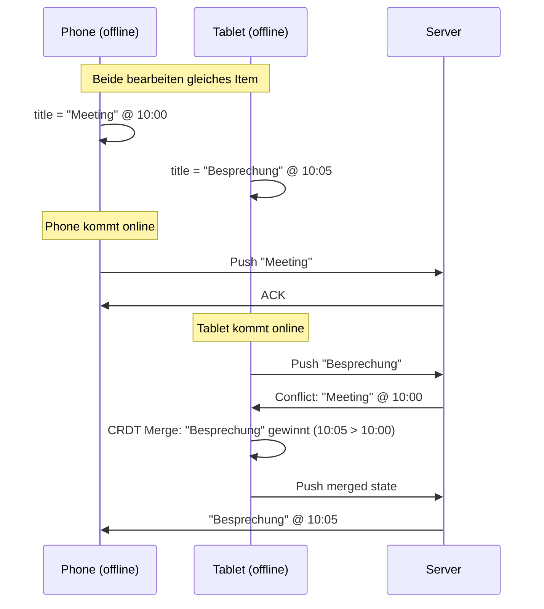

# Sync-Protokoll

> Offline-First Synchronisation im Web of Trust

## Grundprinzip: Offline-First

```
┌─────────────────────────────────────────────────────────────┐
│                                                             │
│  Offline-First bedeutet:                                    │
│                                                             │
│  1. Alle Daten lokal gespeichert                            │
│  2. Alle Operationen funktionieren offline                  │
│  3. Sync passiert im Hintergrund wenn online                │
│  4. Konflikte werden automatisch aufgelöst                  │
│                                                             │
└─────────────────────────────────────────────────────────────┘
```

---

## Architektur



---

## CRDT-basierter Ansatz

### Was sind CRDTs?

**C**onflict-free **R**eplicated **D**ata **T**ypes - Datenstrukturen, die automatisch und deterministisch zusammengeführt werden können.

```
┌─────────────────────────────────────────────────────────────┐
│                                                             │
│  Beispiel: Last-Writer-Wins Register                        │
│                                                             │
│  Gerät A (offline):  name = "Anna" @ timestamp 10:00        │
│  Gerät B (offline):  name = "Anna M." @ timestamp 10:05     │
│                                                             │
│  Nach Sync:                                                 │
│  Beide Geräte:       name = "Anna M." (späterer Timestamp)  │
│                                                             │
└─────────────────────────────────────────────────────────────┘
```

### CRDT-Typen im System

| Datentyp | CRDT-Strategie |
|----------|----------------|
| Profil-Felder | LWW-Register (Last Writer Wins) |
| Kontakt-Liste | LWW-Map + Tombstones |
| Items | LWW-Register + Soft Delete |
| Attestationen | Add-only Set (unveränderlich) |
| Verifizierungen | Add-only Set (unveränderlich) |
| Gruppen-Membership | LWW-Map |

---

## Sync-Ablauf

### 1. Lokale Änderung



### 2. Push zum Server



### 3. Pull vom Server



---

## Konfliktauflösung

### Strategie: Deterministische Merge-Regeln



### Beispiele

#### Profil-Änderung (LWW)

```
Gerät A: { name: "Anna", updatedAt: "10:00" }
Gerät B: { name: "Anna Müller", updatedAt: "10:05" }

Merge: { name: "Anna Müller", updatedAt: "10:05" }
```

#### Item löschen vs. bearbeiten

```
Gerät A: Item bearbeiten @ 10:00
Gerät B: Item löschen @ 10:00

Merge: Item gelöscht (Delete hat Priorität bei gleichem Timestamp)
```

#### Kontakt-Status

```
Gerät A: Kontakt ausblenden @ 10:00
Gerät B: (keine Änderung)

Merge: Kontakt ausgeblendet
```

---

## Server-Rolle

### Was der Server tut

| Aufgabe | Beschreibung |
|---------|--------------|
| **Speichern** | Verschlüsselte Daten persistent halten |
| **Verteilen** | Änderungen an andere Geräte/Nutzer weiterleiten |
| **Benachrichtigen** | Push Notifications bei neuen Daten |
| **Versionieren** | Vector Clocks / Sync Cursors verwalten |

### Was der Server NICHT tut

| Nicht | Warum |
|-------|-------|
| **Entschlüsseln** | Kein Zugriff auf Private Keys |
| **Konfliktauflösung** | Clients machen das deterministisch |
| **Autorisierung prüfen** | Kryptografisch durch Signaturen gesichert |
| **Inhalte verstehen** | Alles E2E-verschlüsselt |

---

## Sync-Cursor und Versionierung

### Vector Clocks

Jedes Gerät hat einen Zähler pro bekanntem Gerät:

```json
{
  "deviceA": 42,
  "deviceB": 17,
  "deviceC": 8
}
```

### Sync Request

```json
{
  "lastSeen": {
    "deviceA": 40,
    "deviceB": 17
  },
  "changes": [
    {
      "type": "item",
      "id": "urn:uuid:...",
      "data": "encrypted...",
      "clock": { "deviceA": 41 }
    },
    {
      "type": "item",
      "id": "urn:uuid:...",
      "data": "encrypted...",
      "clock": { "deviceA": 42 }
    }
  ]
}
```

---

## Offline-Szenarien

### Szenario 1: Lange Offline-Zeit



### Szenario 2: Multi-Device Konflikt



---

## Daten-Priorisierung

### Was zuerst synchronisieren?

| Priorität | Datentyp | Grund |
|-----------|----------|-------|
| 1 (Hoch) | Verifizierungen | Ermöglicht Entschlüsselung |
| 2 | Kontakt-Status | Beeinflusst Sichtbarkeit |
| 3 | Item Keys | Ermöglicht Content-Zugriff |
| 4 | Items (Metadaten) | Übersicht |
| 5 (Niedrig) | Item Content | Kann lazy geladen werden |

---

## Framework-Agnostik

### Spezifikation bleibt abstrakt

```
┌─────────────────────────────────────────────────────────────┐
│                                                             │
│  Diese Spezifikation definiert:                             │
│  ✅ CRDT-basierte Konfliktauflösung                         │
│  ✅ Offline-First Architektur                               │
│  ✅ Sync-Server als "dummer" Speicher                       │
│                                                             │
│  Nicht festgelegt:                                          │
│  ⏳ Konkretes CRDT-Framework                                │
│  ⏳ Wire Protocol Details                                   │
│  ⏳ Spezifische Sync-Library                                │
│                                                             │
│  Mögliche Implementierungen:                                │
│  • Automerge                                                │
│  • Yjs                                                      │
│  • Custom LWW-Implementierung                               │
│  • Electric SQL                                             │
│                                                             │
└─────────────────────────────────────────────────────────────┘
```

---

## Weiterführend

- [Verschlüsselung](verschluesselung.md) - Wie Daten vor dem Sync verschlüsselt werden
- [Flow: Sync](../flows/05-sync-nutzer-flow.md) - Nutzer-Perspektive auf Sync
- [Automerge](https://automerge.org/) - Mögliches CRDT-Framework
- [Yjs](https://yjs.dev/) - Alternatives CRDT-Framework
