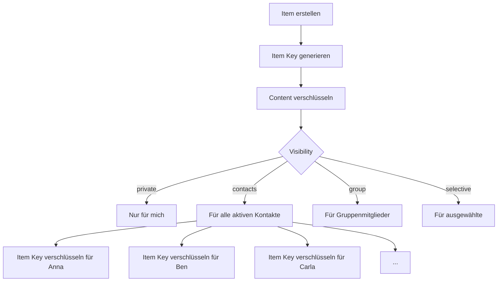
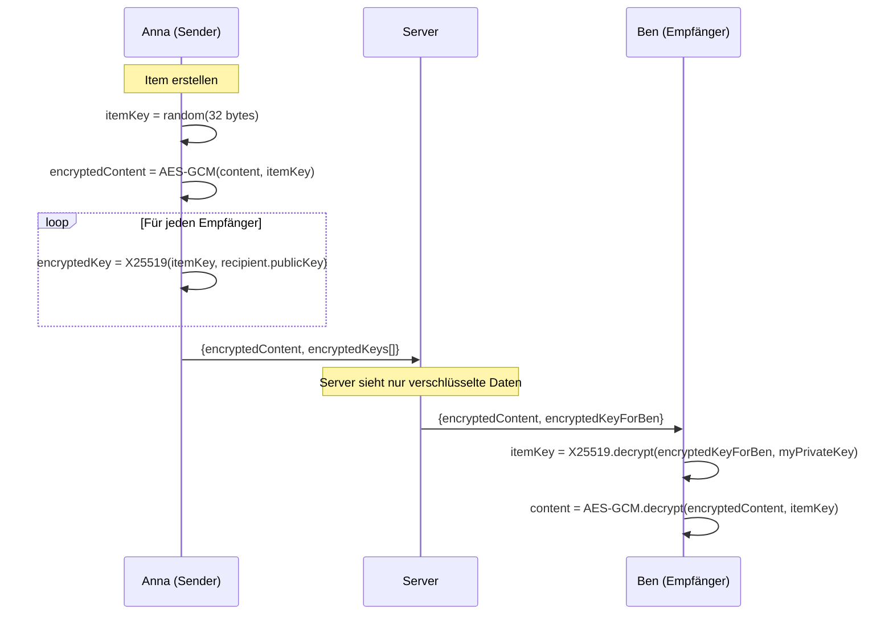
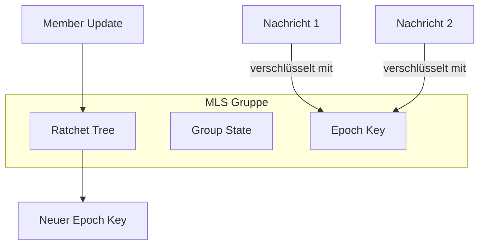
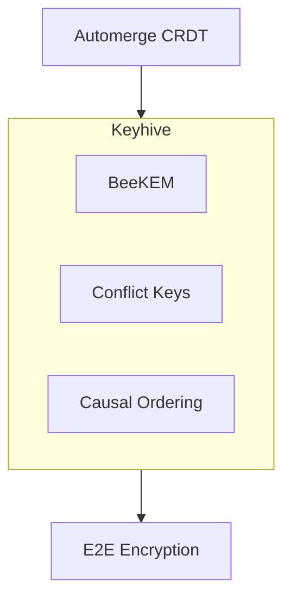

# Verschlüsselung

> End-to-End-Verschlüsselung im Web of Trust
>
> **Hinweis:** Für den POC wurde **Item-Keys** als Verschlüsselungsprotokoll gewählt.
> Die hier dokumentierten Alternativen (MLS, Keyhive) bleiben als Referenz für spätere Phasen.
> Siehe [Adapter-Architektur v2](adapter-architektur-v2.md) für die aktuelle Architektur.

## Anforderungen

Das Verschlüsselungssystem muss folgende Anforderungen erfüllen:

| Anforderung | Beschreibung |
|-------------|--------------|
| **Offline-First** | Verschlüsselung/Entschlüsselung ohne Server-Kontakt |
| **Gruppen** | Effiziente Verschlüsselung für Gruppen mit >50 Mitgliedern |
| **Concurrent Updates** | Mehrere Geräte können gleichzeitig offline Änderungen machen |
| **History Access** | Neue Gruppenmitglieder sehen vergangene Inhalte |
| **Key Rotation** | Bei Mitgliederwechsel müssen Keys rotiert werden können |
| **Skalierung** | Performant für Gruppen bis 1.000+ Mitglieder |

---

## Aktueller Ansatz: Item-Key-Modell

### Konzept

Jedes Item hat einen eigenen symmetrischen Schlüssel (Item Key), der für jeden Empfänger asymmetrisch verschlüsselt wird.



### Ablauf



### Vor- und Nachteile

| Vorteile | Nachteile |
|----------|-----------|
| Einfach zu implementieren | O(N) Overhead pro Item |
| Bewährt (PGP, age, etc.) | Keine Forward Secrecy |
| Kein Server-Ordering nötig | Keine Post-Compromise Security |
| Offline-kompatibel | Bei 100 Empfängern = 100 Verschlüsselungen |

---

## Evaluierte Alternativen

### Vergleichsübersicht

| Kriterium | Item-Keys | MLS (RFC 9420) | Keyhive/BeeKEM |
|-----------|-----------|----------------|----------------|
| **Komplexität** | Gering | Mittel | Hoch |
| **Produktionsreife** | Ja | Ja (Libraries) | Nein (Forschung) |
| **Standard** | Nein (bewährt) | RFC 9420 | Nein |
| **Forward Secrecy** | Nein | Ja | Nein (bewusst) |
| **Post-Compromise Security** | Nein | Ja | Ja |
| **Skalierung** | O(N) | O(log N) | O(log N) |
| **Server-Ordering nötig** | Nein | Ja | Nein |
| **CRDT-kompatibel** | Ja | Bedingt | Native |
| **Offline-First native** | Ja | Bedingt | Ja |
| **History für neue Member** | Ja | Konfigurierbar | Ja |

---

## MLS (RFC 9420)

### Beschreibung

[MLS (Messaging Layer Security)](https://datatracker.ietf.org/doc/rfc9420/) ist ein IETF-Standard für sichere Gruppenkommunikation.

### Kernkonzepte



### Eigenschaften

| Eigenschaft | Beschreibung |
|-------------|--------------|
| **TreeKEM** | Ratchet Tree für O(log N) Key-Updates |
| **Forward Secrecy** | Alte Nachrichten bei Key-Kompromittierung sicher |
| **Post-Compromise Security** | Gruppe "heilt" sich nach Kompromittierung |
| **Asynchron** | Designed für async Messaging |

### Herausforderungen für uns

| Herausforderung | Beschreibung |
|-----------------|--------------|
| **Ordering** | MLS braucht einen Delivery Service für Total Ordering |
| **Concurrent Updates** | Gleichzeitige Offline-Updates sind komplex |
| **State Management** | Ratchet Tree State muss synchron gehalten werden |

### Verfügbare Libraries

- [OpenMLS](https://github.com/openmls/openmls) (Rust, WASM)
- [ts-mls](https://github.com/LukaJCB/ts-mls) (TypeScript)
- [mls-rs](https://github.com/awslabs/mls-rs) (Rust, AWS)

---

## Keyhive/BeeKEM

### Beschreibung

[Keyhive](https://www.inkandswitch.com/keyhive/notebook/) ist ein Forschungsprojekt von Ink & Switch für E2E-Verschlüsselung in Local-First-Anwendungen.

### Kernkonzepte



### Unterschiede zu MLS

| Aspekt | MLS (TreeKEM) | Keyhive (BeeKEM) |
|--------|---------------|------------------|
| **Ordering** | Total Ordering (Server) | Causal Ordering (CRDT) |
| **Concurrent Updates** | Problematisch | "Conflict Keys" lösen das |
| **Offline** | Bedingt | Native ("arbitrarily long disconnection") |
| **Forward Secrecy** | Ja | Nein (bewusst - CRDT braucht History) |

### Status

> **Hinweis:** Keyhive ist ein Forschungsprojekt und noch nicht produktionsreif. Es gibt keine stabile Library.

---

## Empfehlung

### Für die Spezifikation

Die Verschlüsselung wird **abstrakt** spezifiziert:

```
┌─────────────────────────────────────────────────────────────┐
│                                                             │
│  Anforderungen definiert:                                   │
│  ✅ E2E-Verschlüsselung                                     │
│  ✅ Gruppenunterstützung                                    │
│  ✅ Offline-First                                           │
│  ✅ Key Rotation bei Membership-Änderungen                  │
│                                                             │
│  Konkretes Protokoll:                                       │
│  ⏳ Wird bei Implementierung entschieden                    │
│                                                             │
│  Optionen:                                                  │
│  • Item-Keys (einfach, bewährt)                             │
│  • MLS (Standard, wenn Server-Ordering akzeptabel)          │
│  • Keyhive (wenn produktionsreif und CRDT-basiert)          │
│                                                             │
└─────────────────────────────────────────────────────────────┘
```

### Entscheidungskriterien bei Implementierung

| Wenn... | Dann... |
|---------|---------|
| Gruppen meist <50 Mitglieder | Item-Keys ausreichend |
| Forward Secrecy wichtig | MLS |
| Vollständig dezentral (kein Ordering-Server) | Item-Keys oder Keyhive |
| CRDT-Framework gewählt (z.B. Automerge) | Keyhive prüfen |
| Schnelle Implementierung nötig | Item-Keys |

---

## Kryptografische Primitive

Unabhängig vom gewählten Protokoll:

| Zweck | Algorithmus | Standard |
|-------|-------------|----------|
| **Asymmetrische Verschlüsselung** | X25519 + HKDF | RFC 7748 |
| **Symmetrische Verschlüsselung** | AES-256-GCM | NIST SP 800-38D |
| **Signaturen** | Ed25519 | RFC 8032 |
| **Hashing** | SHA-256 / BLAKE3 | FIPS 180-4 |
| **Key Derivation** | HKDF-SHA256 | RFC 5869 |

### Libraries

| Plattform | Empfehlung |
|-----------|------------|
| **Browser** | Web Crypto API + libsodium-wrappers |
| **Node.js** | @noble/curves + @noble/ciphers |
| **React Native** | react-native-quick-crypto |
| **iOS** | CryptoKit + Keychain |
| **Android** | Tink + Keystore |

---

## Weiterführend

- [Datenmodell: Item_Key](../datenmodell/entitaeten.md#item_key-verschlüsselungsschlüssel)
- [Sync-Protokoll](sync-protokoll.md) - Wie verschlüsselte Daten synchronisiert werden
- [RFC 9420 - MLS](https://datatracker.ietf.org/doc/rfc9420/)
- [Keyhive Notebook](https://www.inkandswitch.com/keyhive/notebook/)
