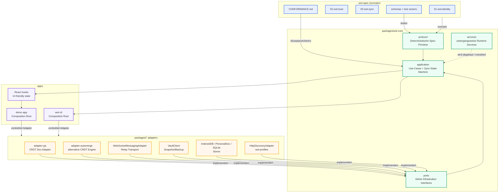
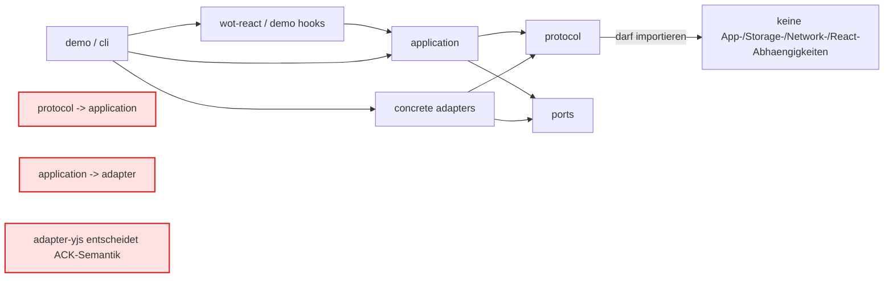
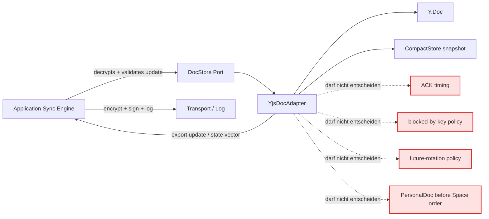
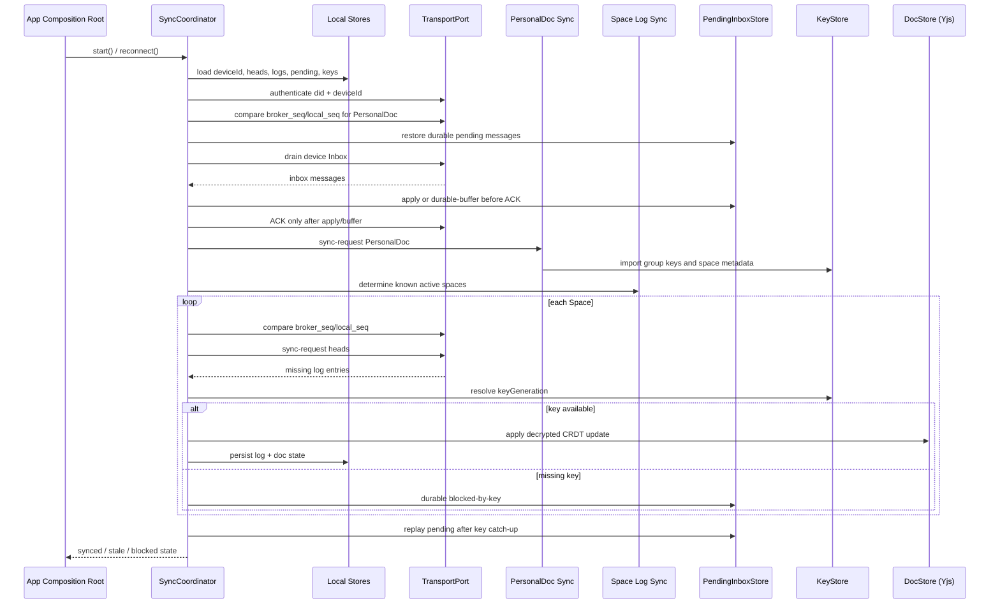
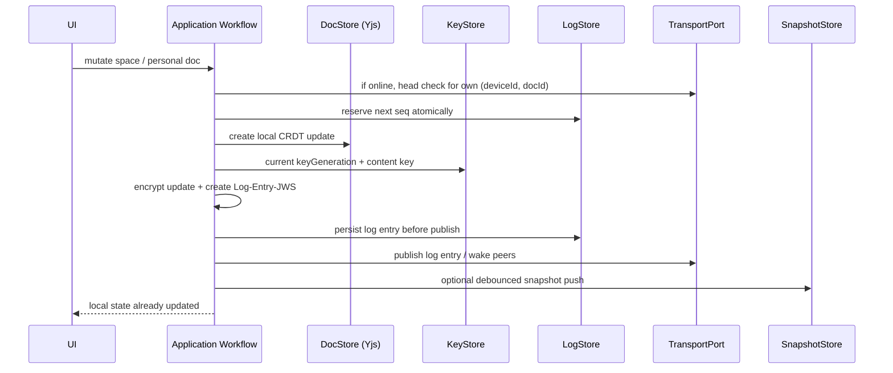
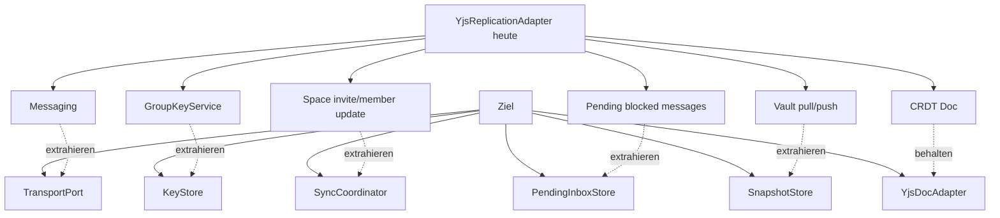

# Spec-vNext Target Architecture

> Nicht normativ. Dieses Dokument beschreibt das gemeinsame Zielbild fuer die TypeScript-Referenzimplementierung. Normative Anforderungen stehen in `wot-spec` und `CONFORMANCE.md`.

**Status:** Entwurf  
**Datum:** 2026-05-02  
**Scope:** `web-of-trust` PR #7 / `spec-vnext`
**Protocol-level counterpart:** `wot-spec/research/sync-zielarchitektur.md`

## Ziel

Die Referenzimplementierung soll die Spec-Struktur widerspiegeln: Protokollregeln werden deterministisch umgesetzt, Application-Workflows orchestrieren Verhalten, Ports beschreiben Infrastrukturfaehigkeiten und Adapter kapseln konkrete Technologien wie Yjs, Relay, Vault oder Browser-Storage.

Der wichtigste Architekturwechsel: **Yjs ist zukuenftig nur noch CRDT-Engine/Adapter, nicht die Sync-State-Machine.**

## Schichten

## Dependency-Regeln

Regeln:

- `protocol` implementiert deterministische Spec-Primitive und Testvektoren.
- `application` implementiert Use-Cases und State-Machines gegen Ports.
- `ports` sind klein und technologieunabhaengig.
- `adapters` implementieren Ports und duerfen Plattform-/Library-Code enthalten.
- Apps sind Composition Roots und waehlen konkrete Adapter.
- React-Hooks duennen Application-Workflows fuer UI aus; sie enthalten keine Protokollautoritaet.

## Ziel-Komponenten

```mermaid
flowchart TB
  subgraph Application["application/sync"]
    SyncCoordinator["SyncCoordinator"]
    StartupFlow["Startup/Reconnect Flow"]
    InboxProcessor["InboxProcessor"]
    LogSync["LogCatchUpService"]
    KeyState["KeyDependencyResolver"]
    AckPolicy["AckPolicy"]
  end

  subgraph Ports["ports"]
    TransportPort["TransportPort\nsend / receive / ack / heads"]
    PendingInboxStore["PendingInboxStore\ncrash-safe blocked messages"]
    LogStore["LogStore\nper (docId, deviceId, seq)"]
    KeyStore["KeyStore\ngroup keys + generations"]
    DocStore["DocStore\nCRDT-agnostic updates"]
    SnapshotStore["SnapshotStore\noptional optimization"]
    ClockRandom["Clock / Random"]
  end

  subgraph Adapters["adapter implementations"]
    Relay["Relay/WebSocket"]
    IndexedDB["IndexedDB / SQLite / PersonalDoc"]
    YjsAdapter["YjsDocAdapter"]
    Vault["Vault Snapshot Adapter"]
  end

  SyncCoordinator --> StartupFlow
  SyncCoordinator --> InboxProcessor
  SyncCoordinator --> LogSync
  SyncCoordinator --> KeyState
  InboxProcessor --> AckPolicy

  StartupFlow --> TransportPort
  StartupFlow --> PendingInboxStore
  StartupFlow --> LogStore
  StartupFlow --> KeyStore

  InboxProcessor --> PendingInboxStore
  InboxProcessor --> KeyStore
  InboxProcessor --> DocStore
  InboxProcessor --> TransportPort

  LogSync --> TransportPort
  LogSync --> LogStore
  LogSync --> DocStore
  LogSync --> KeyStore
  LogSync --> SnapshotStore

  KeyState --> PendingInboxStore
  KeyState --> KeyStore
  KeyState --> TransportPort

  Relay --> TransportPort
  IndexedDB --> PendingInboxStore
  IndexedDB --> LogStore
  IndexedDB --> KeyStore
  YjsAdapter --> DocStore
  Vault --> SnapshotStore
```

## Rolle Von Yjs

Yjs soll langfristig nur:

- lokale Space-Dokumente oeffnen und anlegen,
- CRDT-Updates anwenden,
- CRDT-Updates oder Snapshots exportieren,
- State Vectors bereitstellen,
- lokale Compact-Persistenz kapseln,
- Remote-Update-Events fuer UI ausloesen.

Yjs soll langfristig nicht:

- ACK-Zeitpunkte bestimmen,
- Pending-Inbox-Semantik definieren,
- Key-Rotation-Gaps aufloesen,
- Broker-/Relay-Catch-Up steuern,
- Personal-Doc-vor-Space-Abhaengigkeiten orchestrieren,
- Log-Heads vergleichen oder normative Sync-Recovery ersetzen.

## Startup Und Reconnect Ziel-Flow

## Write Ziel-Flow

## Spec Mapping

| Spec | Normative responsibility | Target implementation |
|---|---|---|
| `01-wot-identity` | DID, key derivation, DID document/key agreement | `protocol/identity`, `application/identity`, `IdentityVault` port |
| `02-wot-trust` | Verifications, Attestations, VC-JWS | `protocol/trust`, `application/verification`, `application/attestations` |
| `03-wot-sync/001` | Space IDs, capabilities, content keys | `protocol/sync`, `KeyStore`, `CapabilityVerifier` |
| `03-wot-sync/002` | Log entries, startup/reconnect, local writes, pending, blocked-by-key, future-rotation | `application/sync/SyncCoordinator`, `LogStore`, `PendingInboxStore`, `KeyDependencyResolver` |
| `03-wot-sync/003` | Broker auth, per-device Inbox, ACK, sync-request/response | `TransportPort`, Relay adapter, `AckPolicy` |
| `03-wot-sync/004` | Transport envelope compatibility | `protocol/sync/envelope`, transport adapter tests |
| `03-wot-sync/005` | Groups, member-update, key-rotation generation rules | `application/spaces`, `KeyStore`, `KeyDependencyResolver` |
| `03-wot-sync/006` | Personal Doc, self-addressed multi-device sync, Personal Doc before Spaces | `application/sync/StartupFlow`, PersonalDoc adapter |
| `CONFORMANCE.md` | Profile-level acceptance criteria | CI conformance checklist + integration tests |
| Schemas/test vectors | Interop fixtures | Protocol tests imported or mirrored from `wot-spec` |

## Aktueller Uebergangszustand

Der aktuelle `YjsReplicationAdapter` bleibt als funktionierende Uebergangsimplementierung. Stabilitaetsfixes sind sinnvoll, wenn sie Datenverlust verhindern oder Spec-Invarianten absichern. Neue groessere Features sollten nicht weiter in diesen Adapter wachsen, sondern in Ports/Application-Workflows extrahiert werden.

## Migrationspfad

1. `PendingInboxStore` als Port einfuehren und die aktuelle CompactStore-basierte Pending-Logik aus `YjsReplicationAdapter` herausziehen.
2. `KeyStore` und `KeyDependencyResolver` einfuehren; `blocked-by-key` und `future-rotation` in Application-Tests abdecken.
3. `TransportPort` mit per-device ACK-Semantik und `sync-request`/`sync-response` als Application-Abhaengigkeit definieren.
4. `LogStore` fuer `(docId, deviceId, seq)` einfuehren; lokale Writes gehen zuerst ins Log, dann an Transport/Peers.
5. `YjsDocAdapter` auf `DocStore` reduzieren: apply/export/state-vector/snapshot/local persistence.
6. Timer-basierte Reconnect-Fixes durch dependency-aware Catch-Up ersetzen.
7. Vor Merge in `main`: Spec-Referenzen, CI-Checks und Reset-/Breaking-Release-Plan aktualisieren.

## Offene Architekturfragen

| Frage | Entscheidungstendenz |
|---|---|
| Soll `PendingInboxStore` im Personal Doc oder lokalem Store liegen? | Lokal crash-sicher als Minimum; Personal Doc nur fuer Daten, die zwischen eigenen Devices repliziert werden muessen. |
| Soll Vault Pending-Nachrichten sichern? | Nein als Norm. Vault bleibt Snapshot-/Backup-Optimierung, nicht Quelle fuer ACK-Sicherheit. |
| Soll Yjs Full-State weiterhin ueber Relay verschickt werden? | Uebergang ja. Langfristig nur Snapshot-/Catch-Up-Optimierung, nicht normativer Sync-Ersatz. |
| Brauchen wir `key-request`? | Nicht in `wot-sync@0.1`. Bestehende Quellen: Inbox, Personal Doc, Space Catch-Up, optionale Snapshots/Full-State. |
| Wann ist ein Adapter-Fix sinnvoll? | Wenn er eine Spec-Invariante absichert und spaeter extrahierbar ist. Keine neuen grossen Verantwortungen im Adapter. |
