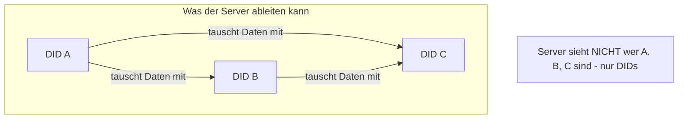
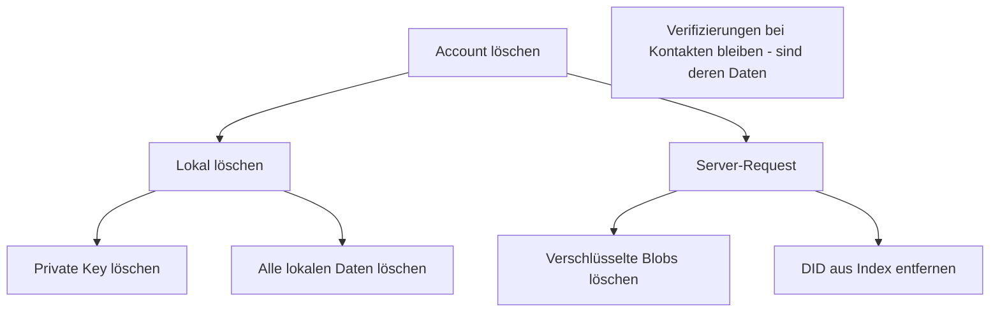

# Privacy

> Datenschutz-Überlegungen im Web of Trust

## Grundprinzipien

### Datenminimierung

```
┌─────────────────────────────────────────────────────────────┐
│                                                             │
│  Nur erforderliche Daten werden erhoben:                    │
│                                                             │
│  ✅ Name (selbst gewählt)                                   │
│  ✅ Foto (optional)                                         │
│  ✅ Kontakte (nur verifizierte)                             │
│  ✅ Selbst erstellte Inhalte                                │
│                                                             │
│  ❌ Keine Telefonnummer                                     │
│  ❌ Keine E-Mail-Adresse                                    │
│  ❌ Keine Standortdaten (außer explizit in Items)           │
│  ❌ Kein Adressbuch-Upload                                  │
│                                                             │
└─────────────────────────────────────────────────────────────┘
```

### Lokale Kontrolle

```
┌─────────────────────────────────────────────────────────────┐
│                                                             │
│  Daten bleiben unter Nutzer-Kontrolle:                      │
│                                                             │
│  • Alle Daten lokal gespeichert                             │
│  • Export jederzeit möglich                                 │
│  • Löschung möglich (lokal + Server)                        │
│  • Kein Account beim Betreiber nötig                        │
│                                                             │
└─────────────────────────────────────────────────────────────┘
```

---

## Was der Server sieht

### Verschlüsselte Daten (kein Zugriff auf Inhalt)

| Datentyp | Server sieht |
|----------|--------------|
| Items | Verschlüsselter Blob |
| Attestation-Inhalt | Verschlüsselt |
| Profil-Details | Verschlüsselt |

### Metadaten (Server sieht)

| Metadatum | Beschreibung | Mitigation |
|-----------|--------------|------------|
| **IP-Adresse** | Bei jeder Verbindung | VPN empfehlen |
| **Timing** | Wann synchronisiert wird | - |
| **Nachrichtengröße** | Wie viel Daten | Padding möglich |
| **DID-Paare** | Wer mit wem kommuniziert | Teilweise ableitbar |

### Kontaktgraph



**Risiko:** Social Graph ist teilweise ableitbar.

**Mitigation-Optionen:**
1. Padding (alle Nachrichten gleich groß)
2. Dummy-Traffic
3. Onion Routing (komplex)

**Aktuelle Entscheidung:** Akzeptiert als Trade-off für Usability.

---

## DSGVO-Konformität

### Rechte der Nutzer

| Recht | Umsetzung |
|-------|-----------|
| **Auskunft (Art. 15)** | Export-Funktion |
| **Berichtigung (Art. 16)** | Profil bearbeitbar |
| **Löschung (Art. 17)** | Lokale Löschung + Server-Request |
| **Datenübertragbarkeit (Art. 20)** | JSON/CSV Export |
| **Widerspruch (Art. 21)** | Keine Profilbildung |

### Besondere Kategorien

```
┌─────────────────────────────────────────────────────────────┐
│                                                             │
│  Keine besonderen Kategorien erhoben:                       │
│                                                             │
│  ❌ Keine Gesundheitsdaten                                  │
│  ❌ Keine politischen Meinungen                             │
│  ❌ Keine religiösen Überzeugungen                          │
│  ❌ Keine biometrischen Daten (Profilbild = optional)       │
│                                                             │
│  Attestationen könnten sensible Infos enthalten             │
│  → Nutzer-Verantwortung, E2E-verschlüsselt                  │
│                                                             │
└─────────────────────────────────────────────────────────────┘
```

---

## Löschung

### Was gelöscht werden kann

| Datentyp | Löschbar? | Anmerkung |
|----------|-----------|-----------|
| Profil | Ja | Lokal + Server |
| Items | Ja (Soft Delete) | Lokal, Server-Markierung |
| Kontakte | Ausblenden | Verifizierung bleibt |
| Verifizierungen | Nein | Immutable by design |
| Attestationen | Nein | Immutable by design |

### Warum Verifizierungen/Attestationen nicht löschbar

```
┌─────────────────────────────────────────────────────────────┐
│                                                             │
│  Design-Entscheidung:                                       │
│                                                             │
│  Verifizierungen und Attestationen sind Aussagen über       │
│  die Vergangenheit:                                         │
│                                                             │
│  "Ich habe Anna am 05.01.2025 getroffen"                    │
│  "Ben hat mir beim Umzug geholfen"                          │
│                                                             │
│  Diese Fakten können nicht "ungeschehen" gemacht werden.    │
│                                                             │
│  Löschbarkeit würde:                                        │
│  • Manipulation ermöglichen                                 │
│  • Vertrauen untergraben                                    │
│  • System-Integrität gefährden                              │
│                                                             │
└─────────────────────────────────────────────────────────────┘
```

### Account-Löschung



---

## Anonymität vs. Pseudonymität

### Aktueller Stand: Pseudonymität

```
┌─────────────────────────────────────────────────────────────┐
│                                                             │
│  Nutzer sind PSEUDONYM:                                     │
│                                                             │
│  • DID = zufälliges Pseudonym                               │
│  • Name = selbst gewählt (kann falsch sein)                 │
│  • Aktivitäten = einem DID zuordenbar                       │
│                                                             │
│  Nutzer sind NICHT anonym:                                  │
│  • Verifizierung = jemand kennt die echte Person            │
│  • Aktivitätsmuster = analysierbar                          │
│                                                             │
└─────────────────────────────────────────────────────────────┘
```

### De-Anonymisierung möglich durch

| Methode | Risiko |
|---------|--------|
| Verifizierender kennt echte Identität | Hoch |
| Attestations-Inhalte | Mittel |
| Metadaten-Korrelation | Mittel |
| IP-Analyse | Mittel |

---

## Privacy by Design

### Implementiert

| Prinzip | Umsetzung |
|---------|-----------|
| **Minimierung** | Nur nötige Daten |
| **Verschlüsselung** | E2E für alle Inhalte |
| **Lokale Speicherung** | Daten auf Gerät |
| **Keine Accounts** | Kein Betreiber-Login |
| **Export** | Volle Datenportabilität |

### Offen

| Prinzip | Status |
|---------|--------|
| **Metadaten-Schutz** | Teilweise (Trade-off) |
| **Unlinkability** | Nicht vollständig |
| **Plausible Deniability** | Nicht implementiert |

---

## Empfehlungen für Nutzer

```
┌─────────────────────────────────────────────────────────────┐
│                                                             │
│  Für maximale Privacy:                                      │
│                                                             │
│  ✅ Pseudonymes Profil verwenden                            │
│  ✅ Kein echtes Foto hochladen                              │
│  ✅ VPN verwenden                                           │
│  ✅ Nur vertrauenswürdige Personen verifizieren             │
│  ✅ Vorsicht bei Attestations-Inhalten                      │
│                                                             │
└─────────────────────────────────────────────────────────────┘
```

---

## Weiterführend

- [Threat Model](threat-model.md) - Sicherheitsrisiken
- [Export-Flow](../flows/08-export-nutzer-flow.md) - Daten exportieren
