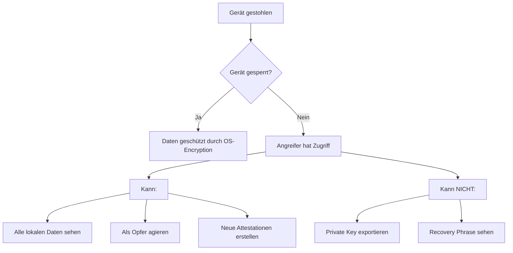
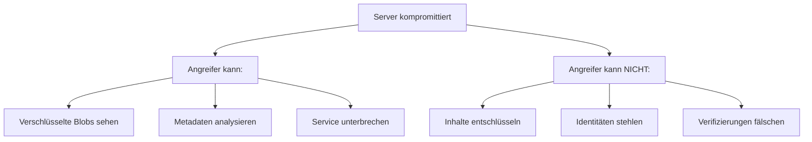
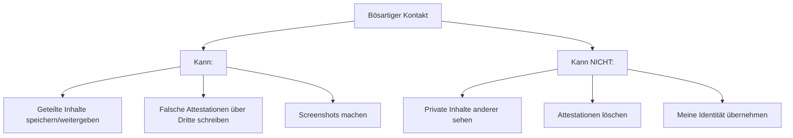
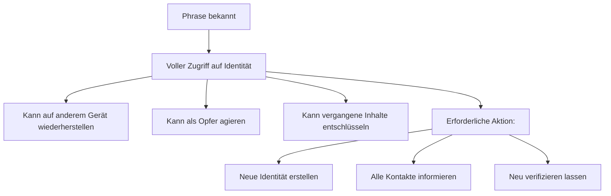

# Threat Model

> Angriffsvektoren und Mitigationen im Web of Trust

## Übersicht

Dieses Dokument analysiert potenzielle Bedrohungen nach dem STRIDE-Modell.

---

## Akteure

### Legitime Akteure

| Akteur | Beschreibung |
|--------|--------------|
| **Nutzer** | Regulärer App-Nutzer |
| **Kontakt** | Verifizierter Kontakt eines Nutzers |
| **Gruppen-Admin** | Admin einer expliziten Gruppe |

### Angreifer

| Angreifer | Fähigkeiten |
|-----------|-------------|
| **Passiver Netzwerk-Angreifer** | Kann Traffic mitlesen |
| **Aktiver Netzwerk-Angreifer** | Kann Traffic manipulieren |
| **Kompromittierter Server** | Voller Zugriff auf Server-Daten |
| **Bösartiger Kontakt** | Verifizierter Kontakt mit bösen Absichten |
| **Gestohlenes Gerät** | Physischer Zugriff auf entsperrtes Gerät |

---

## STRIDE-Analyse

### S - Spoofing (Identitätsfälschung)

| Bedrohung | Risiko | Mitigation |
|-----------|--------|------------|
| Gefälschte Identität erstellen | Niedrig | Identität = kryptografisches Key Pair |
| Verifizierung fälschen | Niedrig | Verifizierungen sind signiert |
| Attestation fälschen | Niedrig | Attestationen sind signiert |
| QR-Code manipulieren | Mittel | DID und Public Key müssen zusammenpassen |

**Verbleibende Risiken:**
- Social Engineering ("Ich bin Max, scann meinen QR")
- Phishing-QR-Codes auf Postern

### T - Tampering (Manipulation)

| Bedrohung | Risiko | Mitigation |
|-----------|--------|------------|
| Nachricht auf Server ändern | Niedrig | E2E-Verschlüsselung + Signaturen |
| Lokale Daten manipulieren | Mittel | Signaturen validieren bei Sync |
| CRDT-State manipulieren | Niedrig | Kryptografische Integrität |

**Verbleibende Risiken:**
- Manipulation vor Verschlüsselung (kompromittiertes Gerät)

### R - Repudiation (Abstreitbarkeit)

| Bedrohung | Risiko | Mitigation |
|-----------|--------|------------|
| Attestation abstreiten | Niedrig | Unveränderliche Signaturen |
| Verifizierung abstreiten | Niedrig | Signatur beweist Aktion |

**Designentscheidung:** Attestationen sind bewusst nicht löschbar.

### I - Information Disclosure (Informationspreisgabe)

| Bedrohung | Risiko | Mitigation |
|-----------|--------|------------|
| Server liest Inhalte | Niedrig | E2E-Verschlüsselung |
| Netzwerk-Sniffer | Niedrig | TLS + E2E |
| Metadaten-Leak | Mittel | Siehe [Privacy](privacy.md) |
| Geräteverlust | Hoch | Siehe "Gestohlenes Gerät" |

**Verbleibende Risiken:**
- Server sieht Timing, IP-Adressen, Nachrichtengrößen
- Kontaktgraph teilweise ableitbar

### D - Denial of Service

| Bedrohung | Risiko | Mitigation |
|-----------|--------|------------|
| Server-DDoS | Mittel | Standard-DDoS-Schutz |
| Spam-Attestationen | Niedrig | Nur verifizierte Kontakte können attestieren |
| Storage-Angriff | Mittel | Rate Limiting, Quotas |

### E - Elevation of Privilege

| Bedrohung | Risiko | Mitigation |
|-----------|--------|------------|
| Admin-Rechte erschleichen | Niedrig | Gruppen-Admin = kryptografischer Beweis |
| Server-Admin missbraucht Macht | Niedrig | Server hat keine inhaltlichen Rechte |

---

## Szenarien

### Szenario 1: Gestohlenes Gerät



**Mitigationen:**
1. Gerätesperre empfehlen
2. Biometrische Authentifizierung für sensible Aktionen
3. Remote Wipe über Server signalisieren
4. Neue Identität erstellen wenn Phrase sicher

### Szenario 2: Kompromittierter Server



**Designentscheidung:** Server ist "Honest but Curious" - wir vertrauen ihm nicht.

### Szenario 3: Bösartiger Kontakt



**Mitigation:**
- Kontakt ausblenden reduziert zukünftige Exposure
- Attestationen zeigen Quelle (Reputation des Attestierenden)

### Szenario 4: Recovery Phrase kompromittiert



**Kritisch:** Recovery Phrase = Vollzugriff. Daher:
- Quiz bei Onboarding
- Warnung vor digitaler Speicherung
- Keine "Phrase anzeigen" Funktion nach Onboarding

---

## Vertrauensmodell

```
┌─────────────────────────────────────────────────────────────┐
│                                                             │
│  Vertrauenshierarchie:                                      │
│                                                             │
│  1. Eigener Private Key        → Voller Kontrolle           │
│  2. Recovery Phrase            → Kann Key rekonstruieren    │
│  3. Verifizierte Kontakte      → Sehen geteilte Inhalte     │
│  4. Server                     → Nur Transport/Speicher     │
│  5. Nicht-Verifizierte         → Sehen nichts               │
│                                                             │
└─────────────────────────────────────────────────────────────┘
```

---

## Empfehlungen

### Für Nutzer

| Empfehlung | Priorität |
|------------|-----------|
| Gerätesperre aktivieren | Hoch |
| Recovery Phrase sicher aufbewahren | Kritisch |
| Nur persönlich verifizieren | Hoch |
| Bei Verdacht: neue Identität | Mittel |

### Für Implementierung

| Empfehlung | Priorität |
|------------|-----------|
| Private Key im Secure Element | Hoch |
| Certificate Pinning | Hoch |
| Biometrie für sensible Aktionen | Mittel |
| Signatur-Validierung bei jedem Sync | Kritisch |

---

## Offene Risiken

| Risiko | Beschreibung | Akzeptiert? |
|--------|--------------|-------------|
| **Metadaten** | Server sieht Kommunikationsmuster | Ja (Abwägung mit Usability) |
| **Screenshots** | Kontakte können Inhalte abfotografieren | Ja (technisch nicht verhinderbar) |
| **Social Engineering** | Falsche Person verifizieren | Ja (Nutzer-Verantwortung) |
| **Gerät ungesperrt gestohlen** | Voller Zugriff | Ja (OS-Verantwortung) |

---

## Weiterführend

- [Privacy](privacy.md) - Datenschutz und Metadaten
- [Best Practices](best-practices.md) - Sichere Implementierung
