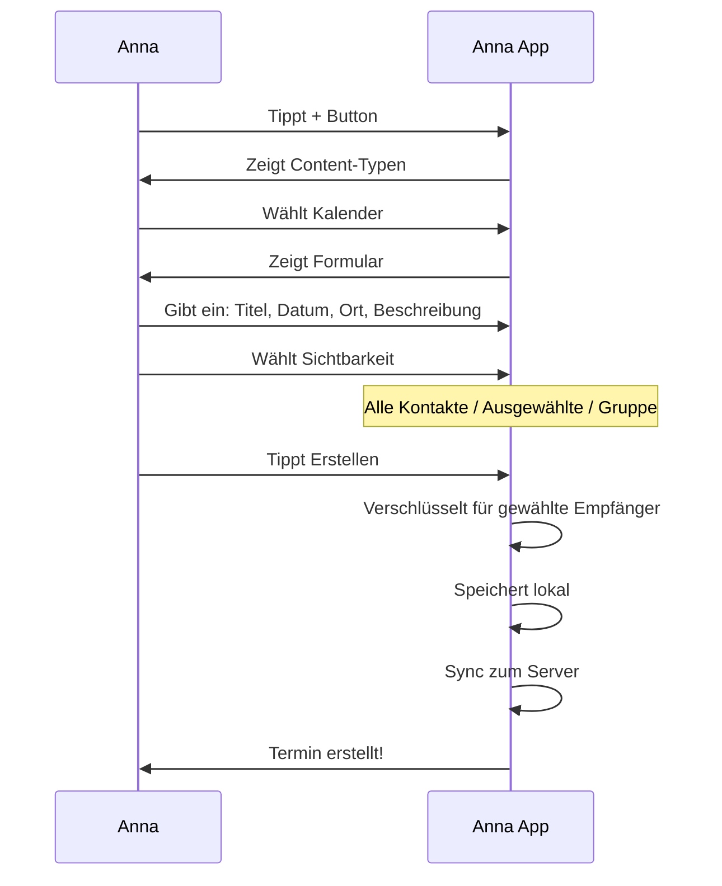
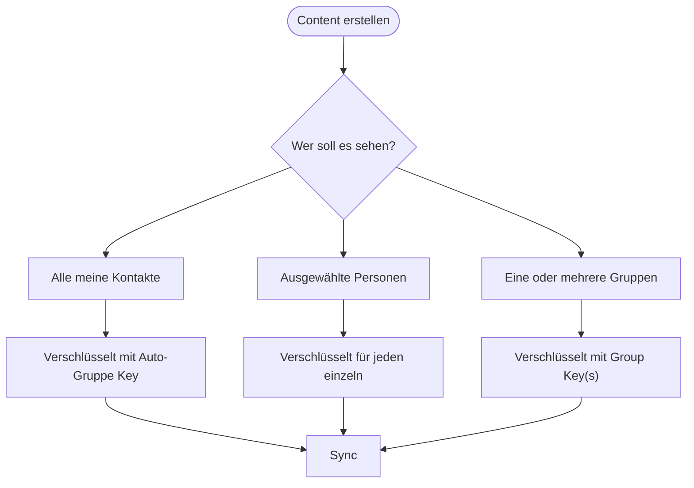
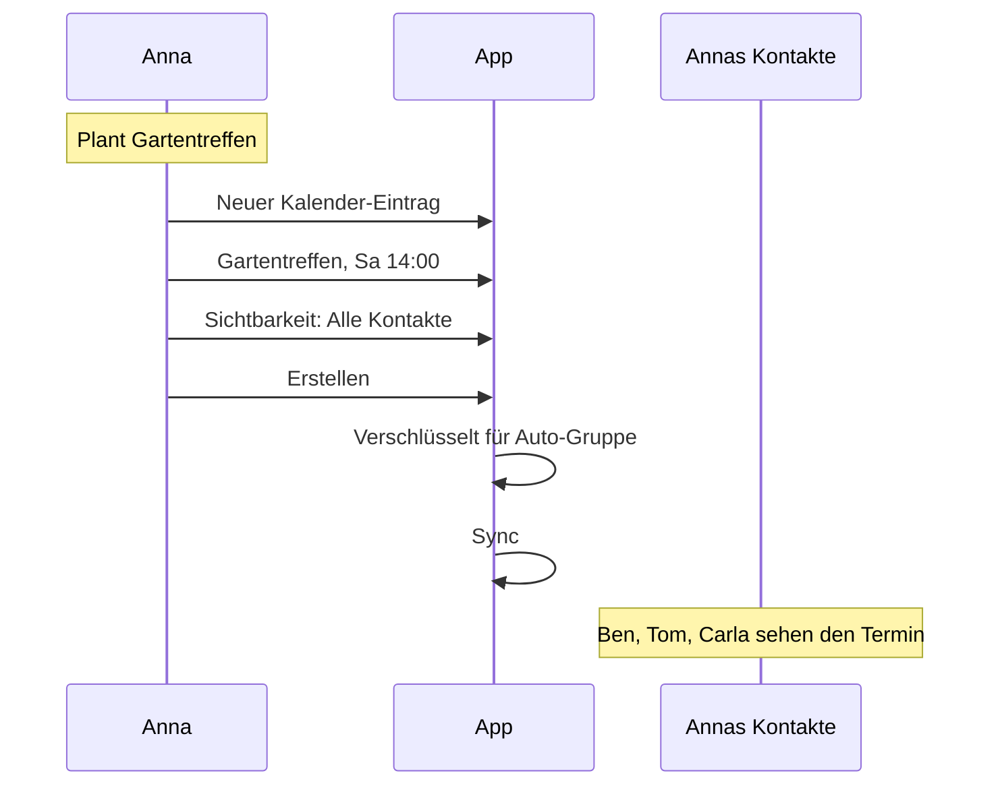
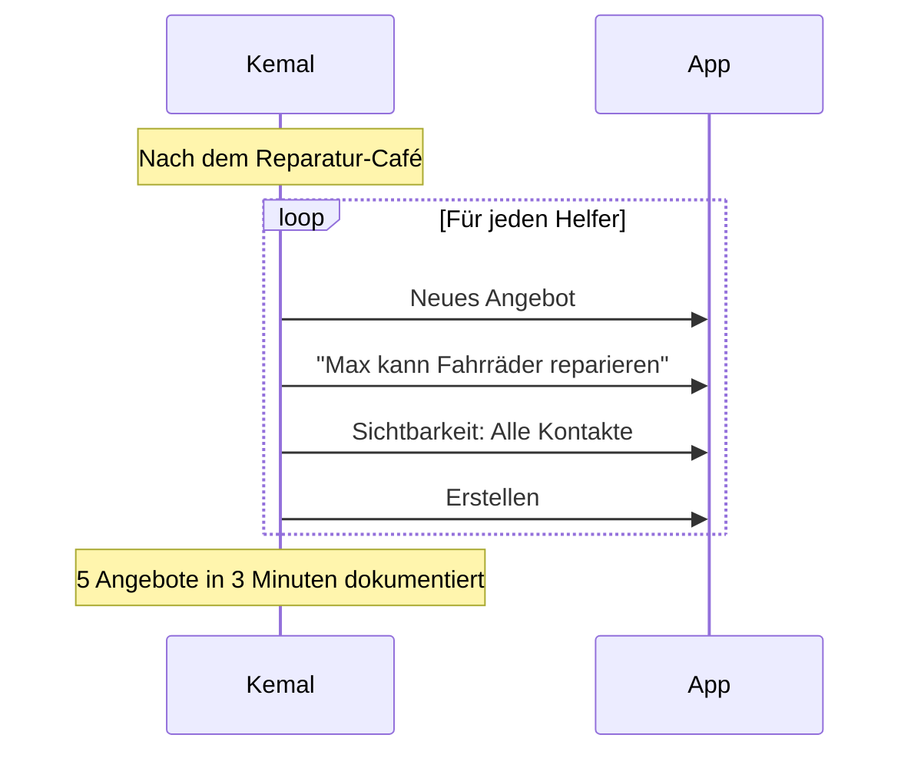
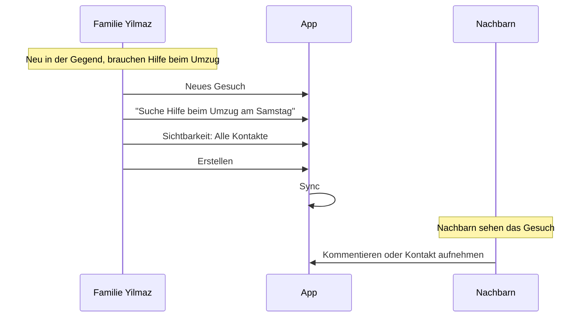
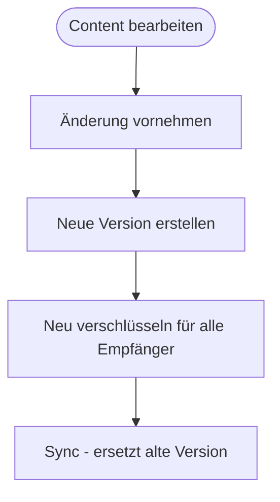
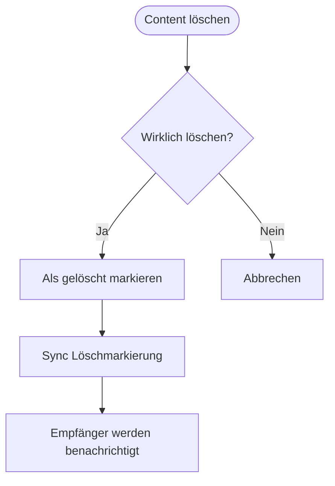

# Content-Flow (Nutzer-Perspektive)

> Wie Nutzer Inhalte erstellen und teilen

## Content-Typen

Das Web of Trust unterstützt verschiedene Content-Typen:

| Typ | Beschreibung | Beispiel |
| --- | ------------ | -------- |
| Kalender | Termine und Events | "Gartentreffen am Samstag" |
| Karte | Orte und Markierungen | "Werkzeugverleih bei Anna" |
| Projekt | Kooperative Vorhaben | "Gemeinschaftsgarten 2025" |
| Angebot | Was ich anbiete | "Kann Fahrräder reparieren" |
| Gesuch | Was ich suche | "Suche Hilfe beim Umzug" |

---

## Hauptflow: Content erstellen



---

## Sichtbarkeit steuern

### Optionen beim Erstellen



### Sichtbarkeit nachträglich ändern

Content kann nach dem Erstellen erweitert werden (mehr Personen hinzufügen), aber nicht eingeschränkt werden (bereits geteilte Kopien existieren).

---

## Was der Nutzer sieht

### Neuen Content erstellen

```
┌─────────────────────────────────┐
│                                 │
│   + Neuer Inhalt                │
│                                 │
├─────────────────────────────────┤
│                                 │
│   ┌─────────────────────────┐   │
│   │  📅 Kalender-Eintrag    │   │
│   │     Termin oder Event   │   │
│   └─────────────────────────┘   │
│                                 │
│   ┌─────────────────────────┐   │
│   │  📍 Karten-Markierung   │   │
│   │     Ort oder Adresse    │   │
│   └─────────────────────────┘   │
│                                 │
│   ┌─────────────────────────┐   │
│   │  📋 Projekt             │   │
│   │     Gemeinsames         │   │
│   │     Vorhaben            │   │
│   └─────────────────────────┘   │
│                                 │
│   ┌─────────────────────────┐   │
│   │  🤝 Angebot             │   │
│   │     Was ich anbiete     │   │
│   └─────────────────────────┘   │
│                                 │
│   ┌─────────────────────────┐   │
│   │  🔍 Gesuch              │   │
│   │     Was ich suche       │   │
│   └─────────────────────────┘   │
│                                 │
└─────────────────────────────────┘
```

### Kalender-Eintrag erstellen

```
┌─────────────────────────────────┐
│                                 │
│   📅 Neuer Termin               │
│                                 │
├─────────────────────────────────┤
│                                 │
│   Titel *                       │
│   ┌─────────────────────────┐   │
│   │ Gartentreffen           │   │
│   └─────────────────────────┘   │
│                                 │
│   Datum *                       │
│   ┌─────────────────────────┐   │
│   │ Sa, 15.01.2025  14:00   │   │
│   └─────────────────────────┘   │
│                                 │
│   Ort                           │
│   ┌─────────────────────────┐   │
│   │ Gemeinschaftsgarten     │   │
│   │ Sonnenberg              │   │
│   └─────────────────────────┘   │
│                                 │
│   Beschreibung                  │
│   ┌─────────────────────────┐   │
│   │ Wir bereiten die Beete  │   │
│   │ für das Frühjahr vor.   │   │
│   │ Bitte Handschuhe        │   │
│   │ mitbringen!             │   │
│   └─────────────────────────┘   │
│                                 │
│   ━━━━━━━━━━━━━━━━━━━━━━━━━━━   │
│                                 │
│   Wer soll es sehen?            │
│                                 │
│   (•) Alle meine Kontakte       │
│   ( ) Ausgewählte Personen      │
│   ( ) Gruppen:                  │
│       [ ] Gemeinschaftsgarten   │
│       [ ] Nachbarschaftshilfe   │
│       [ ] Reparatur-Café        │
│                                 │
│   [ Termin erstellen ]          │
│                                 │
└─────────────────────────────────┘
```

### Karten-Markierung erstellen

```
┌─────────────────────────────────┐
│                                 │
│   📍 Neue Markierung            │
│                                 │
├─────────────────────────────────┤
│                                 │
│   ┌─────────────────────────┐   │
│   │                         │   │
│   │      [Karte mit Pin]    │   │
│   │           📍            │   │
│   │                         │   │
│   └─────────────────────────┘   │
│                                 │
│   Titel *                       │
│   ┌─────────────────────────┐   │
│   │ Werkzeugverleih         │   │
│   └─────────────────────────┘   │
│                                 │
│   Kategorie                     │
│   ┌─────────────────────────┐   │
│   │ Ausleihen            ▼  │   │
│   └─────────────────────────┘   │
│                                 │
│   Beschreibung                  │
│   ┌─────────────────────────┐   │
│   │ Hier kann man sich      │   │
│   │ Werkzeug ausleihen.     │   │
│   │ Einfach klingeln!       │   │
│   └─────────────────────────┘   │
│                                 │
│   [ Markierung erstellen ]      │
│                                 │
└─────────────────────────────────┘
```

### Content-Übersicht (Feed)

```
┌─────────────────────────────────┐
│  Neuigkeiten                    │
├─────────────────────────────────┤
│                                 │
│  ┌─────────────────────────┐    │
│  │ 📅 Gartentreffen        │    │
│  │    Sa, 15.01. 14:00     │    │
│  │                         │    │
│  │    👩 Anna · vor 2h      │    │
│  │    📍 Gemeinschaftsgarten│    │
│  └─────────────────────────┘    │
│                                 │
│  ┌─────────────────────────┐    │
│  │ 🤝 Angebot              │    │
│  │    Kann bei Umzug       │    │
│  │    helfen               │    │
│  │                         │    │
│  │    👨 Ben · vor 1 Tag    │    │
│  └─────────────────────────┘    │
│                                 │
│  ┌─────────────────────────┐    │
│  │ 🔍 Gesuch               │    │
│  │    Suche Bohrmaschine   │    │
│  │    zum Ausleihen        │    │
│  │                         │    │
│  │    👴 Tom · vor 3 Tagen  │    │
│  └─────────────────────────┘    │
│                                 │
│  [ Mehr laden ]                 │
│                                 │
└─────────────────────────────────┘
```

---

## Personas

### Anna teilt einen Termin



### Kemal erstellt Angebote nach Reparatur-Café



### Familie Yilmaz sucht Hilfe



---

## Content bearbeiten und löschen

### Bearbeiten



**Hinweis:** Empfänger, die die alte Version bereits haben, behalten diese lokal. Die neue Version wird beim nächsten Sync überschrieben.

### Löschen



**Hinweis:** Gelöschter Content wird bei Empfängern als "nicht mehr verfügbar" angezeigt. Die verschlüsselten Daten können nicht remote gelöscht werden.

---

## Kalender-Ansicht

```
┌─────────────────────────────────┐
│  📅 Januar 2025                 │
│  ◄                          ►   │
├─────────────────────────────────┤
│  Mo Di Mi Do Fr Sa So           │
│                    1  2  3  4   │
│   5  6  7  8  9 10 11           │
│  12 13 14[15]16 17 18           │
│  19 20 21 22 23 24 25           │
│  26 27 28 29 30 31              │
├─────────────────────────────────┤
│                                 │
│  Sa, 15. Januar                 │
│                                 │
│  ┌─────────────────────────┐    │
│  │ 14:00 Gartentreffen     │    │
│  │       👩 Anna            │    │
│  │       📍 Gemeinschafts-  │    │
│  │          garten         │    │
│  └─────────────────────────┘    │
│                                 │
│  ┌─────────────────────────┐    │
│  │ 18:00 Reparatur-Café    │    │
│  │       👨 Kemal           │    │
│  │       📍 Nachbarschafts- │    │
│  │          haus           │    │
│  └─────────────────────────┘    │
│                                 │
└─────────────────────────────────┘
```

---

## Karten-Ansicht

```
┌─────────────────────────────────┐
│  🗺️ Karte                       │
│  Filter: [Alle ▼]               │
├─────────────────────────────────┤
│                                 │
│   ┌─────────────────────────┐   │
│   │                         │   │
│   │     📍 Werkzeug         │   │
│   │          📍 Garten      │   │
│   │                    📍   │   │
│   │        📍               │   │
│   │     Reparatur           │   │
│   │                         │   │
│   └─────────────────────────┘   │
│                                 │
├─────────────────────────────────┤
│  In der Nähe:                   │
│                                 │
│  📍 Werkzeugverleih (200m)      │
│     Ausleihen · Anna            │
│                                 │
│  📍 Gemeinschaftsgarten (350m)  │
│     Garten · Gruppe             │
│                                 │
│  📍 Reparatur-Café (500m)       │
│     Reparieren · Kemal          │
│                                 │
└─────────────────────────────────┘
```

---

## Benachrichtigungen

Nutzer werden benachrichtigt bei:

| Ereignis | Benachrichtigung |
| -------- | ---------------- |
| Neuer Content von Kontakt | "Anna hat einen Termin geteilt" |
| Content wurde aktualisiert | "Termin wurde geändert" |
| Content wurde gelöscht | "Termin ist nicht mehr verfügbar" |
| Termin steht bevor | "Gartentreffen in 1 Stunde" |

---

## Einschränkungen

| Was | Einschränkung |
| --- | ------------- |
| Sichtbarkeit einschränken | Nicht möglich nach dem Teilen |
| Sichtbarkeit erweitern | Jederzeit möglich |
| Content löschen | Markiert als gelöscht, nicht physisch entfernt |
| Offline erstellen | Möglich, Sync bei Verbindung |
