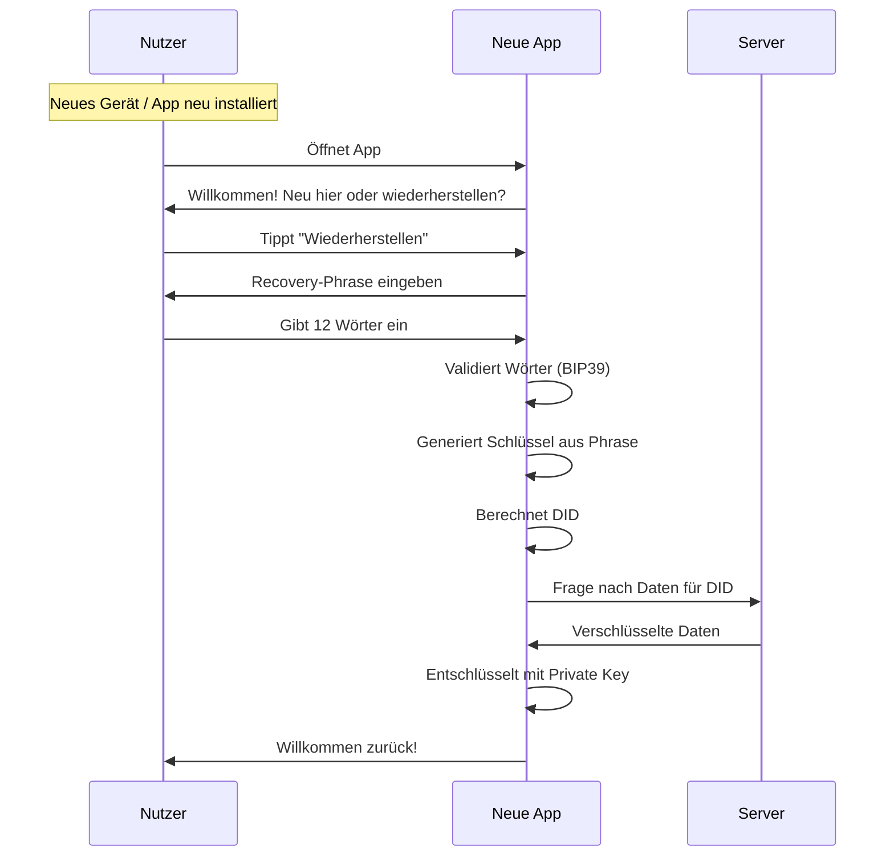
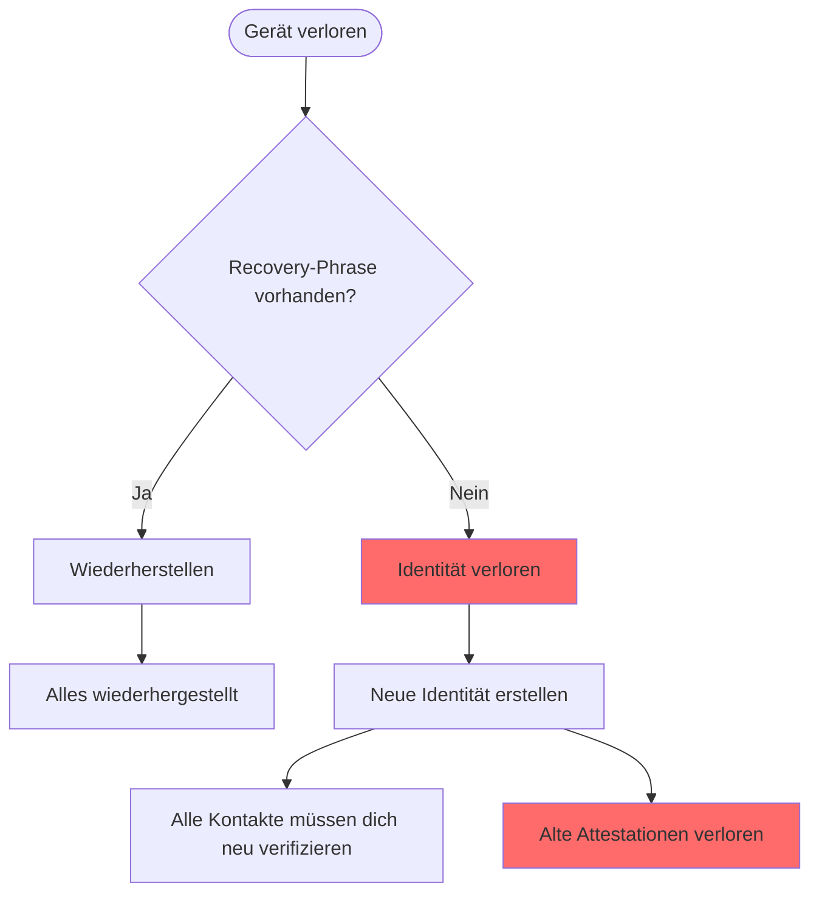
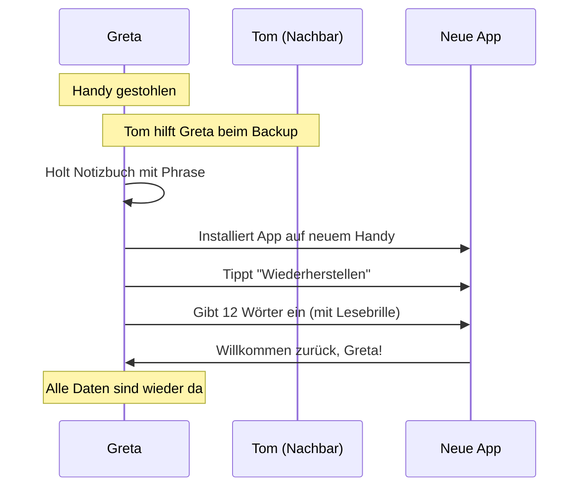
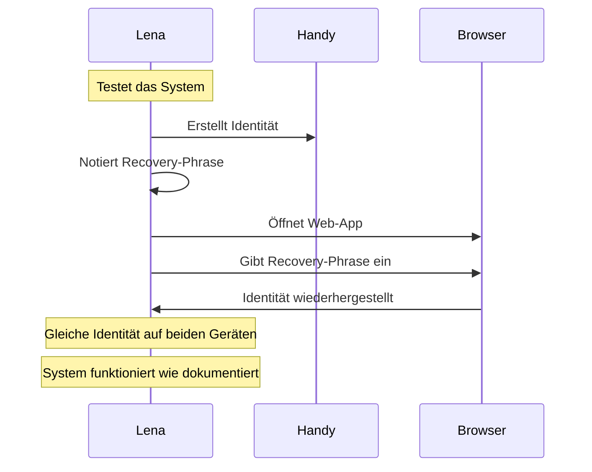
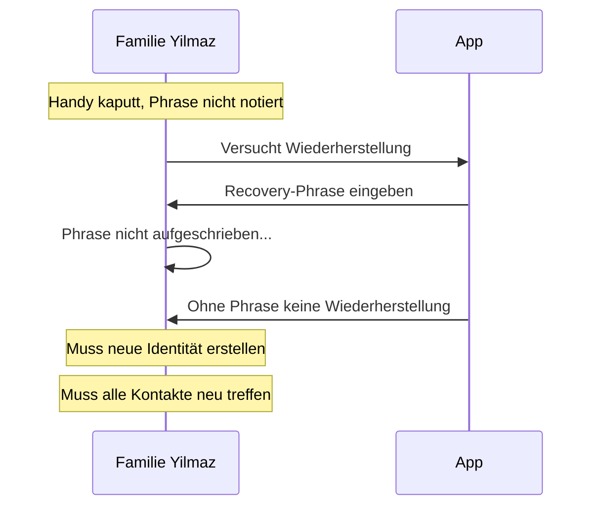
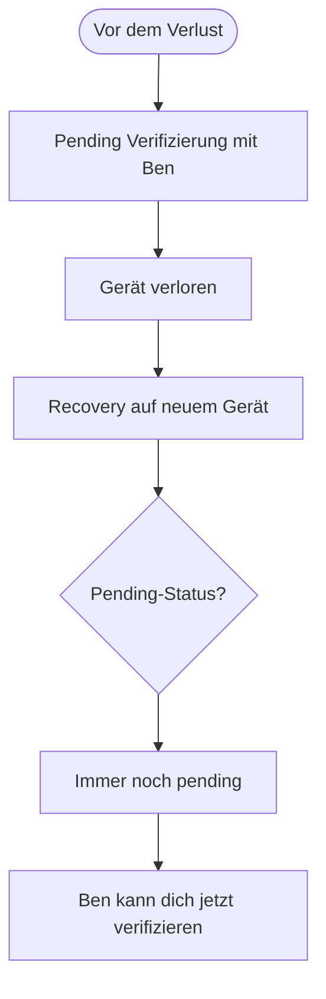
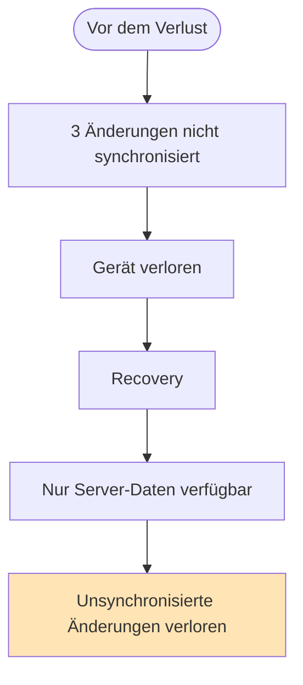

# Recovery-Flow (Nutzer-Perspektive)

> Wie eine Identität wiederhergestellt wird

## Wann brauche ich Recovery?

| Situation | Recovery nötig? |
| --------- | --------------- |
| Gerät verloren | Ja |
| Gerät gestohlen | Ja |
| App gelöscht | Ja |
| Browserdaten gelöscht (Web) | Ja |
| Neues Gerät | Ja (oder Multi-Device Setup) |
| App-Update | Nein |
| Passwort vergessen | Es gibt kein Passwort |

---

## Voraussetzung: Recovery-Phrase

Die Recovery-Phrase ist der **einzige Weg**, deine Identität wiederherzustellen.

```
┌─────────────────────────────────┐
│                                 │
│  ⚠️  WICHTIG                    │
│                                 │
│  Deine Recovery-Phrase wurde    │
│  dir EINMALIG bei der ID-       │
│  Erstellung angezeigt.          │
│                                 │
│  Sie kann NICHT erneut          │
│  abgerufen werden.              │
│                                 │
│  Ohne sie ist deine Identität   │
│  VERLOREN.                      │
│                                 │
└─────────────────────────────────┘
```

---

## Hauptflow: Identität wiederherstellen



---

## Was der Nutzer sieht

### Startbildschirm (neue Installation)

```
┌─────────────────────────────────┐
│                                 │
│      🌐 Web of Trust            │
│                                 │
├─────────────────────────────────┤
│                                 │
│  ┌─────────────────────────┐    │
│  │                         │    │
│  │  🆕 Neu hier?            │    │
│  │                         │    │
│  │  Erstelle eine neue     │    │
│  │  Identität              │    │
│  │                         │    │
│  └─────────────────────────┘    │
│                                 │
│  ┌─────────────────────────┐    │
│  │                         │    │
│  │  🔄 Wiederherstellen     │    │
│  │                         │    │
│  │  Ich habe bereits       │    │
│  │  eine Identität         │    │
│  │                         │    │
│  └─────────────────────────┘    │
│                                 │
└─────────────────────────────────┘
```

### Recovery-Phrase eingeben

```
┌─────────────────────────────────┐
│                                 │
│  🔄 Identität wiederherstellen  │
│                                 │
├─────────────────────────────────┤
│                                 │
│  Gib deine 12 Wörter ein:       │
│                                 │
│  ┌─────────────────────────┐    │
│  │ 1. apple                │    │
│  └─────────────────────────┘    │
│  ┌─────────────────────────┐    │
│  │ 2. banana               │    │
│  └─────────────────────────┘    │
│  ┌─────────────────────────┐    │
│  │ 3. cherry               │    │
│  └─────────────────────────┘    │
│  ┌─────────────────────────┐    │
│  │ 4.                      │    │
│  └─────────────────────────┘    │
│        ...                      │
│  ┌─────────────────────────┐    │
│  │ 12.                     │    │
│  └─────────────────────────┘    │
│                                 │
│  [ Wiederherstellen ]           │
│                                 │
└─────────────────────────────────┘
```

### Wiederherstellung läuft

```
┌─────────────────────────────────┐
│                                 │
│  🔄 Stelle wieder her...        │
│                                 │
├─────────────────────────────────┤
│                                 │
│  ████████████░░░░░░░ 60%        │
│                                 │
│  ✅ Schlüssel generiert         │
│  ✅ Identität gefunden          │
│  🔄 Lade Daten...               │
│  ⬜ Kontakte laden              │
│  ⬜ Content laden               │
│                                 │
└─────────────────────────────────┘
```

### Wiederherstellung erfolgreich

```
┌─────────────────────────────────┐
│                                 │
│  ✅ Willkommen zurück!          │
│                                 │
├─────────────────────────────────┤
│                                 │
│  Deine Identität wurde          │
│  wiederhergestellt:             │
│                                 │
│         📷 [Profilbild]         │
│          Anna Müller            │
│                                 │
│  ━━━━━━━━━━━━━━━━━━━━━━━━━━━    │
│                                 │
│  Wiederhergestellt:             │
│                                 │
│  👥 23 Kontakte                 │
│  📜 47 Attestationen            │
│  📅 12 Kalender-Einträge        │
│  📍 8 Karten-Markierungen       │
│                                 │
│  [ Los geht's ]                 │
│                                 │
└─────────────────────────────────┘
```

---

## Fehlerfall: Falsche Phrase

```
┌─────────────────────────────────┐
│                                 │
│  ❌ Ungültige Phrase            │
│                                 │
├─────────────────────────────────┤
│                                 │
│  Die eingegebene Recovery-      │
│  Phrase ist ungültig.           │
│                                 │
│  Mögliche Ursachen:             │
│                                 │
│  • Wort falsch geschrieben      │
│  • Wörter in falscher           │
│    Reihenfolge                  │
│  • Falsches Wort verwendet      │
│                                 │
│  Bitte prüfe deine Notizen      │
│  und versuche es erneut.        │
│                                 │
│  [ Erneut versuchen ]           │
│                                 │
└─────────────────────────────────┘
```

---

## Fehlerfall: Keine Recovery-Phrase



### Was verloren ist

```
┌─────────────────────────────────┐
│                                 │
│  😔 Ohne Recovery-Phrase        │
│                                 │
├─────────────────────────────────┤
│                                 │
│  Leider können wir deine        │
│  Identität nicht wiederherstellen.│
│                                 │
│  Was verloren ist:              │
│                                 │
│  ❌ Deine Identität (DID)       │
│  ❌ Alle Verifizierungen        │
│  ❌ Alle erhaltenen Attestationen│
│  ❌ Dein Profil                 │
│                                 │
│  ━━━━━━━━━━━━━━━━━━━━━━━━━━━    │
│                                 │
│  Du kannst eine neue Identität  │
│  erstellen, aber du musst:      │
│                                 │
│  • Alle Kontakte neu treffen    │
│  • Neue Attestationen sammeln   │
│                                 │
│  [ Neue Identität erstellen ]   │
│                                 │
└─────────────────────────────────┘
```

---

## Personas

### Greta verliert ihr Handy




### Lena (Skeptikerin) testet Recovery



### Familie Yilmaz ohne Phrase



---

## Recovery auf verschiedenen Plattformen

### iOS / Android

```
┌─────────────────────────────────┐
│                                 │
│  Nach Wiederherstellung:        │
│                                 │
│  ✅ Private Key im Keychain/    │
│     Keystore gespeichert        │
│                                 │
│  ✅ Alle Daten vom Server       │
│     geladen                     │
│                                 │
│  ✅ Push-Benachrichtigungen     │
│     aktiviert                   │
│                                 │
└─────────────────────────────────┘
```

### Web (Browser)

```
┌─────────────────────────────────┐
│                                 │
│  ⚠️ Web-Hinweis                 │
│                                 │
│  Im Browser wird dein           │
│  Schlüssel durch die Web        │
│  Crypto API geschützt und       │
│  kann nicht ausgelesen werden.  │
│                                 │
│  ACHTUNG: Wenn du "Browser-     │
│  daten löschen" verwendest,     │
│  musst du erneut mit der        │
│  Recovery-Phrase wiederherstellen.│
│                                 │
│  [ Verstanden ]                 │
│                                 │
└─────────────────────────────────┘
```

---

## Was passiert mit laufenden Prozessen?

### Ausstehende Verifizierungen



**Ergebnis:** Pending-Verifizierungen bleiben erhalten. Der andere kann dich weiterhin verifizieren.

### Unveröffentlichte Änderungen



**Ergebnis:** Änderungen, die nicht synchronisiert wurden, sind verloren.

---

## Sicherheitshinweise

### Phrase sicher aufbewahren

```
┌─────────────────────────────────┐
│                                 │
│  📝 Empfehlungen                │
│                                 │
├─────────────────────────────────┤
│                                 │
│  ✅ Auf Papier aufschreiben     │
│                                 │
│  ✅ An sicherem Ort aufbewahren │
│     (nicht im Handy!)           │
│                                 │
│  ✅ Eventuell zweite Kopie an   │
│     anderem Ort                 │
│                                 │
│  ━━━━━━━━━━━━━━━━━━━━━━━━━━━    │
│                                 │
│  ❌ Nicht digital speichern     │
│     (Fotos, Notiz-Apps, Cloud)  │
│                                 │
│  ❌ Nicht per Email/Chat senden │
│                                 │
│  ❌ Keinen Screenshot machen    │
│                                 │
└─────────────────────────────────┘
```

### Bei Verdacht auf Kompromittierung

```
┌─────────────────────────────────┐
│                                 │
│  ⚠️ Phrase kompromittiert?      │
│                                 │
├─────────────────────────────────┤
│                                 │
│  Wenn du glaubst, dass jemand   │
│  deine Phrase kennt:            │
│                                 │
│  1. Erstelle eine NEUE Identität│
│                                 │
│  2. Informiere deine Kontakte   │
│                                 │
│  3. Lass dich neu verifizieren  │
│                                 │
│  Die alte Identität sollte      │
│  nicht mehr verwendet werden.   │
│                                 │
└─────────────────────────────────┘
```

---

## FAQ

**Kann ich meine Phrase ändern?**
Nein. Die Phrase ist fest mit deiner Identität verbunden. Eine neue Phrase bedeutet eine neue Identität.

**Was wenn ich ein Wort falsch notiert habe?**
Die App prüft, ob alle Wörter gültig sind (BIP39-Wortliste). Wenn ein Wort falsch ist, wird die Phrase nicht akzeptiert.

**Kann der Support mir helfen?**
Nein. Niemand außer dir kennt deine Phrase. Das ist Absicht - so kann sie auch niemand stehlen.

**Kann ich die Phrase nachträglich anzeigen lassen?**
Nein. Die Phrase wird nur einmal bei der ID-Erstellung angezeigt und danach nirgendwo gespeichert.
