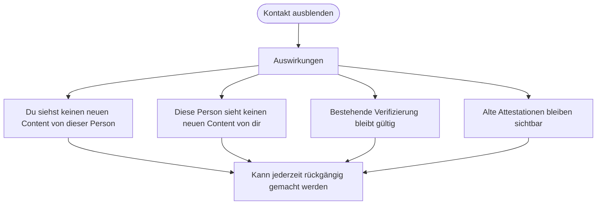
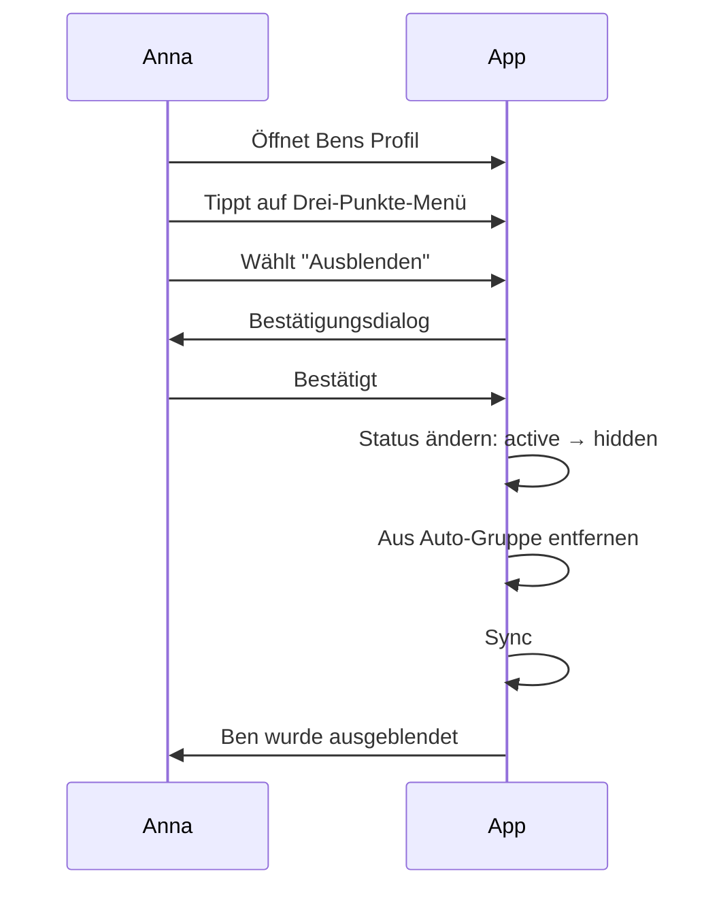
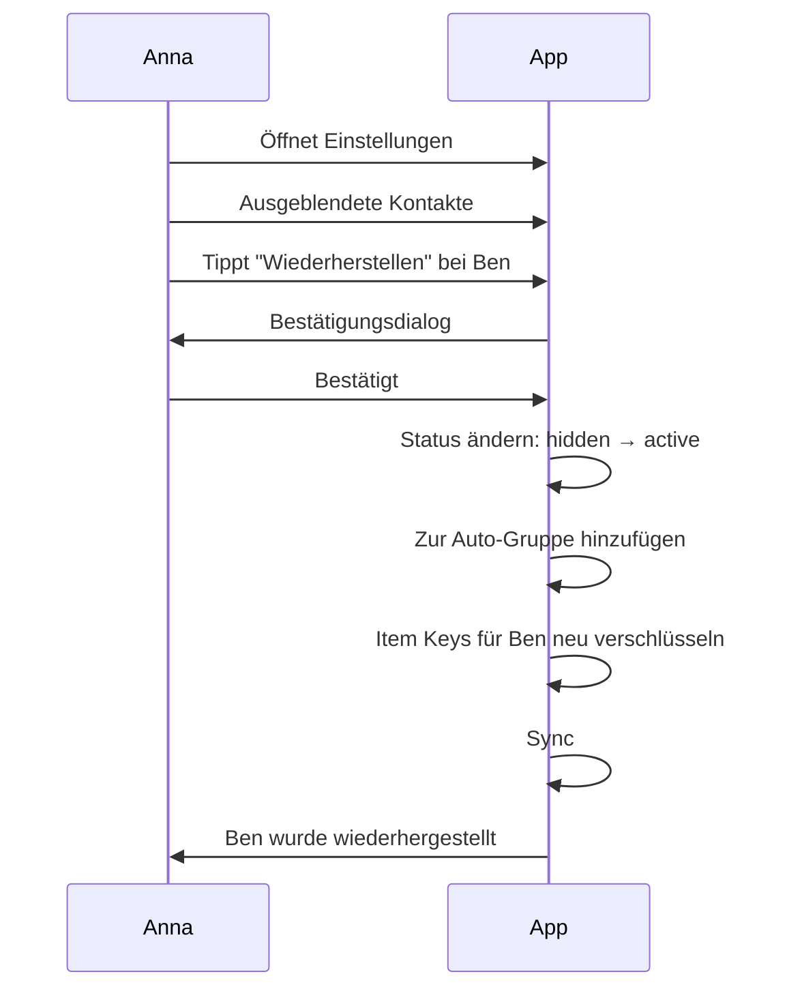
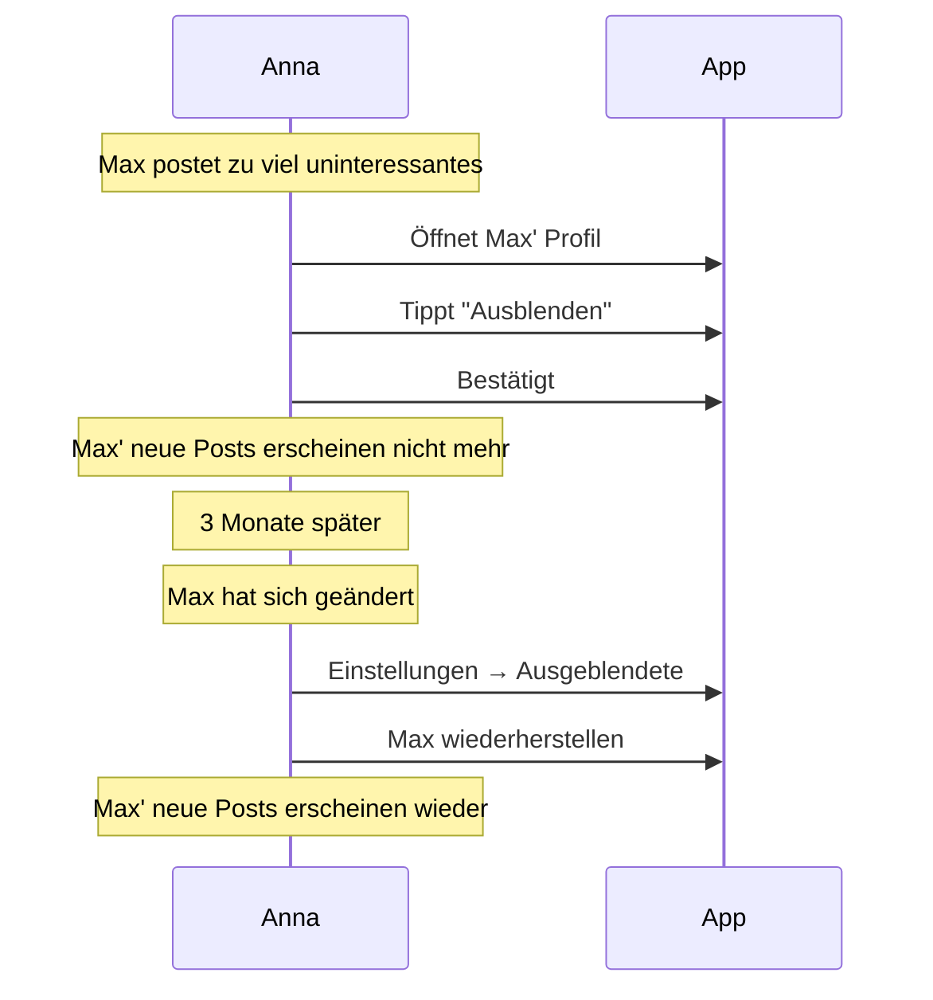
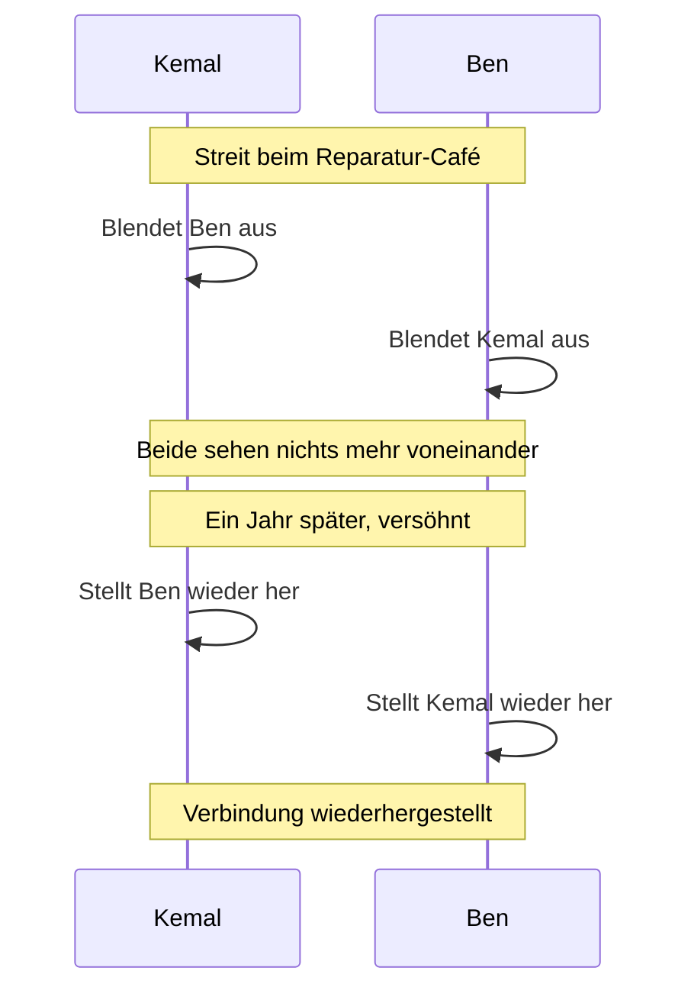

# Ausblenden-Flow (Nutzer-Perspektive)

> Wie ein Kontakt ausgeblendet wird

## Was bedeutet "Ausblenden"?

Ausblenden ist eine **sanfte Trennung** von einem Kontakt. Die Verifizierung bleibt bestehen, aber der Kontakt wird aus deinem aktiven Netzwerk entfernt.

| Ausblenden | Blockieren (gibt es nicht) |
| ---------- | -------------------------- |
| Sanft, reversibel | Hart, permanent |
| Verifizierung bleibt | - |
| Kein neuer Content | - |
| Rückgängig möglich | - |

---

## Was passiert beim Ausblenden?



---

## Hauptflow: Kontakt ausblenden



---

## Was der Nutzer sieht

### Kontakt-Menü

```
┌─────────────────────────────────┐
│         📷 [Profilbild]         │
│          Ben Schmidt            │
│                                 │
│  ━━━━━━━━━━━━━━━━━━━━━━━━━━━    │
│                                 │
│  ┌─────────────────────────┐    │
│  │ 👤 Profil ansehen       │    │
│  └─────────────────────────┘    │
│  ┌─────────────────────────┐    │
│  │ 📜 Attestationen        │    │
│  └─────────────────────────┘    │
│  ┌─────────────────────────┐    │
│  │ ✍️ Attestation erstellen│    │
│  └─────────────────────────┘    │
│                                 │
│  ━━━━━━━━━━━━━━━━━━━━━━━━━━━    │
│                                 │
│  ┌─────────────────────────┐    │
│  │ 👁️ Ausblenden           │    │
│  └─────────────────────────┘    │
│                                 │
└─────────────────────────────────┘
```

### Bestätigungsdialog

```
┌─────────────────────────────────┐
│                                 │
│  👁️ Ben ausblenden?             │
│                                 │
├─────────────────────────────────┤
│                                 │
│  Was passiert:                  │
│                                 │
│  • Du siehst keinen neuen       │
│    Content von Ben              │
│                                 │
│  • Ben sieht keinen neuen       │
│    Content von dir              │
│                                 │
│  • Eure Verifizierung bleibt    │
│    bestehen                     │
│                                 │
│  • Alte Attestationen bleiben   │
│    sichtbar                     │
│                                 │
│  Du kannst das jederzeit        │
│  rückgängig machen.             │
│                                 │
│  ━━━━━━━━━━━━━━━━━━━━━━━━━━━    │
│                                 │
│  [ Abbrechen ]                  │
│                                 │
│  [ Ausblenden ]                 │
│                                 │
└─────────────────────────────────┘
```

### Erfolgsmeldung

```
┌─────────────────────────────────┐
│                                 │
│  ✅ Ben wurde ausgeblendet      │
│                                 │
│  Du siehst keinen neuen         │
│  Content mehr von Ben.          │
│                                 │
│  [ Rückgängig machen ]          │
│                                 │
│  [ OK ]                         │
│                                 │
└─────────────────────────────────┘
```

---

## Ausgeblendete Kontakte verwalten

### Einstellungen

```
┌─────────────────────────────────┐
│  ⚙️ Einstellungen               │
├─────────────────────────────────┤
│                                 │
│  👥 Kontakte                    │
│                                 │
│  ━━━━━━━━━━━━━━━━━━━━━━━━━━━    │
│                                 │
│  Ausgeblendete Kontakte (2)     │
│                                 │
│  ┌─────────────────────────┐    │
│  │ 👨 Ben Schmidt          │    │
│  │    Ausgeblendet am       │    │
│  │    08.01.25              │    │
│  │                         │    │
│  │    [ Wiederherstellen ] │    │
│  └─────────────────────────┘    │
│                                 │
│  ┌─────────────────────────┐    │
│  │ 👩 Carla Braun          │    │
│  │    Ausgeblendet am       │    │
│  │    05.01.25              │    │
│  │                         │    │
│  │    [ Wiederherstellen ] │    │
│  └─────────────────────────┘    │
│                                 │
└─────────────────────────────────┘
```

---

## Kontakt wiederherstellen



### Bestätigungsdialog Wiederherstellen

```
┌─────────────────────────────────┐
│                                 │
│  🔄 Ben wiederherstellen?       │
│                                 │
├─────────────────────────────────┤
│                                 │
│  Was passiert:                  │
│                                 │
│  • Du siehst wieder Content     │
│    von Ben                      │
│                                 │
│  • Ben sieht wieder deinen      │
│    Content                      │
│                                 │
│  • Neuer Content wird geteilt   │
│    (alter Content aus der       │
│    "Ausblenden-Zeit" nicht)     │
│                                 │
│  ━━━━━━━━━━━━━━━━━━━━━━━━━━━    │
│                                 │
│  [ Abbrechen ]                  │
│                                 │
│  [ Wiederherstellen ]           │
│                                 │
└─────────────────────────────────┘
```

---

## Sichtbarkeits-Matrix

### Was sieht wer nach dem Ausblenden?

| Content | Anna sieht | Ben sieht |
| ------- | ---------- | --------- |
| Bens alter Content (vor Ausblenden) | Ja (lokal vorhanden) | - |
| Bens neuer Content (nach Ausblenden) | Nein | - |
| Annas alter Content | - | Ja (lokal vorhanden) |
| Annas neuer Content | - | Nein |
| Alte Attestationen | Ja | Ja |
| Neue Attestationen | Ja (kann erstellt werden) | Ja (erhält sie) |

### Nach Wiederherstellen

| Content | Anna sieht | Ben sieht |
| ------- | ---------- | --------- |
| Content während "Ausblenden-Zeit" | Nein | Nein |
| Neuer Content (nach Wiederherstellen) | Ja | Ja |

---

## Personas

### Anna blendet einen nervigen Kontakt aus



### Kemal nach einem Streit



---

## Unterschied zu anderen Systemen

| System | "Entfreunden" bedeutet |
| ------ | --------------------- |
| Facebook | Beziehung gelöscht, muss neu hinzugefügt werden |
| WhatsApp | Blockieren verhindert alle Nachrichten |
| Web of Trust | Ausblenden ist temporär, Verifizierung bleibt |

### Warum so?

```
┌─────────────────────────────────┐
│                                 │
│  💡 Design-Entscheidung         │
│                                 │
│  Die Verifizierung ist eine     │
│  Aussage über die Vergangenheit:│
│                                 │
│  "Ich habe diese Person am      │
│   08.01.25 persönlich getroffen"│
│                                 │
│  Das kann nicht "ungeschehen"   │
│  gemacht werden.                │
│                                 │
│  Ausblenden bedeutet nur:       │
│  "Ich möchte gerade keinen      │
│   Content mit dieser Person     │
│   teilen."                      │
│                                 │
└─────────────────────────────────┘
```

---

## FAQ

**Sieht der andere, dass ich ihn ausgeblendet habe?**
Nicht direkt. Aber wenn er bemerkt, dass er deinen neuen Content nicht mehr sieht, kann er es vermuten.

**Kann ich noch Attestationen für ausgeblendete Kontakte erstellen?**
Ja. Attestationen sind unabhängig vom Ausblend-Status. Ben erhält die Attestation auch wenn er ausgeblendet ist.

**Was passiert mit Gruppen wenn ich jemanden ausblende?**
Ihr seid beide weiterhin in gemeinsamen Gruppen. Aber dein "für alle Kontakte" Content erreicht diese Person nicht mehr.

**Kann ich jemanden dauerhaft entfernen?**
Nein. Die Verifizierung bleibt bestehen. Du kannst nur ausblenden.

**Was wenn beide sich gegenseitig ausblenden?**
Dann sieht keiner mehr Content vom anderen. Beide können unabhängig wiederherstellen.
