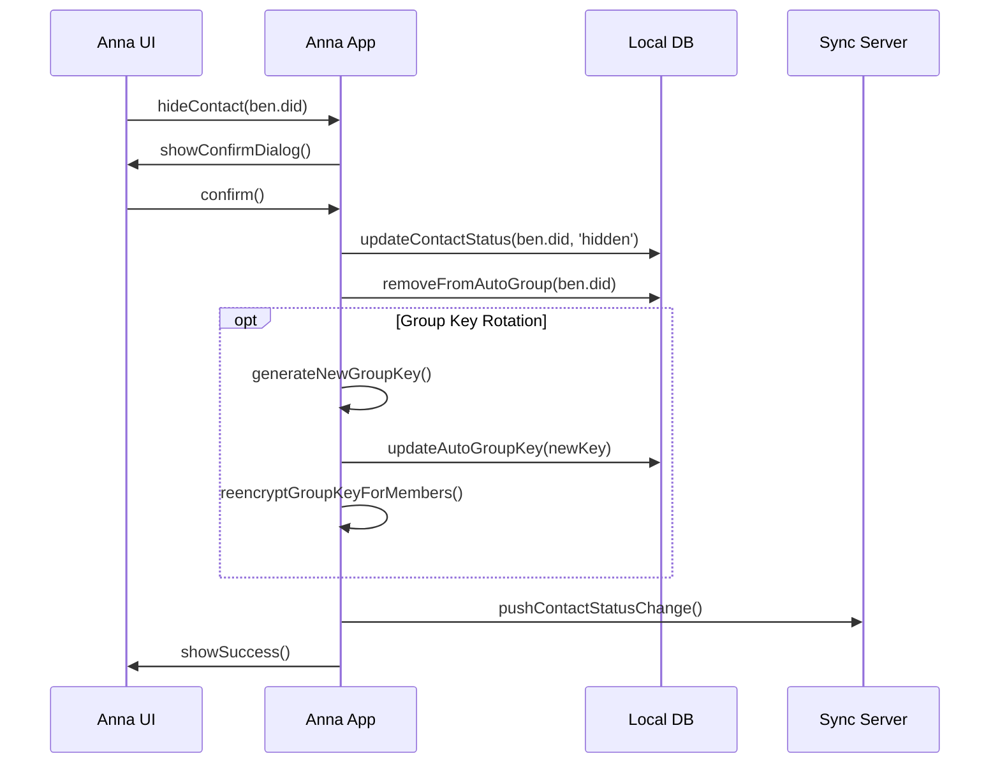

# Ausblenden-Flow (Technische Perspektive)

> Wie Kontakte ausgeblendet und wiederhergestellt werden

## Datenmodell

### Kontakt-Status

```mermaid
stateDiagram-v2
    [*] --> Pending: Einseitig verifiziert

    Pending --> Active: Gegenseitig verifiziert

    Active --> Hidden: Ausblenden

    Hidden --> Active: Wiederherstellen

    state Active {
        [*] --> InAutoGroup
        InAutoGroup: In Auto-Gruppe
        InAutoGroup: Erhält neue Item Keys
    }

    state Hidden {
        [*] --> NotInAutoGroup
        NotInAutoGroup: Nicht in Auto-Gruppe
        NotInAutoGroup: Erhält keine neuen Item Keys
    }
```



### Contact Record

```json
{
  "did": "did:wot:ben456",
  "publicKey": "ed25519:base64...",
  "name": "Ben Schmidt",
  "status": "hidden",
  "statusHistory": [
    {
      "status": "pending",
      "timestamp": "2025-01-05T10:00:00Z"
    },
    {
      "status": "active",
      "timestamp": "2025-01-05T10:05:00Z"
    },
    {
      "status": "hidden",
      "timestamp": "2025-01-08T14:00:00Z",
      "reason": "user_initiated"
    }
  ],
  "verifiedAt": "2025-01-05T10:05:00Z",
  "myVerification": "urn:uuid:123...",
  "theirVerification": "urn:uuid:456..."
}
```

---

## Hauptflow: Kontakt ausblenden

```mermaid
flowchart TD
    Start(["Nutzer tippt Ausblenden"]) --> Confirm["Zeige Bestätigungsdialog"]

    Confirm --> UserChoice{"Bestätigt?"}

    UserChoice -->|Nein| Cancel["Abbrechen"]

    UserChoice -->|Ja| UpdateStatus["Status = hidden"]

    UpdateStatus --> RemoveFromGroup["Aus Auto-Gruppe entfernen"]

    RemoveFromGroup --> RotateKey["Group Key rotieren (optional)"]

    RotateKey --> SyncStatus["Sync Status-Änderung"]

    SyncStatus --> Done(["Fertig"])
```



---

## Sequenzdiagramm: Ausblenden



---

## Auto-Gruppe Verwaltung

### Struktur

```json
{
  "id": "urn:uuid:autogroup-anna",
  "type": "AutoContactGroup",
  "owner": "did:wot:anna123",
  "members": [
    "did:wot:carla789",
    "did:wot:tom012"
  ],
  "excludedMembers": [
    "did:wot:ben456"
  ],
  "groupKey": {
    "current": {
      "key": "aes256:encrypted...",
      "version": 3,
      "createdAt": "2025-01-08T14:00:00Z"
    },
    "previous": [
      {
        "key": "aes256:encrypted...",
        "version": 2,
        "validUntil": "2025-01-08T14:00:00Z"
      }
    ]
  }
}
```

### Ausblenden aus Auto-Gruppe

```mermaid
flowchart TD
    Hide(["Kontakt ausblenden"]) --> GetGroup["Lade Auto-Gruppe"]

    GetGroup --> RemoveMember["Entferne aus members[]"]

    RemoveMember --> AddExcluded["Füge zu excludedMembers[] hinzu"]

    AddExcluded --> ShouldRotate{"Key rotieren?"}

    ShouldRotate -->|Ja| Rotate["Generiere neuen Group Key"]
    Rotate --> Distribute["Verteile an verbleibende Members"]

    ShouldRotate -->|Nein| Skip["Überspringe Rotation"]

    Distribute --> Save["Speichern"]
    Skip --> Save
```



---

## Key Rotation (Optional)

### Wann rotieren?

| Szenario | Key rotieren? |
| -------- | ------------- |
| Normales Ausblenden | Optional (Empfohlen: Nein) |
| Sicherheitsbedenken | Ja |
| Nutzer wünscht es explizit | Ja |

### Warum optional?

```
┌─────────────────────────────────┐
│                                 │
│  💡 Design-Entscheidung         │
│                                 │
│  Key Rotation bei Ausblenden    │
│  ist NICHT standardmäßig,       │
│  weil:                          │
│                                 │
│  1. Der ausgeblendete Kontakt   │
│     hat bereits alle alten      │
│     Item Keys                   │
│                                 │
│  2. Neue Items werden sowieso   │
│     nicht mehr für ihn          │
│     verschlüsselt               │
│                                 │
│  3. Rotation ist aufwendig      │
│     (alle Members neu           │
│     verschlüsseln)              │
│                                 │
│  Bei echten Sicherheitsbedenken │
│  kann Rotation explizit         │
│  ausgelöst werden.              │
│                                 │
└─────────────────────────────────┘
```

### Rotation-Flow

```mermaid
sequenceDiagram
    participant App as App
    participant DB as DB
    participant Members as Verbleibende Members

    App->>App: generateGroupKey()
    Note over App: AES-256 Zufallsschlüssel

    App->>App: incrementKeyVersion()

    loop Für jeden verbleibenden Member
        App->>App: encryptGroupKey(member.publicKey)
        App->>DB: storeEncryptedGroupKey(member, encryptedKey)
    end

    App->>DB: archivePreviousKey()

    App->>Members: notifyKeyRotation()
```



---

## Kontakt wiederherstellen

```mermaid
flowchart TD
    Restore(["Wiederherstellen"]) --> Confirm["Bestätigungsdialog"]

    Confirm --> UpdateStatus["Status = active"]

    UpdateStatus --> AddToGroup["Zur Auto-Gruppe hinzufügen"]

    AddToGroup --> ReencryptItems["Item Keys für neuen Content verschlüsseln"]

    ReencryptItems --> DistributeGroupKey["Group Key an Kontakt verteilen"]

    DistributeGroupKey --> Sync["Sync"]

    Sync --> Done(["Fertig"])
```



### Sequenzdiagramm

```mermaid
sequenceDiagram
    participant UI as Anna UI
    participant App as Anna App
    participant DB as Local DB
    participant Sync as Sync Server

    UI->>App: restoreContact(ben.did)
    App->>UI: showConfirmDialog()
    UI->>App: confirm()

    App->>DB: updateContactStatus(ben.did, 'active')

    App->>DB: addToAutoGroup(ben.did)

    App->>DB: getItemsWithVisibilityAll()

    loop Für jedes Item (erstellt nach heute)
        App->>App: encryptItemKey(ben.publicKey)
        App->>DB: storeItemKey(item.id, ben.did, encryptedKey)
    end

    App->>App: encryptGroupKey(ben.publicKey)
    App->>DB: storeGroupKeyForMember(ben.did)

    App->>Sync: pushChanges()

    App->>UI: showSuccess()
```



---

## Was wird NICHT geteilt nach Wiederherstellen?

```mermaid
flowchart TD
    Timeline["Zeitlinie"]

    subgraph Before["VOR Ausblenden"]
        B1["Item A - geteilt"]
        B2["Item B - geteilt"]
    end

    subgraph During["WÄHREND Ausblenden"]
        D1["Item C - NICHT geteilt"]
        D2["Item D - NICHT geteilt"]
    end

    subgraph After["NACH Wiederherstellen"]
        A1["Item E - geteilt"]
        A2["Item F - geteilt"]
    end

    Timeline --> Before --> During --> After
```



**Begründung:** Items während der "Ausblenden-Zeit" wurden nie für den Kontakt verschlüsselt. Sie nachträglich zu teilen wäre inkonsistent mit der Entscheidung, diesen Kontakt auszublenden.

---

## Speicher-Schema

```sql
-- Erweiterung der contacts Tabelle
ALTER TABLE contacts ADD COLUMN status TEXT DEFAULT 'active';
ALTER TABLE contacts ADD COLUMN status_changed_at DATETIME;
ALTER TABLE contacts ADD COLUMN status_reason TEXT;

-- Status-History
CREATE TABLE contact_status_history (
    id INTEGER PRIMARY KEY AUTOINCREMENT,
    contact_did TEXT NOT NULL,
    status TEXT NOT NULL,
    changed_at DATETIME NOT NULL,
    reason TEXT,
    FOREIGN KEY (contact_did) REFERENCES contacts(did)
);

CREATE INDEX idx_status_history ON contact_status_history(contact_did, changed_at);

-- Excluded Members in Auto-Gruppe
CREATE TABLE auto_group_excluded (
    contact_did TEXT PRIMARY KEY,
    excluded_at DATETIME NOT NULL,
    FOREIGN KEY (contact_did) REFERENCES contacts(did)
);
```

---

## API

### Ausblenden

```javascript
async function hideContact(contactDid) {
  // 1. Validierung
  const contact = await db.contacts.get(contactDid);
  if (!contact || contact.status !== 'active') {
    throw new Error('Kontakt nicht aktiv');
  }

  // 2. Status ändern
  await db.contacts.update(contactDid, {
    status: 'hidden',
    statusChangedAt: new Date().toISOString(),
    statusReason: 'user_initiated'
  });

  // 3. Status-History
  await db.contactStatusHistory.add({
    contactDid,
    status: 'hidden',
    changedAt: new Date().toISOString(),
    reason: 'user_initiated'
  });

  // 4. Aus Auto-Gruppe entfernen
  await removeFromAutoGroup(contactDid);

  // 5. Sync
  await syncQueue.add({
    type: 'contact_status_change',
    contactDid,
    newStatus: 'hidden'
  });
}
```

### Wiederherstellen

```javascript
async function restoreContact(contactDid) {
  // 1. Validierung
  const contact = await db.contacts.get(contactDid);
  if (!contact || contact.status !== 'hidden') {
    throw new Error('Kontakt nicht ausgeblendet');
  }

  // 2. Status ändern
  await db.contacts.update(contactDid, {
    status: 'active',
    statusChangedAt: new Date().toISOString(),
    statusReason: 'user_restored'
  });

  // 3. Zur Auto-Gruppe hinzufügen
  await addToAutoGroup(contactDid);

  // 4. Neue Items teilen
  await reencryptRecentItemsForContact(contactDid);

  // 5. Group Key teilen
  await shareGroupKeyWithContact(contactDid);

  // 6. Sync
  await syncQueue.add({
    type: 'contact_status_change',
    contactDid,
    newStatus: 'active'
  });
}
```

---

## Sicherheitsüberlegungen

### Was der ausgeblendete Kontakt noch hat

| Daten | Zugriff nach Ausblenden |
| ----- | ----------------------- |
| Alte Item Keys | Ja (bereits entschlüsselt) |
| Alter Content | Ja (lokal gespeichert) |
| Alte Attestationen | Ja (unveränderlich) |
| Alter Group Key | Ja (wenn nicht rotiert) |
| **Neuer Content** | **Nein** |
| **Neue Item Keys** | **Nein** |

### Signalisierung an den Kontakt

Der Sync-Server könnte dem Kontakt signalisieren, dass er ausgeblendet wurde. **Empfehlung:** Nicht tun.

| Option | Pro | Con |
| ------ | --- | --- |
| Signalisieren | Transparenz | Kann zu Konflikten führen |
| Nicht signalisieren | Privatsphäre | Kontakt merkt es eventuell |

**Empfehlung:** Keine explizite Signalisierung. Der Kontakt merkt es, wenn er keinen neuen Content mehr sieht.

---

## Edge Cases

### Beide blenden sich gegenseitig aus

```mermaid
sequenceDiagram
    participant A as Anna
    participant B as Ben

    A->>A: Blendet Ben aus
    B->>B: Blendet Anna aus

    Note over A,B: Beide Status: hidden

    Note over A: Annas Sicht: Ben ist ausgeblendet
    Note over B: Bens Sicht: Anna ist ausgeblendet

    A->>A: Stellt Ben wieder her
    Note over A: Annas Status für Ben: active
    Note over B: Bens Status für Anna: hidden

    Note over A: Anna sieht Bens Content nicht (weil Ben sie ausgeblendet hat)
    Note over B: Ben sieht Annas Content nicht (weil er sie ausgeblendet hat)
```



### Ausblenden während Offline

```mermaid
flowchart TD
    Offline(["Offline"]) --> Hide["Ausblenden lokal"]

    Hide --> Queue["In Sync-Queue"]

    Queue --> Later["Später online"]

    Later --> Sync["Sync Status-Änderung"]

    Sync --> Note["Kontakt erhält keine neuen Items mehr"]
```



**Hinweis:** Während der Offline-Zeit erstellte Items für "alle Kontakte" werden beim Sync nicht mehr an den ausgeblendeten Kontakt verteilt.

### Kontakt wird während Ausblenden-Zeit gelöscht

Nicht möglich. Kontakte können nicht gelöscht werden, nur ausgeblendet.
