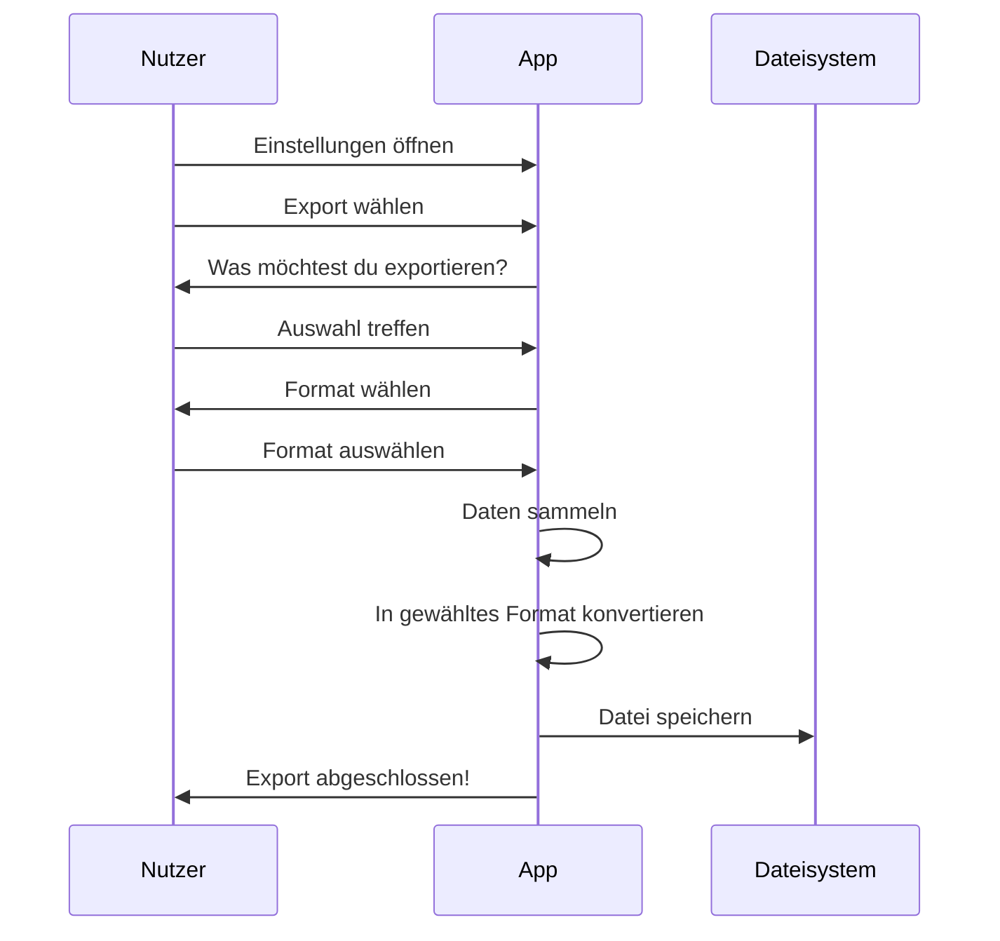
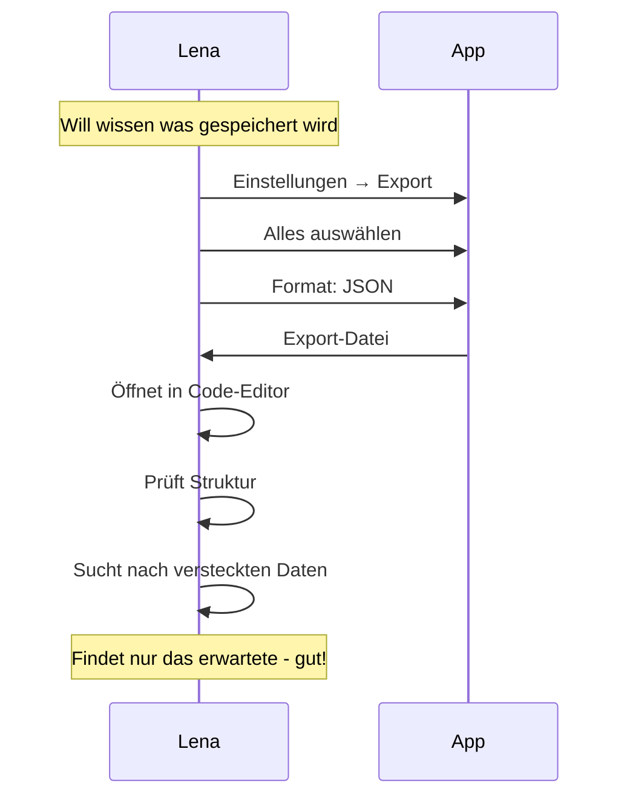
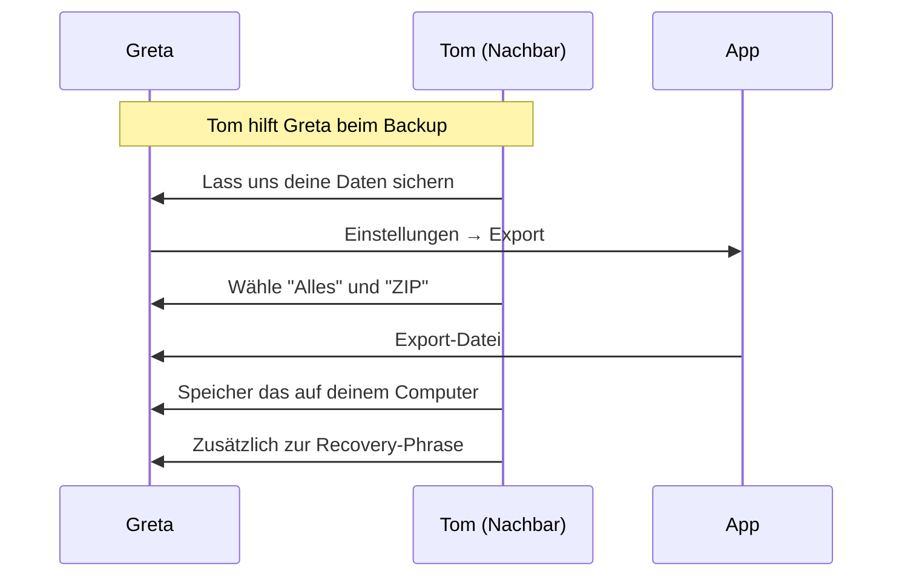
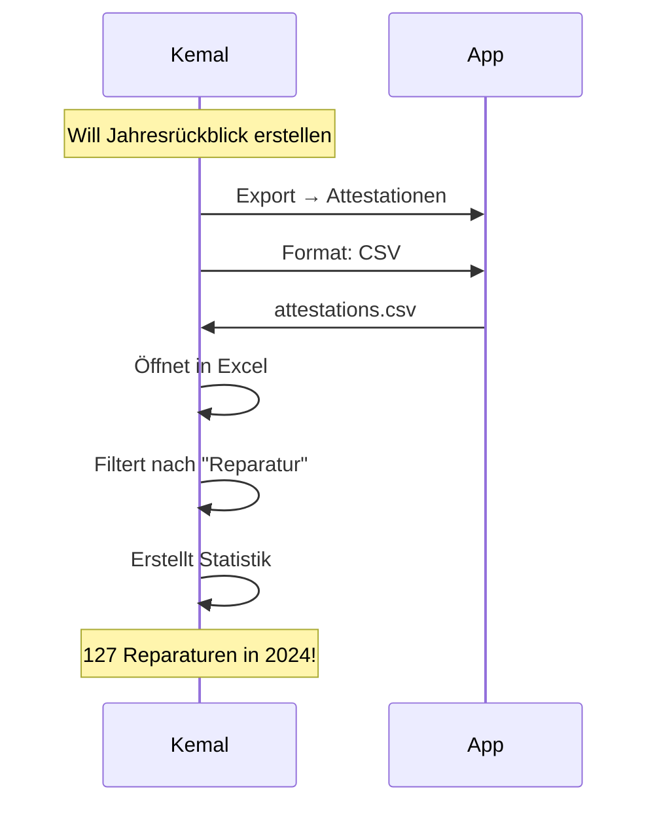

# Export-Flow (Nutzer-Perspektive)

> Wie Daten exportiert werden

## Warum Export?

Das Web of Trust ist **kein Vendor-Lock-in**. Deine Daten gehören dir.

```
┌─────────────────────────────────┐
│                                 │
│  💡 Deine Daten, dein Recht     │
│                                 │
│  Du kannst jederzeit alle       │
│  deine Daten exportieren:       │
│                                 │
│  • Für Backups                  │
│  • Zur Archivierung             │
│  • Für andere Tools             │
│  • Aus reiner Neugier           │
│                                 │
└─────────────────────────────────┘
```

---

## Hauptflow: Daten exportieren



---

## Was der Nutzer sieht

### Export starten

```
┌─────────────────────────────────┐
│  ⚙️ Einstellungen               │
├─────────────────────────────────┤
│                                 │
│  Daten & Speicher               │
│                                 │
│  ━━━━━━━━━━━━━━━━━━━━━━━━━━━    │
│                                 │
│  ┌─────────────────────────┐    │
│  │ 📤 Daten exportieren    │    │
│  │    Alle deine Daten als │    │
│  │    Datei herunterladen  │    │
│  └─────────────────────────┘    │
│                                 │
│  ┌─────────────────────────┐    │
│  │ 🗑️ Daten löschen        │    │
│  │    Alle lokalen Daten   │    │
│  │    entfernen            │    │
│  └─────────────────────────┘    │
│                                 │
└─────────────────────────────────┘
```

### Export-Auswahl

```
┌─────────────────────────────────┐
│                                 │
│  📤 Daten exportieren           │
│                                 │
├─────────────────────────────────┤
│                                 │
│  Was möchtest du exportieren?   │
│                                 │
│  [✓] Profil                     │
│      Name, Foto, Bio            │
│                                 │
│  [✓] Kontakte                   │
│      23 Kontakte                │
│                                 │
│  [✓] Verifizierungen            │
│      23 Verifizierungen         │
│                                 │
│  [✓] Attestationen              │
│      47 erhalten, 12 gegeben    │
│                                 │
│  [✓] Content                    │
│      34 Einträge                │
│                                 │
│  [ ] Gruppen                    │
│      3 Gruppen                  │
│                                 │
│  ━━━━━━━━━━━━━━━━━━━━━━━━━━━    │
│                                 │
│  [ Alles auswählen ]            │
│                                 │
│  [ Weiter ]                     │
│                                 │
└─────────────────────────────────┘
```

### Format wählen

```
┌─────────────────────────────────┐
│                                 │
│  📤 Export-Format               │
│                                 │
├─────────────────────────────────┤
│                                 │
│  Wähle ein Format:              │
│                                 │
│  ┌─────────────────────────┐    │
│  │ 📋 JSON                 │    │
│  │    Maschinenlesbar,     │    │
│  │    für Entwickler       │    │
│  └─────────────────────────┘    │
│                                 │
│  ┌─────────────────────────┐    │
│  │ 📊 CSV                  │    │
│  │    Für Excel/Tabellen   │    │
│  └─────────────────────────┘    │
│                                 │
│  ┌─────────────────────────┐    │
│  │ 📄 PDF                  │    │
│  │    Lesbares Dokument    │    │
│  └─────────────────────────┘    │
│                                 │
│  ┌─────────────────────────┐    │
│  │ 📦 ZIP (alle Formate)   │    │
│  │    Komplettes Archiv    │    │
│  └─────────────────────────┘    │
│                                 │
└─────────────────────────────────┘
```

### Export läuft

```
┌─────────────────────────────────┐
│                                 │
│  📤 Exportiere...               │
│                                 │
├─────────────────────────────────┤
│                                 │
│  ████████████░░░░░░░ 60%        │
│                                 │
│  ✅ Profil                      │
│  ✅ Kontakte                    │
│  ✅ Verifizierungen             │
│  🔄 Attestationen...            │
│  ⬜ Content                     │
│                                 │
└─────────────────────────────────┘
```

### Export abgeschlossen

```
┌─────────────────────────────────┐
│                                 │
│  ✅ Export abgeschlossen!       │
│                                 │
├─────────────────────────────────┤
│                                 │
│  Datei: wot-export-2025-01-08.zip│
│  Größe: 2.3 MB                  │
│                                 │
│  Enthält:                       │
│  • 1 Profil                     │
│  • 23 Kontakte                  │
│  • 23 Verifizierungen           │
│  • 59 Attestationen             │
│  • 34 Content-Einträge          │
│                                 │
│  ━━━━━━━━━━━━━━━━━━━━━━━━━━━    │
│                                 │
│  [ Teilen ]                     │
│                                 │
│  [ In Dateien öffnen ]          │
│                                 │
│  [ Fertig ]                     │
│                                 │
└─────────────────────────────────┘
```

---

## Was ist im Export enthalten?

### Profil

```
┌─────────────────────────────────┐
│  👤 Mein Profil                 │
├─────────────────────────────────┤
│                                 │
│  Name: Anna Müller              │
│  DID: did:wot:anna123...        │
│  Bio: Aktiv im Gemeinschafts-   │
│       garten Sonnenberg         │
│                                 │
│  Erstellt: 01.01.2025           │
│  Foto: [enthalten]              │
│                                 │
└─────────────────────────────────┘
```

### Kontakte

```
┌─────────────────────────────────┐
│  👥 Kontakte (23)               │
├─────────────────────────────────┤
│                                 │
│  1. Ben Schmidt                 │
│     DID: did:wot:ben456...      │
│     Status: aktiv               │
│     Verifiziert: 05.01.2025     │
│                                 │
│  2. Carla Braun                 │
│     DID: did:wot:carla789...    │
│     Status: aktiv               │
│     Verifiziert: 03.01.2025     │
│                                 │
│  ...                            │
│                                 │
└─────────────────────────────────┘
```

### Attestationen

```
┌─────────────────────────────────┐
│  📜 Attestationen               │
├─────────────────────────────────┤
│                                 │
│  ERHALTEN (47):                 │
│                                 │
│  "Hat 3 Stunden im Garten       │
│   geholfen"                     │
│  Von: Tom Wagner                │
│  Datum: 08.01.2025              │
│  Tags: Garten, Helfen           │
│                                 │
│  ...                            │
│                                 │
│  GEGEBEN (12):                  │
│                                 │
│  "Kennt sich super mit          │
│   Fahrrädern aus"               │
│  An: Ben Schmidt                │
│  Datum: 06.01.2025              │
│  Tags: Handwerk, Fahrrad        │
│                                 │
│  ...                            │
│                                 │
└─────────────────────────────────┘
```

---

## Export-Formate

### JSON

Maschinenlesbares Format mit vollständiger Struktur:

```json
{
  "exportVersion": "1.0",
  "exportedAt": "2025-01-08T15:00:00Z",
  "profile": {
    "did": "did:wot:anna123",
    "name": "Anna Müller",
    "bio": "..."
  },
  "contacts": [...],
  "verifications": [...],
  "attestations": [...],
  "items": [...]
}
```

### CSV

Tabellenformat, eine Datei pro Typ:

```
contacts.csv:
Name,DID,Status,Verifiziert am
Ben Schmidt,did:wot:ben456,aktiv,2025-01-05
Carla Braun,did:wot:carla789,aktiv,2025-01-03

attestations.csv:
Von,An,Text,Tags,Datum
Tom Wagner,Anna Müller,"Hat geholfen","Garten,Helfen",2025-01-08
```

### PDF

Lesbares Dokument mit formatierter Übersicht:

```
┌─────────────────────────────────┐
│                                 │
│  WEB OF TRUST EXPORT            │
│  Anna Müller                    │
│  08.01.2025                     │
│                                 │
│  ─────────────────────────────  │
│                                 │
│  PROFIL                         │
│  ...                            │
│                                 │
│  KONTAKTE                       │
│  ...                            │
│                                 │
│  ATTESTATIONEN                  │
│  ...                            │
│                                 │
└─────────────────────────────────┘
```

### ZIP (Komplett-Archiv)

```
wot-export-2025-01-08.zip
├── profile.json
├── contacts.json
├── contacts.csv
├── verifications.json
├── attestations.json
├── attestations.csv
├── items.json
├── items.csv
├── media/
│   ├── profile-photo.jpg
│   └── ...
└── summary.pdf
```

---

## Personas

### Lena (Skeptikerin) prüft ihre Daten



### Greta macht Backup



### Kemal archiviert Reparatur-Café



---

## Was ist NICHT im Export?

| Nicht enthalten | Warum |
| --------------- | ----- |
| Private Key | Sicherheitsrisiko |
| Recovery-Phrase | Sicherheitsrisiko |
| Verschlüsselte Blobs | Nicht nützlich ohne Key |
| Content anderer | Nur deine eigenen Daten |
| Gruppen-Keys | Sicherheitsrisiko |

---

## FAQ

**Kann ich den Export woanders importieren?**
Das hängt vom Zielsystem ab. Das JSON-Format ist standardisiert und kann von anderen Tools verarbeitet werden.

**Enthält der Export sensible Daten?**
Ja - er enthält deine Kontakte, Attestationen und Inhalte. Behandle die Export-Datei vertraulich.

**Wie oft sollte ich exportieren?**
Für Backups: Regelmäßig, z.B. monatlich. Die Recovery-Phrase ist wichtiger als der Export.

**Kann ich gelöschte Daten exportieren?**
Nein. Der Export enthält nur aktuelle Daten.

**Ist der Export verschlüsselt?**
Nein. Der Export ist im Klartext. Wenn du ihn sicher aufbewahren willst, verschlüssele die Datei selbst.
